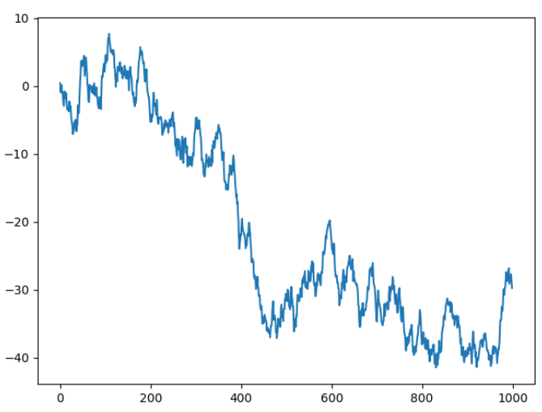
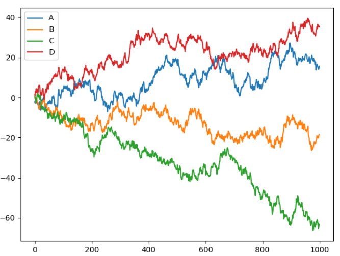
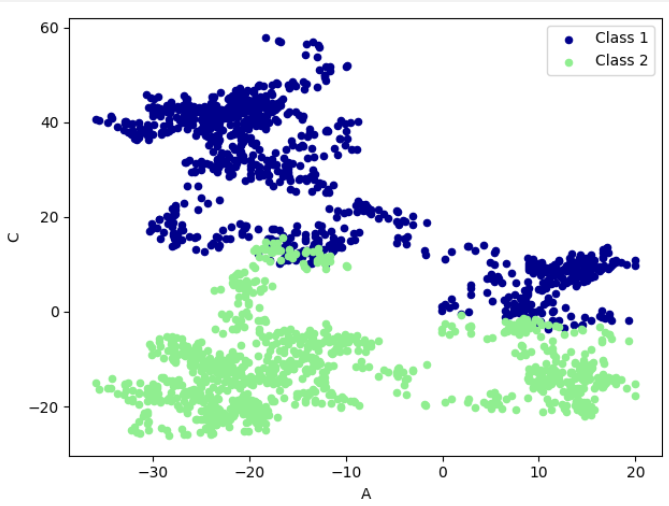

## 数据处理 Numpy\&Pandas

### 00 视频传送门

[【莫烦Python】Numpy & Pandas (数据处理教程)\_哔哩哔哩\_bilibili](https://www.bilibili.com/video/BV1Ex411L7oT/?spm_id_from=333.788.top_right_bar_window_custom_collection.content.click\&vd_source=50f2f5b2c83676d4a38697ecabf48753)

### 01 numpy

#### 1.1 安装

`pip3 install numpy`

`pip3 install pandas`

#### 1.2 numpy 属性

```python
import numpy as np
array = np.array([[1,2,3],[4,5,6]])
print(array)
# [[1 2 3]
#  [4 5 6]]
print('几维数组',array.ndim) #几维数组 2
print('行列数',array.shape) #行列数 (2, 3)
print('元素个数',array.size) #元素个数 6
```

#### 1.3 numpy的创建 array

```python
import numpy as np
a = np.array([1,2,3],dtype=np.int64) #一个数组中元素的数据类型
print(a.dtype) #int64
a = np.array([1,2,3],dtype=np.float64)
print(a.dtype) #float64

a = np.zeros((3,4)) #3行4列的零矩阵
print(a)
# [[0. 0. 0. 0.]
#  [0. 0. 0. 0.]
#  [0. 0. 0. 0.]]

a = np.ones((3,4)) #3行4列的1矩阵
print(a)
# [[1. 1. 1. 1.]
#  [1. 1. 1. 1.]
#  [1. 1. 1. 1.]]

a = np.empty((3,4)) #3行4列的新的空数组，随机元素
print(a)
# [[0. 0. 1. 1.]
#  [1. 1. 1. 1.]
#  [1. 0. 0. 1.]]

a=np.arange(12).reshape((3,4)) #3行4列从0-11
print(a)
# [[ 0  1  2  3]
#  [ 4  5  6  7]
#  [ 8  9 10 11]]

a=np.linspace(1,10,5) #5段在1-10的数列
print(a) #[ 1.    3.25  5.5   7.75 10.  ]

a=np.linspace(1,10,6).reshape((2,3)) #6段在1-10的数列
print(a)
# [[ 1.   2.8  4.6]
#  [ 6.4  8.2 10. ]]
```

#### 1.4 numpy的基础运算

```python
import numpy as np
a=np.array([10,20,30,40])
b=np.arange(4)
print(a,b) #[10 20 30 40] [0 1 2 3]

c=a+b
print(c) #[10 21 32 43]

d=a**2
print(d) #[ 100  400  900 1600]

e=10*np.sin(a)
print(e) #[-5.44021111  9.12945251 -9.88031624  7.4511316 ]

print(b<3) #[ True  True  True False]

a1=np.array([[1,1],
             [0,1]])
b1 = np.arange(4).reshape((2,2))

c=a1*b1#直接乘
c_dot=np.dot(a1,b1) #矩阵乘法
c_dot2 = a1.dot(b1) #矩阵乘法
print(c)
# [[0 1]
#  [0 3]]
print(c_dot)
# [[2 4]
#  [2 3]]
print(c_dot2)
# [[2 4]
#  [2 3]]

a3 = np.random.random((2,4))
print(a3)
# [[0.40954262 0.46004192 0.46409414 0.44912359]
#  [0.60550943 0.44206979 0.30307923 0.06122485]]
print(np.sum(a3,axis=1)) #[1.78280227 1.41188329] 每一行和
print(np.min(a3,axis=0)) #[0.40954262 0.44206979 0.30307923 0.06122485] 每一列最小值

a4 = np.arange(2,14).reshape((3,4))
print(a4)
# [[ 2  3  4  5]
#  [ 6  7  8  9]
#  [10 11 12 13]]
print(np.argmin(a4)) #0  最小值索引
print(np.mean(a4)) #7.5 平均值
print(a4.mean()) #7.5 平均值
print(np.average(a4)) #7.5 平均值
print(np.median(a4)) #7.5 中位数
print(np.cumsum(a4)) #[ 2  5  9 14 20 27 35 44 54 65 77 90] 累加前缀和
print(np.diff(a4))
# [[1 1 1]
#  [1 1 1]
#  [1 1 1]]  差分

print(np.nonzero(a4)) #非0数的索引
# (array([0, 0, 0, 0, 1, 1, 1, 1, 2, 2, 2, 2], dtype=int64), array([0, 1, 2, 3, 0, 1, 2, 3, 0, 1, 2, 3], dtype=int64))

a5 = np.arange(14,2,-1).reshape((3,4))
print(np.sort(a5)) #逐行排序
# [[11 12 13 14]
#  [ 7  8  9 10]
#  [ 3  4  5  6]]

print(np.transpose(a4)) #转置
# [[ 2  6 10]
#  [ 3  7 11]
#  [ 4  8 12]
#  [ 5  9 13]]

print(np.clip(a4,5,9)) #小于5的数变成5，大于9的数变成9，其余不变
# [[5 5 5 5]
#  [6 7 8 9]
#  [9 9 9 9]]
```

#### 1.5 numpy的索引

```python
import numpy as np
a = np.arange(3,15)
print(a) #[ 3  4  5  6  7  8  9 10 11 12 13 14]
print(a[3]) #6

b = np.arange(3,15).reshape((3,4))
print(b)
# [[ 3  4  5  6]
#  [ 7  8  9 10]
#  [11 12 13 14]]
print(b[1][1]) #8
print(b[1,1]) #8
print(b[2:]) #[[11 12 13 14]]
print(b[1,1:3]) #[8 9]

for row in b:
    print(row)
# [3 4 5 6]
# [ 7  8  9 10]
# [11 12 13 14]

for column in b.T:
    print(column)
# [ 3  7 11]
# [ 4  8 12]
# [ 5  9 13]
# [ 6 10 14]

print(b.flatten()) #[ 3  4  5  6  7  8  9 10 11 12 13 14]
for item in b.flat:
    print(item)
# 3
# 4
# 5
# 6
# 7
# 8
# 9
# 10
# 11
# 12
# 13
# 14
```

#### 1.6 numpy的array合并

```python
import numpy as np
a=np.array([1,1,1])
b=np.array([2,2,2])

print(np.vstack((a,b))) #上下合并
# [[1 1 1]
#  [2 2 2]]

print(np.hstack((a,b))) #左右合并
#[1 1 1 2 2 2]

print(a[:,np.newaxis]) #增加一个维度
# [[1]
#  [1]
#  [1]]

a1=np.array([1,1,1])[:,np.newaxis]
b1=np.array([2,2,2])[:,np.newaxis]
print(a1)
# [[1]
#  [1]
#  [1]]
c1=np.concatenate((a1,b1,b1,a1),axis=1)
print(c1)
# [[1 2 2 1]
#  [1 2 2 1]
#  [1 2 2 1]]
```

#### 1.7 numpy的array分割

```python
import numpy as np
a = np.arange(12).reshape((3,4))
print(a)
# [[ 0  1  2  3]
#  [ 4  5  6  7]
#  [ 8  9 10 11]]

print(np.split(a,2,axis=1)) #纵向分割，每成2块
# [array([[0, 1],
#        [4, 5],
#        [8, 9]]), array([[ 2,  3],
#        [ 6,  7],
#        [10, 11]])]

print(np.split(a,3,axis=0)) #横向分割，每成3块
#[array([[0, 1, 2, 3]]), array([[4, 5, 6, 7]]), array([[ 8,  9, 10, 11]])]

print(np.array_split(a,3,axis=1)) #不等项分割
# [array([[0, 1],
#        [4, 5],
#        [8, 9]]), array([[ 2],
#        [ 6],
#        [10]]), array([[ 3],
#        [ 7],
#        [11]])]

print(np.vsplit(a,3)) #横向分割
#[array([[0, 1, 2, 3]]), array([[4, 5, 6, 7]]), array([[ 8,  9, 10, 11]])]
print(np.hsplit(a,2)) #纵向分割
# [array([[0, 1],
#        [4, 5],
#        [8, 9]]), array([[ 2,  3],
#        [ 6,  7],
#        [10, 11]])]
```

#### 1.8  numpy的copy和deep copy

```python
import numpy as np
a=np.arange(4)
print(a) #[0 1 2 3]
b=a
c=a
d=b
a[0]=5
print(a) #[5 1 2 3]
print(a[0]) #0
print(b is a) #True
print(b) #[5 1 2 3]
print(c) #[5 1 2 3]
print(d is a) #True
#即改变了a,其他都会变

b=a.copy() #deep copy  改变a,不会改变b
print(b) #[5 1 2 3]
a[3]=44
print(a) #[ 5  1  2 44]
print(b) #[5 1 2 3]
```

### 02 pandas

#### &#x20;2.1 基本介绍

```python
 import pandas as pd
import numpy as np
s = pd.Series([1,3,6,np.nan,44,1])
print(s)
# 0     1.0
# 1     3.0
# 2     6.0
# 3     NaN
# 4    44.0
# 5     1.0
# dtype: float64

dates=pd.date_range('20160101',periods=6)
print(dates)
# DatetimeIndex(['2016-01-01', '2016-01-02', '2016-01-03', '2016-01-04',
#                '2016-01-05', '2016-01-06'],
#               dtype='datetime64[ns]', freq='D')

df=pd.DataFrame(np.random.randn(6,4),index=dates,columns=['a','b','c','d'])
print(df)
#                    a         b         c         d
# 2016-01-01 -0.220216  0.368688  1.587790  0.748289
# 2016-01-02 -1.433355 -0.147509 -0.085049  0.996482
# 2016-01-03  0.378110  1.759845  1.701570  0.804441
# 2016-01-04  0.524432 -1.062535 -1.074092  0.645325
# 2016-01-05  0.433614  1.284368  1.350275  0.383789
# 2016-01-06  0.865750  0.092376  1.367926  0.317832

df1=pd.DataFrame(np.arange(12).reshape((3,4)))
print(df1)
#    0  1   2   3
# 0  0  1   2   3
# 1  4  5   6   7
# 2  8  9  10  11

df2 = pd.DataFrame({'A' : 1.,
                    'B' : pd.Timestamp('20130102'),
                    'C' : pd.Series(1,index=list(range(4)),dtype='float32'),
                    'D' : np.array([3] * 4,dtype='int32'),
                    'E' : pd.Categorical(["test","train","test","train"]),
                    'F' : 'foo'})
print(df2)
#      A          B    C  D      E    F
# 0  1.0 2013-01-02  1.0  3   test  foo
# 1  1.0 2013-01-02  1.0  3  train  foo
# 2  1.0 2013-01-02  1.0  3   test  foo
# 3  1.0 2013-01-02  1.0  3  train  foo

print(df2.dtypes)
# A           float64
# B    datetime64[ns]
# C           float32
# D             int32
# E          category
# F            object
# dtype: object

print(df2.index)
#Int64Index([0, 1, 2, 3], dtype='int64')

print(df2.columns)
#Index(['A', 'B', 'C', 'D', 'E', 'F'], dtype='object')

print(df2.values)
# [[1.0 Timestamp('2013-01-02 00:00:00') 1.0 3 'test' 'foo']
#  [1.0 Timestamp('2013-01-02 00:00:00') 1.0 3 'train' 'foo']
#  [1.0 Timestamp('2013-01-02 00:00:00') 1.0 3 'test' 'foo']
#  [1.0 Timestamp('2013-01-02 00:00:00') 1.0 3 'train' 'foo']]

print(df2.describe())
#          A    C    D
# count  4.0  4.0  4.0
# mean   1.0  1.0  3.0
# std    0.0  0.0  0.0
# min    1.0  1.0  3.0
# 25%    1.0  1.0  3.0
# 50%    1.0  1.0  3.0
# 75%    1.0  1.0  3.0
# max    1.0  1.0  3.0

print(df2.transpose()) #转置
#                      0  ...                    3
# A                  1.0  ...                  1.0
# B  2013-01-02 00:00:00  ...  2013-01-02 00:00:00
# C                  1.0  ...                  1.0
# D                    3  ...                    3
# E                 test  ...                train
# F                  foo  ...                  foo
#
# [6 rows x 4 columns]

print(df2.sort_index(axis=1,ascending=False))
#      F      E  D    C          B    A
# 0  foo   test  3  1.0 2013-01-02  1.0
# 1  foo  train  3  1.0 2013-01-02  1.0
# 2  foo   test  3  1.0 2013-01-02  1.0
# 3  foo  train  3  1.0 2013-01-02  1.0

print(df2.sort_index(axis=0,ascending=False))
#      A          B    C  D      E    F
# 3  1.0 2013-01-02  1.0  3  train  foo
# 2  1.0 2013-01-02  1.0  3   test  foo
# 1  1.0 2013-01-02  1.0  3  train  foo
# 0  1.0 2013-01-02  1.0  3   test  foo

print(df2.sort_values(by='E'))
#      A          B    C  D      E    F
# 0  1.0 2013-01-02  1.0  3   test  foo
# 2  1.0 2013-01-02  1.0  3   test  foo
# 1  1.0 2013-01-02  1.0  3  train  foo
# 3  1.0 2013-01-02  1.0  3  train  foo
```

#### 2.2 选择数据

```python
import pandas as pd
import numpy as np

dates = pd.date_range('20130101', periods=6)
print(dates)
# DatetimeIndex(['2013-01-01', '2013-01-02', '2013-01-03', '2013-01-04',
#                '2013-01-05', '2013-01-06'],
#               dtype='datetime64[ns]', freq='D')

df = pd.DataFrame(np.arange(24).reshape((6,4)), index=dates, columns=['A', 'B', 'C', 'D'])
print(df)
#              A   B   C   D
# 2013-01-01   0   1   2   3
# 2013-01-02   4   5   6   7
# 2013-01-03   8   9  10  11
# 2013-01-04  12  13  14  15
# 2013-01-05  16  17  18  19
# 2013-01-06  20  21  22  23

print(df['A'])
# 2013-01-01     0
# 2013-01-02     4
# 2013-01-03     8
# 2013-01-04    12
# 2013-01-05    16
# 2013-01-06    20
# Freq: D, Name: A, dtype: int32

print(df.A)
# 2013-01-01     0
# 2013-01-02     4
# 2013-01-03     8
# 2013-01-04    12
# 2013-01-05    16
# 2013-01-06    20
# Freq: D, Name: A, dtype: int32

print(df[0:3])
#             A  B   C   D
# 2013-01-01  0  1   2   3
# 2013-01-02  4  5   6   7
# 2013-01-03  8  9  10  11

print(df['20130102':'20130104'])
#              A   B   C   D
# 2013-01-02   4   5   6   7
# 2013-01-03   8   9  10  11
# 2013-01-04  12  13  14  15

print(df.loc['20130102'])
# A    4
# B    5
# C    6
# D    7
# Name: 2013-01-02 00:00:00, dtype: int32

print(df.loc[:,['A','B']])
#              A   B
# 2013-01-01   0   1
# 2013-01-02   4   5
# 2013-01-03   8   9
# 2013-01-04  12  13
# 2013-01-05  16  17
# 2013-01-06  20  21

print(df.loc['20130102', ['A','B']])
# A    4
# B    5
# Name: 2013-01-02 00:00:00, dtype: int32

print(df.iloc[3])
# A    12
# B    13
# C    14
# D    15
# Name: 2013-01-04 00:00:00, dtype: int32

print(df.iloc[3, 1])
#13

print(df.iloc[3:5,0:2])
#              A   B
# 2013-01-04  12  13
# 2013-01-05  16  17

print(df.iloc[[1,2,4],[0,2]])
#              A   C
# 2013-01-02   4   6
# 2013-01-03   8  10
# 2013-01-05  16  18

print(df[df.A > 9])
#              A   B   C   D
# 2013-01-04  12  13  14  15
# 2013-01-05  16  17  18  19
# 2013-01-06  20  21  22  23
```

#### 2.3 设置值

```python
import pandas as pd
import numpy as np

dates = pd.date_range('20130101', periods=6)
df = pd.DataFrame(np.arange(24).reshape((6,4)), index=dates, columns=['A', 'B', 'C', 'D'])
print(df)
#              A   B   C   D
# 2013-01-01   0   1   2   3
# 2013-01-02   4   5   6   7
# 2013-01-03   8   9  10  11
# 2013-01-04  12  13  14  15
# 2013-01-05  16  17  18  19
# 2013-01-06  20  21  22  23

df.iloc[2,2] = 1111
print(df)
#              A   B     C   D
# 2013-01-01   0   1     2   3
# 2013-01-02   4   5     6   7
# 2013-01-03   8   9  1111  11
# 2013-01-04  12  13    14  15
# 2013-01-05  16  17    18  19
# 2013-01-06  20  21    22  23

df.loc['2013-01-03', 'D'] = 2222
print(df)
#              A   B     C     D
# 2013-01-01   0   1     2     3
# 2013-01-02   4   5     6     7
# 2013-01-03   8   9  1111  2222
# 2013-01-04  12  13    14    15
# 2013-01-05  16  17    18    19
# 2013-01-06  20  21    22    23

df.A[df.A>4] = 0
print(df)
#             A   B     C     D
# 2013-01-01  0   1     2     3
# 2013-01-02  4   5     6     7
# 2013-01-03  0   9  1111  2222
# 2013-01-04  0  13    14    15
# 2013-01-05  0  17    18    19
# 2013-01-06  0  21    22    23

df['F'] = np.nan
print(df)
#             A   B     C     D   F
# 2013-01-01  0   1     2     3 NaN
# 2013-01-02  4   5     6     7 NaN
# 2013-01-03  0   9  1111  2222 NaN
# 2013-01-04  0  13    14    15 NaN
# 2013-01-05  0  17    18    19 NaN
# 2013-01-06  0  21    22    23 NaN

df['G']  = pd.Series([1,2,3,4,5,6], index=pd.date_range('20130101', periods=6))
print(df)
#             A   B     C     D   F  G
# 2013-01-01  0   1     2     3 NaN  1
# 2013-01-02  4   5     6     7 NaN  2
# 2013-01-03  0   9  1111  2222 NaN  3
# 2013-01-04  0  13    14    15 NaN  4
# 2013-01-05  0  17    18    19 NaN  5
# 2013-01-06  0  21    22    23 NaN  6
```

#### 2.4 处理丢失数据

```python
import pandas as pd
import numpy as np

dates = pd.date_range('20130101', periods=6)
df = pd.DataFrame(np.arange(24).reshape((6,4)), index=dates, columns=['A', 'B', 'C', 'D'])
df.iloc[0,1] = np.nan
df.iloc[1,2] = np.nan

print(df)
#              A     B     C   D
# 2013-01-01   0   NaN   2.0   3
# 2013-01-02   4   5.0   NaN   7
# 2013-01-03   8   9.0  10.0  11
# 2013-01-04  12  13.0  14.0  15
# 2013-01-05  16  17.0  18.0  19
# 2013-01-06  20  21.0  22.0  23

print(df.dropna(axis=0, how='any'))   # how={'any', 'all'} 如果有nan删除一整行
#              A     B     C   D
# 2013-01-03   8   9.0  10.0  11
# 2013-01-04  12  13.0  14.0  15
# 2013-01-05  16  17.0  18.0  19
# 2013-01-06  20  21.0  22.0  23

print(df.fillna(value=0)) #改成0
#              A     B     C   D
# 2013-01-01   0   0.0   2.0   3
# 2013-01-02   4   5.0   0.0   7
# 2013-01-03   8   9.0  10.0  11
# 2013-01-04  12  13.0  14.0  15
# 2013-01-05  16  17.0  18.0  19
# 2013-01-06  20  21.0  22.0  23

print(pd.isnull(df)) #是nan为True
#                 A      B      C      D
# 2013-01-01  False   True  False  False
# 2013-01-02  False  False   True  False
# 2013-01-03  False  False  False  False
# 2013-01-04  False  False  False  False
# 2013-01-05  False  False  False  False
# 2013-01-06  False  False  False  False

print(np.any(df.isnull()) == True) #是否有Nan np.any()函数用于测试NumPy数组中是否存在至少一个元素满足指定条件
# True
```

#### 2.5 导入导出

```python
import pandas as pd
data = pd.read_csv('我的csv文件.csv') #读取
print(data)

data.to_pickle('把数据保存到csv.csv') #保存
```

#### 2.6 合并concat

```python
  import pandas as pd
import numpy as np

df1 = pd.DataFrame(np.ones((3,4))*0, columns=['a','b','c','d'])
df2 = pd.DataFrame(np.ones((3,4))*1, columns=['a','b','c','d'])
df3 = pd.DataFrame(np.ones((3,4))*2, columns=['a','b','c','d'])

print(df1)
#      a    b    c    d
# 0  0.0  0.0  0.0  0.0
# 1  0.0  0.0  0.0  0.0
# 2  0.0  0.0  0.0  0.0

print(df2)
#      a    b    c    d
# 0  1.0  1.0  1.0  1.0
# 1  1.0  1.0  1.0  1.0
# 2  1.0  1.0  1.0  1.0

print(df3)
#      a    b    c    d
# 0  2.0  2.0  2.0  2.0
# 1  2.0  2.0  2.0  2.0
# 2  2.0  2.0  2.0  2.0

res = pd.concat([df1, df2, df3], axis=0)
print(res)
#      a    b    c    d
# 0  0.0  0.0  0.0  0.0
# 1  0.0  0.0  0.0  0.0
# 2  0.0  0.0  0.0  0.0
# 0  1.0  1.0  1.0  1.0
# 1  1.0  1.0  1.0  1.0
# 2  1.0  1.0  1.0  1.0
# 0  2.0  2.0  2.0  2.0
# 1  2.0  2.0  2.0  2.0
# 2  2.0  2.0  2.0  2.0

res = pd.concat([df1, df2, df3], axis=0, ignore_index=True)
print(res)
#      a    b    c    d
# 0  0.0  0.0  0.0  0.0
# 1  0.0  0.0  0.0  0.0
# 2  0.0  0.0  0.0  0.0
# 3  1.0  1.0  1.0  1.0
# 4  1.0  1.0  1.0  1.0
# 5  1.0  1.0  1.0  1.0
# 6  2.0  2.0  2.0  2.0
# 7  2.0  2.0  2.0  2.0
# 8  2.0  2.0  2.0  2.0

# # join, ('inner', 'outer')
df1 = pd.DataFrame(np.ones((3,4))*0, columns=['a','b','c','d'], index=[1,2,3])
df2 = pd.DataFrame(np.ones((3,4))*1, columns=['b','c','d', 'e'], index=[2,3,4])
print(df1)
#      a    b    c    d
# 1  0.0  0.0  0.0  0.0
# 2  0.0  0.0  0.0  0.0
# 3  0.0  0.0  0.0  0.0

print(df2)
#      b    c    d    e
# 2  1.0  1.0  1.0  1.0
# 3  1.0  1.0  1.0  1.0
# 4  1.0  1.0  1.0  1.0

res = pd.concat([df1, df2], axis=1, join='outer')
print(res)
#      a    b    c    d    b    c    d    e
# 1  0.0  0.0  0.0  0.0  NaN  NaN  NaN  NaN
# 2  0.0  0.0  0.0  0.0  1.0  1.0  1.0  1.0
# 3  0.0  0.0  0.0  0.0  1.0  1.0  1.0  1.0
# 4  NaN  NaN  NaN  NaN  1.0  1.0  1.0  1.0

res = pd.concat([df1, df2], axis=1, join='inner')
print(res)
#      a    b    c    d    b    c    d    e
# 2  0.0  0.0  0.0  0.0  1.0  1.0  1.0  1.0
# 3  0.0  0.0  0.0  0.0  1.0  1.0  1.0  1.0

# append
df1 = pd.DataFrame(np.ones((3,4))*0, columns=['a','b','c','d'])
df2 = pd.DataFrame(np.ones((3,4))*1, columns=['a','b','c','d'])
res = df1.append(df2, ignore_index=True)
print(res)
#      a    b    c    d
# 0  0.0  0.0  0.0  0.0
# 1  0.0  0.0  0.0  0.0
# 2  0.0  0.0  0.0  0.0
# 3  1.0  1.0  1.0  1.0
# 4  1.0  1.0  1.0  1.0
# 5  1.0  1.0  1.0  1.0

res = df1.append([df2, df2])
print(res)
#      a    b    c    d
# 0  0.0  0.0  0.0  0.0
# 1  0.0  0.0  0.0  0.0
# 2  0.0  0.0  0.0  0.0
# 0  1.0  1.0  1.0  1.0
# 1  1.0  1.0  1.0  1.0
# 2  1.0  1.0  1.0  1.0
# 0  1.0  1.0  1.0  1.0
# 1  1.0  1.0  1.0  1.0
# 2  1.0  1.0  1.0  1.0

df3 = pd.DataFrame(np.ones((3,4))*1, columns=['b','c','d', 'e'], index=[2,3,4])
res = df1.append([df2, df3])
print(res)
#      a    b    c    d    e
# 0  0.0  0.0  0.0  0.0  NaN
# 1  0.0  0.0  0.0  0.0  NaN
# 2  0.0  0.0  0.0  0.0  NaN
# 0  1.0  1.0  1.0  1.0  NaN
# 1  1.0  1.0  1.0  1.0  NaN
# 2  1.0  1.0  1.0  1.0  NaN
# 2  NaN  1.0  1.0  1.0  1.0
# 3  NaN  1.0  1.0  1.0  1.0
# 4  NaN  1.0  1.0  1.0  1.0

s1 = pd.Series([1,2,3,4], index=['a','b','c','d'])
res = df1.append(s1, ignore_index=True)
print(res)
#      a    b    c    d
# 0  0.0  0.0  0.0  0.0
# 1  0.0  0.0  0.0  0.0
# 2  0.0  0.0  0.0  0.0
# 3  1.0  2.0  3.0  4.0
```

#### 2.7 合并merge

```python
import pandas as pd

# merging two df by key/keys. (may be used in database)
# simple example
left = pd.DataFrame({'key': ['K0', 'K1', 'K2', 'K3'],
                    'A': ['A0', 'A1', 'A2', 'A3'],
                    'B': ['B0', 'B1', 'B2', 'B3']})
right = pd.DataFrame({'key': ['K0', 'K1', 'K2', 'K3'],
                    'C': ['C0', 'C1', 'C2', 'C3'],
                    'D': ['D0', 'D1', 'D2', 'D3']})
print(left)
#   key   A   B
# 0  K0  A0  B0
# 1  K1  A1  B1
# 2  K2  A2  B2
# 3  K3  A3  B3

print(right)
#   key   C   D
# 0  K0  C0  D0
# 1  K1  C1  D1
# 2  K2  C2  D2
# 3  K3  C3  D3

res = pd.merge(left, right, on='key')
print(res)
#   key   A   B   C   D
# 0  K0  A0  B0  C0  D0
# 1  K1  A1  B1  C1  D1
# 2  K2  A2  B2  C2  D2
# 3  K3  A3  B3  C3  D3

# # consider two keys
left = pd.DataFrame({'key1': ['K0', 'K0', 'K1', 'K2'],
                     'key2': ['K0', 'K1', 'K0', 'K1'],
                      'A': ['A0', 'A1', 'A2', 'A3'],
                      'B': ['B0', 'B1', 'B2', 'B3']})
right = pd.DataFrame({'key1': ['K0', 'K1', 'K1', 'K2'],
                      'key2': ['K0', 'K0', 'K0', 'K0'],
                      'C': ['C0', 'C1', 'C2', 'C3'],
                      'D': ['D0', 'D1', 'D2', 'D3']})
print(left)
#   key1 key2   A   B
# 0   K0   K0  A0  B0
# 1   K0   K1  A1  B1
# 2   K1   K0  A2  B2
# 3   K2   K1  A3  B3

print(right)
#   key1 key2   C   D
# 0   K0   K0  C0  D0
# 1   K1   K0  C1  D1
# 2   K1   K0  C2  D2
# 3   K2   K0  C3  D3

res = pd.merge(left, right, on=['key1', 'key2'], how='inner')  # default for how='inner'
# how = ['left', 'right', 'outer', 'inner']
print(res)
#   key1 key2   A   B   C   D
# 0   K0   K0  A0  B0  C0  D0
# 1   K1   K0  A2  B2  C1  D1
# 2   K1   K0  A2  B2  C2  D2

res = pd.merge(left, right, on=['key1', 'key2'], how='left')
print(res)
#   key1 key2   A   B    C    D
# 0   K0   K0  A0  B0   C0   D0
# 1   K0   K1  A1  B1  NaN  NaN
# 2   K1   K0  A2  B2   C1   D1
# 3   K1   K0  A2  B2   C2   D2
# 4   K2   K1  A3  B3  NaN  NaN

# # indicator
df1 = pd.DataFrame({'col1':[0,1], 'col_left':['a','b']})
df2 = pd.DataFrame({'col1':[1,2,2],'col_right':[2,2,2]})

print(df1)
#    col1 col_left
# 0     0        a
# 1     1        b

print(df2)
#    col1  col_right
# 0     1          2
# 1     2          2
# 2     2          2

res = pd.merge(df1, df2, on='col1', how='outer', indicator=True)
print(res)
#    col1 col_left  col_right      _merge
# 0     0        a        NaN   left_only
# 1     1        b        2.0        both
# 2     2      NaN        2.0  right_only
# 3     2      NaN        2.0  right_only

res = pd.merge(df1, df2, on='col1', how='outer', indicator='indicator_column') #indicator改名字,默认_merge
print(res)
#    col1 col_left  col_right indicator_column
# 0     0        a        NaN        left_only
# 1     1        b        2.0             both
# 2     2      NaN        2.0       right_only
# 3     2      NaN        2.0       right_only

left = pd.DataFrame({'A': ['A0', 'A1', 'A2'],
                    'B': ['B0', 'B1', 'B2']},
                    index=['K0', 'K1', 'K2'])
right = pd.DataFrame({'C': ['C0', 'C2', 'C3'],
                        'D': ['D0', 'D2', 'D3']},
                        index=['K0', 'K2', 'K3'])
print(left)
#      A   B
# K0  A0  B0
# K1  A1  B1
# K2  A2  B2

print(right)
#      C   D
# K0  C0  D0
# K2  C2  D2
# K3  C3  D3

res = pd.merge(left, right, left_index=True, right_index=True, how='outer')
print(res)
#       A    B    C    D
# K0   A0   B0   C0   D0
# K1   A1   B1  NaN  NaN
# K2   A2   B2   C2   D2
# K3  NaN  NaN   C3   D3

res = pd.merge(left, right, left_index=True, right_index=True, how='inner')
print(res)
#      A   B   C   D
# K0  A0  B0  C0  D0
# K2  A2  B2  C2  D2

boys = pd.DataFrame({'k': ['K0', 'K1', 'K2'], 'age': [1, 2, 3]})
girls = pd.DataFrame({'k': ['K0', 'K0', 'K3'], 'age': [4, 5, 6]})
print(boys)
#     k  age
# 0  K0    1
# 1  K1    2
# 2  K2    3
print(girls)
#     k  age
# 0  K0    4
# 1  K0    5
# 2  K3    6
res = pd.merge(boys, girls, on='k', suffixes=['_boy', '_girl'], how='inner')
print(res)
#     k  age_boy  age_girl
# 0  K0        1         4
# 1  K0        1         5
```

#### 2.8 plot画图

```python
import pandas as pd
import numpy as np
import matplotlib.pyplot as plt

data = pd.Series(np.random.randn(1000), index=np.arange(1000))
data = data.cumsum() #累加
data.plot()
plt.show()
```



```python
data = pd.DataFrame(np.random.randn(1000, 4), index=np.arange(1000), columns=list("ABCD"))
data = data.cumsum()
data.plot()
plt.show()
```



```sql
#'bar', 'hist', 'box', 'kde', 'area', scatter', hexbin', 'pie'
ax = data.plot.scatter(x='A', y='B', color='DarkBlue', label="Class 1")
data.plot.scatter(x='A', y='C', color='LightGreen', label='Class 2', ax=ax)
data.plot()
plt.show()
```




#### 2.9 刷题知识点补充

```python
#.astype(int) 将填充后的列强制转换为整数类型（int）
#对 Pandas DataFrame 中的 Level 列进行空值填充和类型转换操作
data["Level"] = data["Level"].fillna(0).astype(int) 

#.median() 中位数 
#.mean() 平均数
#.mode() 众数
#.var() 方差
#.std() 标准差

# unique()方法返回的是去重之后的不同值，而nunique()方法则直接返回不同值的个数
# 直接输出计算的种类数，输出类型为整型Int。
# 换行再输出有哪些语言，排序按照在csv中的出现顺序排布。
print(len(df['Language'].unique())) 
print(df['Language'].unique()) 

#1. 使用 value_counts() 统计唯一值及其频次
value_counts_result = data.value_counts()
#2. 使用 unique() 获取唯一值数组
unique_values_result = data.unique()
#3. 使用 nunique() 获取唯一值的数量
nunique_result = data.nunique()
#4. 使用 count() 获取非缺失值的数量
non_missing_count_result = data.count()

# to_frame将 Series 转换为 DataFrame 的方法
# 计算 DataFrame 中 Level 列的众数（mode），并将其转换为 DataFrame 格式输出
print(df['Level'].mode().to_frame(name='Level'))

# 方法1：直接选择多列
df[['Achievement_value', 'Continuous_check_in_days']]
# 方法2：用 .loc[]
df.loc[:, ['Achievement_value', 'Continuous_check_in_days']]
# 方法3：用 .iloc[]（按列位置）
df.iloc[:, [0, 1]]  # 假设这两列是第0和第1列

# .quantile() 方法计算分位数，q=0.25 表示计算第 25 百分位数（即下四分位数）
df1 = df.loc[:,['Achievement_value','Continuous_check_in_days']].quantile(q=0.25)

# 在 Pandas 中，计算字符串列的长度可以使用 str.len() 方法
df = df['Name'].str.len()

# duplicated()标记重复行
# drop_duplicates()直接删除重复行
print(df.duplicated()) 
print(df.drop_duplicates()) 
df.drop_duplicates(inplace=True) #inplace=True直接修改原数据

# pd.to_datetime()用于将输入转换为 datetime 类型
# format="%Y-%m-%d" 指定输入字符串的日期格式为 年-月-日
# 将 DataFrame 中的 'Last_submission_time' 列转换为 Pandas 的 datetime 类型，并指定日期格式为 "YYYY-MM-DD"
df['Last_submission_time']=pd.to_datetime(df['Last_submission_time'],format="%Y-%m-%d")
```

