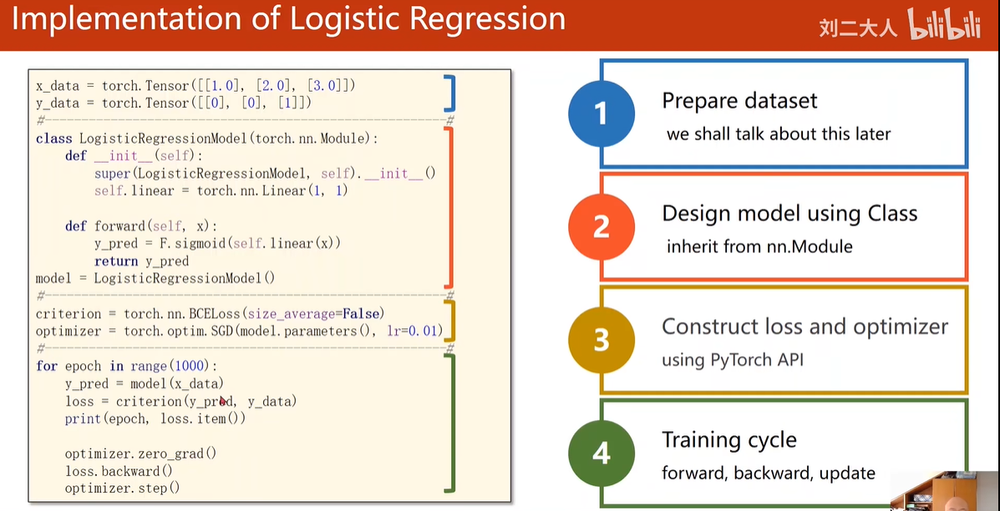
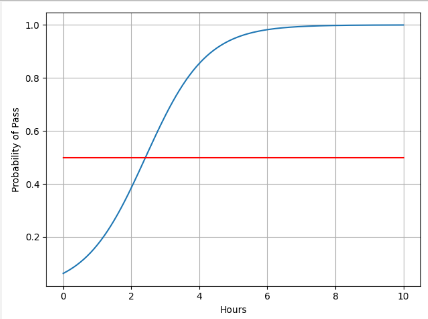
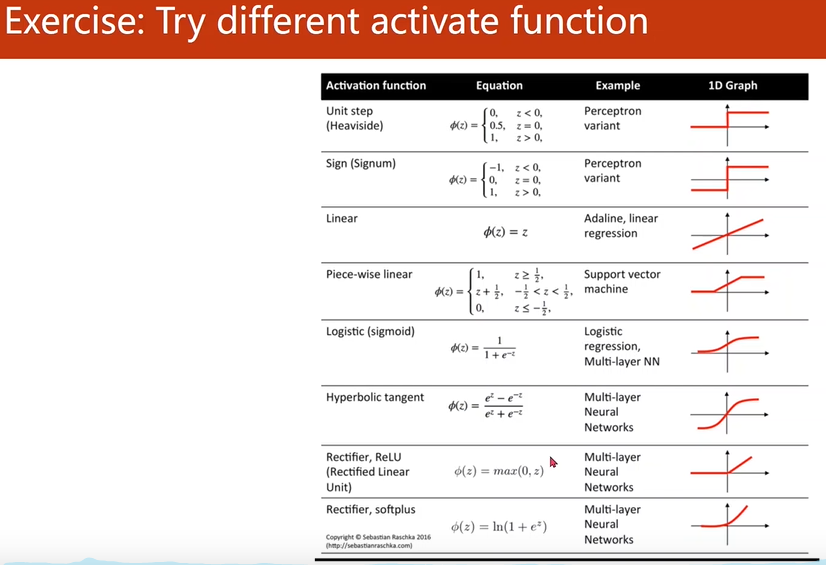
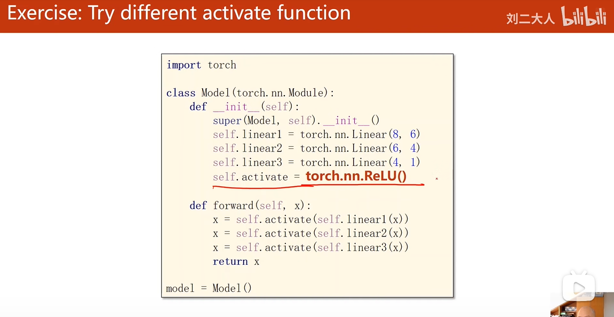
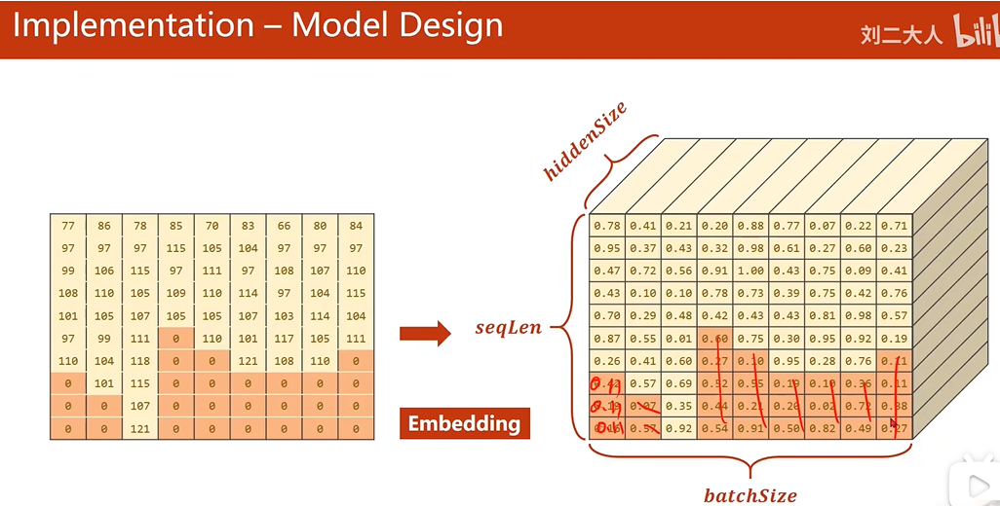
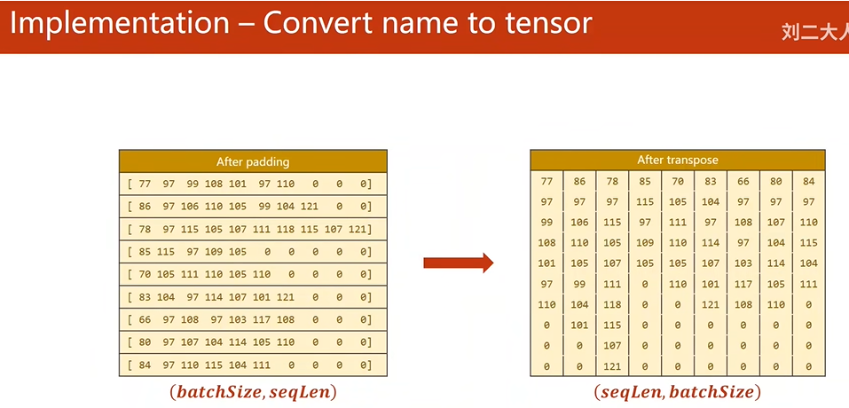

## 第一部分 概论

### 01  人工智能（AI）领域中不同学习系统的区别

**（1）基于规则的系统（Rule - based systems）**

* 流程：

  * 输入（Input）：接收原始的数据或信息，比如在一个简单的文本分类规则系统里，输入可能是一段待分类的文本内容 。

  * 人工设计的程序（Hand - designed program）：依据特定领域知识和规则编写的程序。例如在一个判断邮件是否为垃圾邮件的规则系统中，程序里会设定如包含特定关键词（“免费抽奖”“促销大酬宾” 等）就判定为垃圾邮件这样明确的规则。

  * 输出（Output）：根据程序规则处理后得到的结果，如上述例子中对邮件是否为垃圾邮件的判定结果。

* 特点：规则明确、可解释性强，但需要人工精确制定规则，面对复杂多变情况时规则编写工作量大且难以覆盖所有情形。

**（2）经典机器学习（Classic machine learning）**

* 流程：

  * 输入（Input）：获取原始数据，像图像识别任务中输入的原始图像数据 。

  * 人工设计的特征（Hand - designed features）：人工从原始数据中提取关键特征，例如在图像识别里，人工提取图像的边缘、角点、纹理等特征；在文本情感分析中，提取特定情感词、否定词等特征 。

  * 特征映射（Mapping from features）：通过特定算法（如决策树、支持向量机等模型）将提取的特征映射到相应的输出空间，比如将图像特征映射到 “猫”“狗” 等类别标签，将文本特征映射到 “积极”“消极” 情感标签 。

  * 输出（Output）：最终得到的分类、预测等结果。

* 特点：一定程度上依赖人工提取特征的能力，特征设计的好坏对模型性能影响大，泛化能力受限于特征工程。

**（3）表征学习（Representation learning）**

**1.端到端（End - to - End ）**

* 流程：

  * 输入（Input）：原始数据进入系统，比如在语音识别中输入一段原始语音信号 。

  * 特征（Features）：系统自动学习数据中的特征，与经典机器学习人工设计特征不同，这里特征学习是系统自主进行的。

  * 特征映射（Mapping from features）：将学到的特征进行映射转换，例如在语音识别中把学到的语音特征映射为文字序列 。

  * 输出（Output）：得到最终结果，如识别出的文字内容。

* 特点：无需人工手动设计特征，减少人工干预，模型可以自动学习到更适合任务的特征表示，但模型可解释性相对降低。

**2.深度学习（Deep learning）**

* 流程：

  * 输入（Input）：接收原始数据，例如在自然语言处理的机器翻译任务中，输入源语言句子 。

  * 简单特征（Simple features）：模型首先提取一些基础简单的特征，比如在图像深度学习模型里，最初可能提取一些简单的像素点组合特征 。

  * 多层更抽象特征（Additional layers of more abstract features）：通过深度神经网络的多层结构，逐步将简单特征转化为更抽象、更具语义信息的特征，如在图像模型后续层中可能提取到物体的轮廓、部件等特征；在语言模型中提取到语义短语等特征 。

  * 特征映射（Mapping from features）：将这些抽象特征映射到最终输出空间，如在机器翻译中映射为目标语言句子 。

  * 输出（Output）：产生最终的任务结果，如翻译好的句子。

* 特点：能够自动学习数据的分层特征表示，对复杂数据有强大的建模能力，但训练需要大量数据和计算资源，模型训练和调优难度较大 。

SVM（**支持向量机，Support Vector Machine**）是一种经典的**监督学习**算法，主要用于**分类**和**回归**任务，尤其在中小规模数据集中表现优异。它的核心思想是找到一个最优的决策边界（超平面），将不同类别的数据分开，并最大化分类的**鲁棒性**。

### 02 感知机的结构

感知机（Perceptron）可以理解为“单层神经网络”

**感知机的基本结构包括以下组成部分：**

**（1）输入层（Input Layer）**

接收特征向量$$\mathbf{x} = (x_1, x_2, \dots, x_n)$$

其中 xi 表示第 i 个特征值

**（2） 权重（Weights）**

每个输入对应一个权重：

$$\mathbf{w} = (w_1, w_2, \dots, w_n)$$

wi 表示第 i 个特征的权重

**（3）偏置（Bias）**

一个额外的参数 b，用于调整决策边界

**（4）激活函数（Activation Function）**

通常使用阶跃函数（Step Function）：

$$f(z) = 
\begin{cases} 
1 & \text{当 } z \geq 0 \\ 
0 & \text{当 } z < 0 
\end{cases}$$

### 03 下载PyTorch

`pip3 install torch torchvision torchaudio`

验证是否安装：

`python -c "import torch; print(torch.__version__)"`

## 第二部分 线性模型

### 01 原始数据集划分

（1）**数据集划分**

在机器学习中，通常会将原始数据集划分为**训练集（Training Set）**、**开发集（Development Set，又称验证集 Validation Set）**&#x548C;**测试集（Test Set）**。

* **训练集**：用于模型训练（调整权重参数）。

* **开发集（验证集）**：用于超参数调优、模型选择和早期停止（避免过拟合）。

* **测试集**：仅用于最终评估模型性能（模拟真实场景，**绝不参与任何训练或调参**）。

（2） **为什么需要开发集**

* 避免模型在测试集上“过拟合”：如果直接用测试集调参，模型会间接学习测试集分布，导致评估结果不真实。

* 开发集用于迭代优化，测试集仅用于最终验收。

（3）**什么是超参数**

**超参数（Hyperparameters）**&#x662F;机器学习模型在训练开始前需要手动设置（或通过算法优化）的配置参数，它们不通过训练数据直接学习得到，而是控制模型的整体行为和性能。如学习率、神经网络层数、正则化强度。

### 02 线性模型

（1）第一个式子是损失函数(loss)，是针对一个样本的。因为预测值yhat有可能大于真实值y，也可能小于真实值y，所以取平方。

（2）第二个式子是代价函数(cost)，是针对整个训练集的。即平均平方误差(MES)，将每个样本的预测值和真实值相减取平分后求平均值。使用优化算法（如梯度下降）迭代更新 w，通过代价函数以找到最优w。

### 03 代码实践

（1）项目1

上图中，显示的是w和代价的关系。之后更多是将x坐标改成迭代次数来绘制图片。

（2）项目2

### 04 visdom

visdom是模型训练可视化常用的一种工具，可以与模型持久化工具（如 PyTorch 的 `torch.save` 或 TensorFlow 的 `model.save`）结合使用，**提供模型持久化（保存/加载模型）的功能**

## 第三部分 梯度下降算法

### 01 梯度下降

（1）计算导数

（yhat预测值-y准确值）的平分求和再取平均值，即为代价函数cost，即前面讲到的平均平方误差。cost对w求导可得倒数

（2）更新w

使用梯度下降更新w，w=w-学习率乘导数

### 02 **凸函数（Convex Function）**&#x548C;**非凸函数**

**（1）凹函数**

函数图像上任意两点连线位于函数曲线上方

**唯一全局最小值**：凸函数的局部最小值即全局最小值，优化算法（如梯度下降）一定能找到最优解。

**典型例子：**&#x7EBF;性回归的均方误差（MSE）损失函数。逻辑回归的负对数似然损失（当参数线性时）。

**（2）非凹函数**

不满足凸性条件的函数称为非凸函数。函数图像存在“凹陷”或“鞍点”。

**多个局部极小值**：优化算法可能陷入局部最优而非全局最优。

**典型例子**：神经网络（尤其是深度网络）的损失函数。矩阵分解、混合模型等非线性问题。

**（3）直观理解**

**凸函数**：像一碗平滑的汤，只有一个最低点。

**非凸函数**：像崎岖的山地，有多个坑洼（局部极小）和山脊（鞍点）。

**（4）非凸优化的应对策略**

**随机初始化**：避免算法陷入糟糕的局部极小值。

**动量法（Momentum）**：加速收敛并逃离鞍点。

**自适应学习率**：如Adam、RMSprop调整参数更新步长。

**批量归一化（BatchNorm）**：平滑优化地形。

**模拟退火/遗传算法**：启发式搜索全局最优。

### 03 **BGD、SGD、Mini-batch GD**

在机器学习中，**批量梯度下降（BGD）、随机梯度下降（SGD）、和小批量梯度下降（Mini-batch GD）**&#x662F;三种常用的优化算法，核心区别在于**每次参数更新时使用的数据量不同**。

**（1）批量梯度下降（Batch Gradient Descent, BGD）**

**工作原理**：

**特点**：

**适用场景：**

小规模数据集或凸优化问题（如线性回归）。

**（2）随机梯度下降（Stochastic Gradient Descent, SGD）**

**工作原理**：

每次迭代**随机选择一个样本**计算梯度并更新参数。

**特点**：

**适用场景**：

大规模数据训练或非凸优化（如深度学习）。

**（3）小批量梯度下降（Mini-batch Gradient Descent）**

**工作原理**：

每次迭代使用**一小批样本（batch）**&#x8BA1;算梯度（平衡BGD和SGD）。

**特点**：

**适用场景**：

绝大多数深度学习任务（如训练神经网络）。

**（4）如何选择**

**数据规模**：

**模型类型**：

**硬件条件**：

GPU可用 → **Mini-batch GD**（利用并行计算）。

### 04 代码实现

**（1）BGD**

**（2）SGD**

**关键说明**

1. **SGD的核心特点**：

   * **随机性**：每次迭代随机选择一个样本 (`np.random.choice`) 计算梯度。

   * **高方差**：梯度估计噪声大，收敛路径震荡（但可能逃离局部最优）。

2. **超参数选择**：

   * **学习率&#x20;**`lr`：
     当前设为 `0.00001` 是因为单个样本的梯度可能较大，需小学习率防止发散。

     * 若损失不下降，尝试增大（如 `0.0001`）；若震荡剧烈，尝试减小。

   * **终止条件**：
     当单个样本的损失 `<1e-7` 时停止（注意：SGD的损失是逐样本的，可能波动较大）。

3. **与BGD的区别**：

   * BGD用全部数据计算梯度，SGD用单个样本，因此：

     * SGD更快（每次迭代计算量小）。

     * SGD需要更多迭代次数才能稳定收敛。

4. **输出验证**：

   * 最终权重 `w` 应接近 `2.0`（真实关系）。

   * 训练后 `forward(400, w)` 应接近 `800`。

SGD每次迭代仅基于一个或少量样本（mini-batch）计算梯度，这使得梯度估计具有噪声。与使用全数据集的BGD（批量梯度下降）相比，这种随机性导致参数更新方向不完全指向全局最优解，而是围绕最优解震荡（类似“醉汉走路”）。这种震荡在损失函数曲面复杂（如存在鞍点、局部极小值）时尤为明显。

**负面影响**

**潜在优势**

**（3）Mini-batch GD**

**代码说明：**

1. **数据准备**：

   * 创建了y=2x的完美线性数据集用于测试

2. **模型定义**：

   * 简单线性模型：y = w\*x

   * 使用均方误差(MSE)作为损失函数

3. **训练过程**：

   * 使用小批量梯度下降(Mini-batch GD)

   * 每次迭代随机选取2个样本(batch\_size=2)计算梯度和更新权重

   * 学习率设置为0.00001

4. **训练监控**：

   * 记录每个epoch的损失值

   * 绘制损失变化曲线

   * 训练前后测试模型在未见数据(x=400)上的预测能力

5. **停止条件**：

   * 当损失值小于1e-7时提前停止训练

## 第四部分 反向传播

### 01 反向传播

反向传播是训练神经网络的核心算法，用于高效计算损失函数对网络参数的梯度。它通过**链式法则**将误差从输出层逐层传递回输入层，指导参数更新。

**前向传播**：输入数据通过网络计算预测值，得到损失（Loss）。

**反向传播**：从输出层开始，按网络结构的反向顺序计算损失对每个参数的梯度。

**参数更新**：利用梯度下降法优化参数。

### 02 前向传播和反向传播的计算

### 03 **Tensor（张量）**

张量是深度学习中**数据表示和计算的核心载体**，可视为高维数组的数学抽象。

**自动微分支持**：张量记录计算图，实现梯度自动传播。Tensor 中指定需要计算梯度，requires\_grad = True

### 04 代码实践

使用PyTorch的自动微分功能手动实现线性回归训练过程。使用 PyTorch 库通过梯度下降算法来学习函数 *y*=2*x* 的权重参数 *w*。

前向计算、反向传播、参数更新、梯度清零

训练前：输入4输出≈4.0（因为w初始为1.0）

训练后：输入4输出≈8.0（w应接近2.0）

最终权重w应接近2.0，输入4的输出接近8.0。

## 第五部分 用pytorch实现线性回归

### 01 代码实现

**（1）数据准备**：定义了输入数据`x_data`和标签`y_data`，模拟线性关系`y = 2x`。

**（2）模型定义**：创建了一个简单的线性模型`LinearModel`，包含一个线性层（`torch.nn.Linear`）。

**（3）训练配置**：

**（4）训练过程**：

**（5）结果输出**：

## 第六部分 Logistic回归

### 01  pytorch中的MNIST数据集和CIFAR数据集

使用 `torchvision` 加载 MNIST 数据集

### 02 逻辑回归损失函数

### 03 线性回归和逻辑回归代码区别

逻辑回归交叉熵：

### 04 代码实现

学习时间和通过率的关系，使用逻辑回归预测通过率

## 第七部分 处理多维特征的输入

### 01 `torch.nn.Linear`

`torch.nn.Linear` 是 PyTorch 中的一个全连接层（线性层），用于对输入数据进行线性变换

下图中定义了一个线性层，输入维度是8维，输出维度是1维

### 02 处理多维特征的输入的步骤

1.准备数据集

2.定义模型

3\. 定义损失函数和优化器

4\. 重复迭代

### 03 尝试其他激活函数

### 04 代码实现

## 第八部分 加载数据集

### 01 数据加载

**样本 (Sample)**：一条独立的数据（如一张图片、一段文本）。

**Batch Size**：每次迭代时模型同时处理的样本数（你设为2）。

**Iteration**：完成一个epoch需要的批次数（= 总样本数 / Batch Size）。

**Epoch**：所有训练样本被模型完整遍历一次的轮次。

**Shuffle**：每个epoch开始时是否打乱样本顺序（避免模型记忆固定顺序）。

例如：8个样本、shuffle是打乱样本的顺序，Batch-szie为2，iteration 就是 8 / 2 为4，epoch是训练集进行几个轮次的迭代。

### 02 dataset和dataloader

`Dataset`：定义数据的存储和访问方式（必须实现 `getitem` 和 `len`）。

`DataLoader`：负责从 `Dataset` 中高效加载数据，支持批处理、shuffle、并行加载等。

典型流程：

### 03 代码实现-使用minibatch对数据集进行训练

**步骤：**

1.准备数据集（Dataset + DataLoader）

2.定义模型

3.定义损失函数和优化器

4.Mini-Batch 训练循环（外层循环控制 epoch（完整遍历数据集的次数），内层循环遍历 DataLoader 返回的 Mini-Batch）

## 第九部分 多分类问题

### 01 独热编码 (One-Hot Encoding)

**定义**：将具有N个不同类别的特征转换为N个二进制特征，每个特征对应一个类别，只有一个特征为1(热)，其余为0(冷)

**目的**：解决分类数据在算法中的数值表示问题，避免数值大小关系误导模型

**优点:**

1.消除类别间的数值大小关系

2.适用于大多数机器学习算法

3.实现简单直观

**缺点:**

1.当类别很多时会导致维度爆炸(高维稀疏矩阵)

2.不适用于树模型(可能降低性能)

3.无法表达类别间的潜在关系

### 02 Softmax 函数

Softmax 函数是机器学习中常用的激活函数，特别适用于多分类问题的输出层。

**定义**：将一组实数转换为概率分布的函数，输出值的总和为1

**公式**：对于输入向量 z = (z₁, z₂, ..., zₙ)，Softmax的计算为：

**输出范围**：每个输出值在(0,1)区间内，所有输出值之和为1

公式中，每个 z 就对应了多个分类的得分值。SoftMax对得分值进行了如下处理：

1.以e为底数进行了指数运算，算出每个分类的 eZi，作为公式的分子

2.分母为各分类得分指数运算的加和。

3.根据公式很自然可以想到，各个分类的SoftMax值加在一起是1，也就是100%。所以，每个分类的SoftMax的值，就是将得分转化为了概率，所有分类的概率加在一起是100%。

这个公式很自然的就解决了从得分映射到概率的问题。

那它又是怎么解决两个得分相近的问题的呢？

指数增长的特性就是，横轴变化很小的量，纵轴就会有很大的变化。从而，我们可以更加明确的知道，图片的分类应该属于最大的那个。指数让得分大的分类最终的概率更大，得分小的分类最终的概率更小

### 03 交叉熵

交叉熵是信息论和机器学习中非常重要的概念，主要用于衡量两个概率分布之间的差异。

1.作为损失函数：

2.与Softmax的关系：

### 04 代码实现（MNIST 手写数字识别）

**0.导入包**

**1.准备数据集**

**2.建立模型**

**3.交叉熵损失和优化器**

**4.训练和测试**

## 第十部分 卷积神经网络（基础篇）

### 01 卷积神经网络

### 02 卷积核的权重张量

m： 卷积核的个数（输出通道数 *Cout*）决定输出特征图的通道数

n：输入数据的通道数（*Cin*） 必须与输入数据的通道数一致

kw：卷积核的宽度（如 3、5）  空间维度（横向）

kh：卷积核的高度（如 3、5）   空间维度（纵向）

### 03 代码实现1

使用 PyTorch 创建一个简单的 2D 卷积层（`nn.Conv2d`），并对随机生成的输入数据进行卷积操作。

### 04 代码实现2

使用PyTorch进行手动定义的2D卷积操作，主要目的是：

1.展示卷积的基本计算过程

2.验证padding如何保持特征图尺寸

3.演示如何手动设置卷积核参数

### 05 代码实现3

使用PyTorch实现2D最大池化（Max Pooling）操作，主要目的是：

1.展示最大池化的基本计算过程

2.验证池化操作对特征图的降维效果

3.演示如何用PyTorch实现池化层

### 06 代码实现4

使用卷积神经网络（CNN）实现了MNIST手写数字识别任务

## 第十一部分 卷积神经网络（高级篇）

### 01 Inception模块

Inception模块的设计理念是并行执行多种卷积运算并将它们的输出拼接起来，使网络能够同时捕捉不同尺度的特征。

一个基础的Inception模块包含四条并行路径：

1、1×1卷积 - 捕捉局部特征

2、1×1卷积 + 3×3卷积 - 捕捉稍大范围特征

3、1×1卷积 + 5×5卷积 - 捕捉更大范围特征

4、3×3最大池化 + 1×1卷积 - 捕捉池化后的特征

所有路径的输出会沿通道维度进行拼接(concatenate)。

### 02 1×1卷积

1×1卷积（又称点卷积，Pointwise Convolution）是指使用1×1大小的卷积核在输入特征图上进行滑动窗口计算。

1×1卷积相当于对每个空间位置的所有通道进行加权组合，实现跨通道的特征交互。

降维（Bottleneck）：减少计算量（如Inception模块先用1×1卷积降维，再做3×3或5×5卷积）

在深度网络中，大尺寸卷积（如3×3、5×5）的计算成本很高。1×1卷积可以先降低通道数，再进行大卷积计算，从而大幅减少计算量。

### 03 Inception Moudle 的代码实现

**每个通道的代码：**

**拼接到一起：**

**总结：**

### 04 代码实现1

使用 Inception模块 和传统CNN结合的神经网络，在MNIST手写数字数据集上进行分类任务

数据预处理：

Inception 模块：

网络架构：

训练过程：

评估过程：

### 05 Residual Network (ResNet)&#x20;

传统深层网络（如VGG）随着层数增加会出现梯度消失/爆炸，导致训练困难。实验发现，深层网络的训练误差反而比浅层网络更高（退化问题，Degradation Problem）

ResNet（残差网络）是2015年由微软研究院提出的革命性CNN架构，通过引入残差连接（Skip Connection）解决了深层网络训练难题.

ResNet提出学习残差（Residual）而非直接学习目标映射：

输出=*F*(*x*)+*x*

其中：

*x*：输入

*F*(*x*)：残差函数（即卷积层的变换）

+：通过跳跃连接（Skip Connection）实现

### 06 Residual Block、简单Residual Network 的代码实现

### 07 代码实现2

基于残差网络（Residual Network）的 MNIST 手写数字识别系统

数据准备：使用 torchvision 加载 MNIST 数据集，并进行预处理（转换为张量和归一化）。

模型设计：

训练设置：

训练与评估：

## 第十二部分 循环神经网络（基础篇）

### 01 RNN

RNN（Recurrent Neural Network，循环神经网络）是一种专门用于处理序列数据的神经网络架构，在自然语言处理、语音识别、时间序列预测等领域有广泛应用。

RNN的核心特点

1.记忆功能：能够保存之前步骤的信息

2.循环连接：网络中存在循环结构，信息可以随时间步传递

3.顺序处理：逐个处理序列中的元素

运算过程：
h0和x1经过某种运算将他们拼接在一起，即：分别做线性变换，然后求和，生成h1。然后把h1,作为输出送到下一次RNN cell计算中，这次输入变成x2，x2和h1合在一起运算，生成h2等。

### 02 RNN Cell（循环神经网络单元）

RNN Cell 是循环神经网络的基本计算单元，定义了单个时间步内的状态计算方式。

**参数说明：**

`h_t`: 当前时间步的隐藏状态

`h_{t-1}`: 前一时间步的隐藏状态

`x_t`: 当前时间步的输入

`W_hh`: 隐藏状态到隐藏状态的权重矩阵

`W_xh`: 输入到隐藏状态的权重矩阵

`b_h`: 隐藏状态偏置

`y_t`: 当前时间步的输出

具体计算过程：

输入xt先做线性变换，h t-1也是，xt的维度是input\_size,h t-1的维度是hidden\_size,输出ht的维度是hidden\_size，我们需要先把xt的维度变成hidden\_size,所以Wih应该是一个 hidden\_size\*input\_size的矩阵，Wih \* xt得到一个 hidden\_size\*1的矩阵（就是维度为hidden\_size的向量），bih是偏置。输入权重矩阵Whh是一个hidden\_size\* hidden\_size的矩阵。

whhHt-1+bhh和WihXt+bih都是维度为hidden\_size的向量，两个向量相加，就把信息融合起来了，融合之后用tanh做激活，循环神经网络的激活函数用的是tanh,因为tanh的取值在-1到+1之间，算出结果得到隐藏层输出ht。

把RNN Cell以循环的方式把序列（x1,x2,…）一个一个送进去，然后依次算出隐藏层(h1,h2…)的过程,每一次算出来的h会作为下一个RNN Cell的输入，这就叫循环神经网络 。

### 03 在pytorch中实现 RNN Cell

### 04 在pytorch中实现 RNN

### 05 RNN中的num\_layers

`num_layers`是RNN架构中的一个重要超参数，用于控制网络的深度（堆叠的RNN层数）。

`num_layers`表示堆叠的RNN层数

当num\_layers>1时，形成堆叠RNN(Stacked RNN)

每一层的输出作为下一层的输入

### 06 案例1及其代码实现

使用RNN Cell训练模型，来学习“hello”到“ohlol”的转换

输入应该是个向量，使用独热编码

**输出结果：**

**目标：**&#x8BAD;练一个简单的RNN模型，学习从输入序列"h e l l o"到输出序列"o h l o l"的映射关系

**数据处理：**

**模型结构：**

**训练过程：**

**预期输出：**

## 第十三部分 循环神经网络（高级篇）

### 01 案例介绍

基于PyTorch实现的RNN(GRU)分类器，用于根据人名预测其所属国家。

**模型：**

x经过嵌入层，使用GRU模型，在通过线性层输出，hn是最后一层隐藏层的输出

输入的x是序列，且每个序列的长短不一

**代码整体功能：**

数据预处理：读取压缩的CSV文件，包含人名和国家标签

构建RNN分类模型：使用GRU网络和嵌入层

训练和测试模型：包含训练循环和测试评估

可视化结果：绘制准确率随训练轮次变化的曲线

### **02 实现过程**

**准备数据：**

将人名转换为ASCII码，国家转换为类别索引

paading，保证每个序列的长度相同

**pack\_padded\_sequence：**

`pack_padded_sequence` 是 PyTorch 中处理变长序列的重要函数，用于优化 RNN 对填充序列的计算效率。

性能优势：

1.计算加速 - 避免在填充位置上进行计算

2.内存节省 - 不存储重复的填充数据

3.数值稳定性 - 防止填充值影响梯度计算

**把名字转换成tensor的步骤：**

最终有一个矩阵和每个字符串长度的列表

1.字符串变字符，字符变ascii

2.填充

3.转置

4.排序

### 03 代码实现

