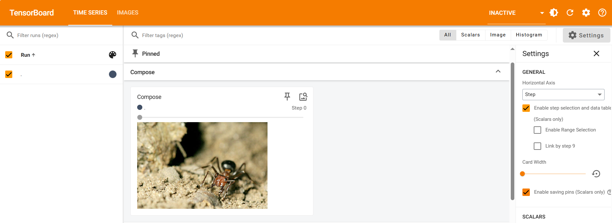
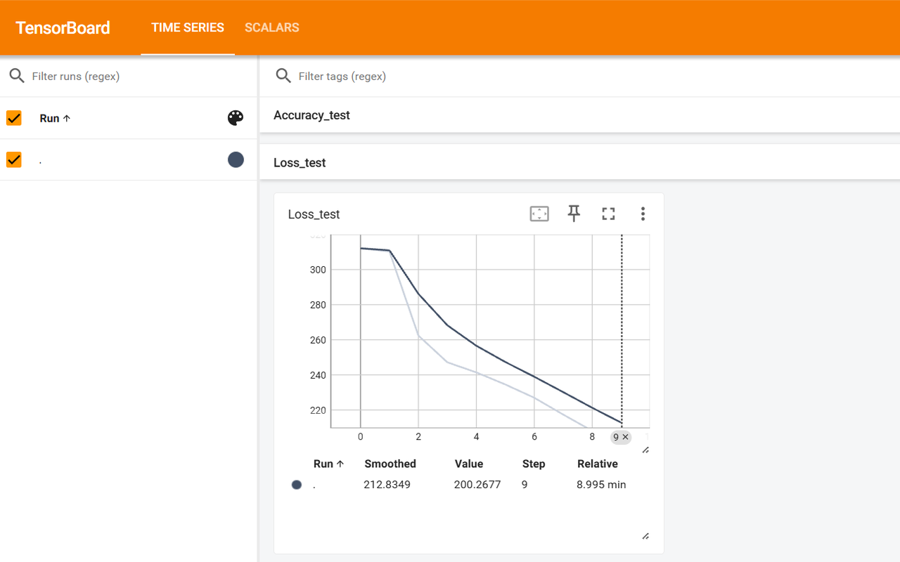

### 00 视频传送门

### 01 pytorch环境的配置及安装

**anaconda的历史版本下载网站：**

修改安装路径（最好非C盘）后默认

在开始菜单打开anaconda Prompt，显示base则说明安装成功

**GPU:**

打开任务管理器，性能选项中正常显示GPU，则说明显卡的驱动已经正确安装

**创建环境：**

打开anaconda Prompt

`conda create -n pytorch python=3.6`创建一个名为 "pytorch" 的 Conda 虚拟环境，并指定 Python 版本为 3.6

`y`安装 包

`conda activate pytorch` 激活名为 `pytorch` 的 Conda 虚拟环境

安装pytorch：

在此网站下查看gpu是否支持cuda

输入`nvidia-smi`,其中driver version要大于396.26，否则官网点击更新驱动

在刚才的环境下安装pytorch

使用`pip list`查看有torch

输入python查看是否安装成功

gpu是否能被使用

### 02 python编辑器的选择、安装及配置

pycharm的解释器：

用的是刚才anaconda下的python路径

jupyter默认安装在base环境下，如果要在pytorch的环境下打开，需要先安装包

`conda install nb_conda`

安装不成功我又安装了这个

`conda install ipykernel`

然后进入pytorch环境中

`jupyter notebook`打开jupyter

### 03 python两大函数

**dir() 查看当前目录下的文件/文件夹列表**

**help() 获取帮助**

### 04 pycharm及jupyter使用及对比

### 05 pytorch加载数据初认识

**Dataset：**

定义数据的存储方式和索引方式

**DataLoader：**

批量加载数据，支持多线程和随机打乱

### 06 Dataset类代码实践

这段代码实现了一个自定义PyTorch数据集类，主要用于加载和访问图像分类数据集。

**图像数据加载**：从指定目录读取图像文件（如JPG/PNG）

**自动标注**：使用子目录名作为图像标签（如`ants`、`bees`）

**数据集接口**：提供标准化的数据访问方式（通过索引获取样本）

### 07 TensorBoard的使用（一）

TensorBoard 是 TensorFlow 官方提供的可视化工具，主要用于帮助用户理解和优化机器学习模型的训练过程。它通过交互式仪表盘展示模型的结构、训练指标、数据分布等信息，让开发者能更直观地调试和优化模型。

**在pytorch环境下安装tensorboard**

`pip install tensorboard`

**代码实战：**

使用 PyTorch 的 TensorBoard 工具（`SummaryWriter`）记录数据到日志文件，用于可视化。100 个标量数据点（通过 `add_scalar` 记录，模拟 `y=2x` 函数）。生成的日志文件保存在 `logs/` 目录下，可通过 `tensorboard --logdir=logs` 在浏览器中查看可视化结果。

模拟了一个简单的线性关系(y=2x)，实际使用时可以替换为真实的训练指标（如loss、accuracy等）

运行这段代码后，会在当前目录下生成一个`logs`文件夹，包含TensorBoard可读取的事件文件

**查看可视化结果：**

在命令行运行`tensorboard --logdir=logs --port=6007`

是一个命令行指令，用于启动 TensorBoard 服务，并告诉它从 `logs` 目录读取日志数据（即 `SummaryWriter` 保存的数据）

TensorBoard 会读取该目录下的所有事件文件（`.tfevents` 或 `.pt` 文件），并在网页端可视化数据（如损失曲线、准确率等）。

`--port=6007`避免端口冲突，适用于多实验或 6006 被占用的情况。

如果不指定端口，默认使用 `6006`（访问 `http://localhost:6006`）。

**注意事项：**

1.确保已安装tensorboard包（可通过`pip install tensorboard`安装）

2.不要将脚本命名为tensorboard.py（会导致导入冲突）

3.每次运行会生成新的事件文件，建议定期清理旧的日志文件

### 08 TensorBoard的使用（二）

**安装 OpenCV（本教程未用）：**

`pip install opencv-python`

OpenCV 是一个广泛使用的开源计算机视觉和机器学习软件库，提供了丰富的函数和算法，用于处理图像和视频数据。

**代码实战：**

使用 PyTorch 的 TensorBoard 工具（`SummaryWriter`）记录一张图片（通过 `add_image` 记录），到日志文件，用于可视化。生成的日志文件保存在 `logs/` 目录下，可通过 `tensorboard --logdir=logs` 在浏览器中查看可视化结果。

当修改图片路径，并将`writer.add_image('test',img_array,1,dataformats='HWC')`中的`global_step`改成2，TensorBoard 会生成一个滑动条，允许用户查看不同 `step` 对应的图片（例如训练过程中生成的中间结果）。如在 TensorBoard 的 "Images" 选项卡中，会显示滑动条供切换查看 `step=1` 和 `step=2` 的图片。

**注意事项：**

**1.为什么要加 `dataformats='HWC'`？**

图片数据在内存中的存储格式可能不同，常见的有：

**HWC** (Height, Width, Channels)：OpenCV、PIL 等库的默认格式（如 `(512, 768, 3)`）。

**CHW** (Channels, Height, Width)：PyTorch 张量的默认格式（如 `(3, 512, 768)`）。

如果直接传递 NumPy 数组（通常为 HWC）而不指定 `dataformats`，TensorBoard 可能因维度误解而显示错乱（如颜色通道错位、图片扭曲）。

本代码中的输入数组形状：`(高度=512, 宽度=768, 通道=3)`，即 `HWC`。

不加 `dataformats` 的后果：TensorBoard 默认可能尝试按 `CHW` 解析，导致将 `768` 误认为通道数，引发错误或显示异常。

### 09 Transforms的使用（一）

**打开`structure`窗口：**

快捷键Alt+7

**代码实战：**

这段代码演示了如何使用transforms

1.使用Pillow库加载一张图片

2.使用torchvision.transforms的ToTensor()转换器：

3.打印输出转换后的张量信息

**transforms的使用：**

先创建实例，再使用

### 10 Transforms的使用（二）

**查看函数的参数：**

快捷键`ctrl+p`

**代码实战：**

1.在08 TensorBoard的使用（二）中，用PIL读取图片，并转为numpy数组，然后使用`writer.add_image('test',img_array,1,dataformats='HWC')`*将图片写入TensorBoard日志*

2.此处，使用`torchvision.transforms`的`ToTensor()`转换器，将图片从PIL格式转换为`PyTorch`张量格式，使用`writer.add_image("Tensor_img",tensor_img)`，将转换后的张量图像写入TensorBoard日志

在终端运行`tensorboard --logdir=logs --port=6007`查看可视化

**关键说明：**

1.维度转换：ToTensor()自动将HWC转为CHW，所以add\_image()不需要dataformats参数

2.数值归一化：像素值从0-255自动缩放到0-1，适合神经网络处理

3.TensorBoard可视化：运行后可通过`tensorboard --logdir=logs`查看图像

### 11 常见的Transforms（一）

**\_\_call\_\_的使用**

让类的实例可以像函数一样被调用

**ToTensor、Normalize的使用：**

**ToTensor的结果：**

**Normalize的结果：**

计算公式：output = (input - mean) / std，假设mean和std都是0.5，原来的输入为0\~1，则归一化之后为-1\~1

发现图片颜色变了

### 12 常见的Transforms（二）

**小技巧：**

当输入r，也可提示R开头的函数

第一个区分大小写不打钩即可

**Resize、Compose、RandomCrop的使用：**

**Resize的结果：**

将图像调整为300x300像素（可能改变原始宽高比）

transforms.Resize((300, 300))

**Compose的结果：**

此处使用Compose实现Resize的效果，将多个Transform函数组合起来，此处是将Resize和toTensor组合起来

仅指定短边为300像素（保持原始宽高比）
transforms.Resize(300)  单个参数表示短边长度

**RandomCrop的结果：**

随机裁剪300x300的区域
trans\_random = transforms.RandomCrop(300)

### 13 torchvision中的数据集使用

**官方数据集：**

左上角选择0.9.0版本，可以查看官方提供的数据集

**Dataset和Transform的联合使用**

[CIFAR](https://docs.pytorch.org/vision/0.9/datasets.html#id19)数据集的使用说明：

查看数据集图片：

下载数据集：

CIFAR10的每张图片是32x32的RGB图像，标签是0\~9的整数，对应`classes`中的类别名称。这个是第一张图片

### 14 DataLoader的使用

**Dataset和DataLoader：**

`原始数据` → `Dataset`（存储+单样本处理） → `DataLoader`（批量加载+加速） → 模型输入

DataLoader：把数据加载到神经网络中，相当于如何从一堆扑克牌（数据集）中抓取几张或如何抓取

**加载CIFAR10测试集数据：**

加载CIFAR10测试集数据，用DataLoader批量处理，并通过TensorBoard可视化图片数据

数据加载：使用`torchvision`加载CIFAR10测试集（10类彩色图像，尺寸32x32）。

数据预处理：通过`ToTensor()`将图像转为PyTorch张量（形状`[3, 32, 32]`，值范围\[0,1]）。

批量处理：用`DataLoader`将数据分批次（每批64张），支持打乱顺序（`shuffle=True`）。

可视化：通过TensorBoard展示所有批次的图片，按epoch和步骤分类。

显示形式：
每批次的64张图片会被自动排列成一个 网格（grid），在TensorBoard的`Images`标签页中显示。

标签信息：
每组图片的标题格式为 `Epoch:{epoch}`（例如`Epoch:0`、`Epoch:1`），并通过`step`参数记录批次序号。

### 15 神经网络的基本骨架——nn.Module的使用

**torch.nn 神经网络模型的文档介绍：**

**PyTorch 神经网络模块示例：**

创建一个自定义的神经网络层（`nn.Module`）

核心操作：实现一个“输入值加1”的运算（`output = input + 1`）。

演示目的：

在 PyTorch 中，`forward` 方法可以通过直接调用类实例（如 `m(x)`）来触发，这是因为 `nn.Module` 基类实现了 `call` 方法

### 16 神经网络——卷积操作

**torch.nn.functional.conv2d的说明文档：**

**卷积计算：**

PyTorch中基本的2D卷积操作，以及不同参数对结果的影响

1.卷积操作需要输入是4D张量：(batch\_size, channels, height, width)

`batch_size`：一次性处理的样本（图像）数量。
`channels`：图像的通道数&#x20;

RGB彩色图：3通道

特殊：可能有更多通道（如深度图）

`height`：图像的垂直高度（像素数）

`width`：图像的水平宽度（像素数）

2.输出形状：

### 17 神经网络——卷积层

**Conv2d的文档说明：**

**卷积动画演示：**

**卷积层计算公式：**
输出高度 = (输入高度 + 2\*padding - kernel\_size) // stride + 1

**简单的 卷积神经网络(CNN)前向传播：**

对CIFAR10测试集图像进行卷积操作，并使用TensorBoard可视化：

创建 `nn.Conv2d` 层时，没有手动指定权重，PyTorch会自动初始化卷积核

### 18 神经网络——最大池化的使用

**MaxPool2d的文档说明：**

**ceil\_mode：**

`ceil_mode` 是池化操作（如 `MaxPool2d`、`AvgPool2d`）的一个参数，用于控制当输入尺寸无法被池化核尺寸（`kernel_size`）和步长（`stride`）整除时，输出尺寸的计算方式。

`ceil_mode` 的作用：

`ceil_mode=True`：输出尺寸按向上取整（ceil）计算，保留边缘的剩余数据。

`ceil_mode=False`（默认）：输出尺寸按向下取整（floor）计算，直接舍弃无法覆盖的边缘数据。

**最大池化：**

**最大池化的作用：**

最大池化（Max Pooling） 是卷积神经网络（CNN）中最常用的池化操作之一，其核心作用是提取局部区域的最显著特征，同时实现降维和平移不变性。

1.保留最显著特征

提取局部最大值：在滑动窗口（如 `2x2` 或 `3x3`）内取最大值，忽略其他数值。

突出关键特征：例如，在图像中，最大值可能对应边缘、纹理或特定模式的激活，保留这些值能增强有用信号的强度。

2.降低特征图尺寸（下采样）

减少计算量：通过压缩特征图的宽和高（如 `4x4` → `2x2`），大幅减少后续层的参数和计算负担。

扩大感受野：每个池化后的像素对应原始图中更大的区域，帮助网络捕捉更广的上下文信息。

3.增强平移不变性

对微小位移不敏感：即使目标在输入中轻微移动，最大池化仍可能捕获到相同的最大值（只要特征在池化窗口内）。

鲁棒性提升：适用于分类任务，因为分类更关注“是否存在特征”而非“特征的具体位置”。

4.减少过拟合风险

降低特征图维度：间接减少了模型的复杂度，类似一种正则化手段。

抑制噪声：忽略非极大值，可能过滤掉一些不重要的细节或噪声。

### 19 神经网络——非线性激活

**ReLU的文档说明：**

**参数：inplace** ([bool](https://docs.python.org/3/library/functions.html#bool)) – can optionally do the operation in-place. Default: `False`

一般情况说用Flase，即默认

**ReLU激活函数：**

定义一个简单的神经网络模块，并使用 ReLU激活函数 处理输入数据

**Sigmoid的文档说明：**

**Sigmoid激活函数：**

了一个 图像数据（CIFAR10）的Sigmoid激活函数可视化实验，主要目的是通过TensorBoard对比观察原始图片和经过Sigmoid处理后的效果差异。

Sigmoid函数会将所有输入值映射到(0,1)区间，因此在TensorBoard中会看到图像亮度/对比度的变化。

### 20 神经网络——线性层及其它层介绍

**Linear的文档说明：**

**torch.flatten的文档说明：**

`torch.flatten` 是 PyTorch 中的一个函数，用于将输入张量展平成一维或指定维度的张量。

`torch.flatten(input, start_dim=0, end_dim=-1)`

作用：将输入张量的连续维度展平

参数：

**Linear层：**

用线性层将196608维输入映射到10维输出

### 21 神经网络——搭建小实战和Sequential的使用

**Sequential的文档说明：**

在PyTorch中，`nn.Sequential` 是一个顺序容器，用于按顺序组合多个网络层。它可以简化模型定义，特别适用于简单的线性堆叠结构。

**CIFAR10的神经网络模型结构：**

图像尺寸：32×32 RGB图像

类别数：10类（飞机、汽车、鸟等）

在第一次卷积的时候，即conv1时，由于图中未给出padding的值，而图片经过卷积后仍然为32\*32，可以通过以下公式进行计算

分母=32+2\*padding-(5-1)-1=27+2\*padding=31  padding=2

在此处dilation默认为1，即空洞卷积为1，没有使用空洞卷积，但stride不知道，但stride不能太大，否则padding会很大，所以stride为1，padding为2

**tensorboa可视化显示：**

### 22 损失函数与反向传播

**L1Loss的文档说明：**

`reduction` (str, *可选*): 指定损失的缩减方式，可选：

**MSELoss的文档说明：**

**L1Loss和MSELoss：**

使用PyTorch的L1Loss（平均绝对误差损失） 计算预测值（`input`）与真实值（`targets`）之间的误差，并展示了不同 `reduction` 参数（`'mean'` 和 `'sum'`）对计算结果的影响。

**CrossEntropyLoss的文档说明：**

**CrossEntropyLoss：**

使用PyTorch计算交叉熵损失（CrossEntropyLoss）

1.模型输出`[0.1, 0.2, 0.3]`（3个类别的原始分数/未归一化的logits）

2.真实类别是第1类（注意索引从0开始）

3.计算预测输出与真实标签之间的交叉熵损失

**为什么要`x = torch.reshape(x, (1, 3))`：**

在PyTorch中，`x = torch.reshape(x, (1, 3))` 这行代码的作用是将张量 `x` 的形状从 `(3,)`（一维，3个元素）调整为 `(1, 3)`（二维，1行3列）

神经网络通常以 批次（batch） 的形式处理数据，即使只有一个样本，也会表示为 `(batch_size, ...)` 的形式。

原始输入 `x = [0.1, 0.2, 0.3]` 的形状是 `(3,)`，表示3个数值，但缺乏明确的批次维度。

调整后的形状 `(1, 3)` 明确表示：

**为什么重要？**
PyTorch的损失函数（如 `CrossEntropyLoss`）默认要求输入是二维的：

第一维是批次（batch）

第二维是类别分数（logits）

**在图像分类神经网络中运用损失函数：**

实现了一个完整的 图像分类神经网络训练流程，使用 CIFAR-10 数据集和自定义的卷积神经网络（CNN）

代码功能总结：

1\. 加载CIFAR10测试集并进行预处理

2\. 定义一个包含3个卷积层和2个全连接层的CNN模型

3\. 使用交叉熵损失函数计算模型输出与真实标签的差异

4\. 对每个样本进行前向传播和反向传播

5\. 输出训练过程标记

注意事项：

1.这里batch\_size=1，实际训练通常会使用更大的batch

2.没有显示优化器，实际训练需要添加优化器步骤

3.这只是演示流程，完整训练还需要验证和测试环节

### 23 优化器

TORCH.OPTIM的官方文档：

**在图像分类神经网络中使用优化器：**

实现了一个完整的图像分类神经网络训练流程，使用CIFAR-10数据集和自定义的卷积神经网络（CNN）

### 24 现有网络模型的使用与修改

**TORCHVISION.MODELS的文档说明：**

**数据集ImageNet的文档说明：**

该数据集需要有scipy包，在终端使用`pip list`查看是否安装&#x20;

**修改现有网络模型vgg16：**

模型加载对比：

模型修改方法：

适应CIFAR10：

原始VGG模型是在ImageNet数据集上训练的，原始VGG最后一层是1000个神经元，对应ImageNet的1000个类别。而现在迁移学习到CIFAR10的数据集上，则需要将模型的最后一层输出1000类改为CIFAR10的10类输出。

ImageNet预训练模型：原始VGG最后一层是 `Linear(4096, 1000)`，对应ImageNet的1000个类别。

CIFAR10任务：只有10个类别（飞机、汽车、鸟等），必须将输出层改为 `Linear(4096, 10)`。

### 25 网络模型的保存与读取

PyTorch中模型的两种保存和加载方法，使用预训练的VGG16作为示例

**模型的保存：**

**模型的加载：**

### 26 完整的模型训练套路（一）

**.item()的作用：**

`.item()` 是 PyTorch 张量（Tensor）和 NumPy 数组（ndarray）中的一个方法，用于提取单元素张量/数组中的值，并转换为标准的 Python 标量（如 `int`、`float` 等）。

**图像分类模型训练流程代码实战：**

实现了一个完整的 图像分类模型训练流程，使用的是 CIFAR-10 数据集（包含 10 类彩色图像）。训练一个能对 CIFAR-10 图像（飞机、汽车、鸟等 10 类）分类的模型。

数据加载 → 模型定义 → 训练循环（计算损失、更新参数）→ 输出日志

model.py

21\_train.py

### 27 完整的模型训练套路（二）

**评估模型在测试集上的性能，计算测试准确率：**

使用 PyTorch 框架实现的 CIFAR-10 图像分类任务 的完整代码。它的主要功能是训练一个深度学习模型来对 CIFAR-10 数据集中的图像进行分类，并评估模型的性能。

**`accuracy = (outputs.argmax(1)==targets).sum()`的解释：**

`outputs.argmax(1)`沿着第1维度（类别维度）取最大值索引，即找出每个样本预测概率最大的类别编号，结果形状为 \[batch\_size]，包含每个样本的预测类别

`== targets `将预测类别与真实标签targets逐元素比较，返回一个布尔张量，True表示预测正确，False表示错误，结果形状仍为 \[batch\_size]

`.sum() `对布尔张量求和，True=1，False=0，得到这批样本中预测正确的总数

### 28 完整的模型训练套路（三）

在 PyTorch 中，`mymodel.eval()` 和 `mymodel.train()` 是用于切换模型训练和评估模式的两个重要方法，它们主要影响模型中某些特定层（如 Dropout 和 Batch Normalization）的行为。

**`mymodel.train()`** —— 训练模式，启用模型中所有层的训练行为，

特别是：

Dropout 层：会按照设定的 `p` 值随机丢弃部分神经元。

BatchNorm 层：会基于当前批次的数据计算均值和方差，并更新滑动平均统计量。

**`mymodel.eval()`** —— 评估模式，关闭模型中所有层的 训练行为，

表现为：

Dropout 层：不再随机丢弃神经元（所有神经元均参与计算）。

BatchNorm 层：使用训练阶段累积的全局均值和方差（而非当前批次的统计量）。

### 29 利用GPU训练（一）

Google Colab（Colaboratory 的简称），它是 Google 提供的免费云端平台，主要用于运行 Python 代码，特别适合机器学习和数据科学任务。需要外网打开。提供免费的 GPU 和 TPU 加速计算，适合训练深度学习模型。

**检查 GPU 可用性：**

检查系统是否支持 CUDA（即是否有 NVIDIA GPU 且安装了正确的驱动和 PyTorch CUDA 版本）。

`print(torch.cuda.is_available())  `*`# 返回True表示当前环境有可用的GPU`*

**将模型移动到 GPU：**

`model.cuda()` 会将模型的参数（权重和偏置）从 CPU 内存复制到 GPU 显存。

之后的所有计算（如 `forward()` 和 `backward()`）会在 GPU 上执行。

**&#x20;将数据（张量）移动到 GPU：**

数据必须和模型在同一设备：如果模型在 GPU 上，输入数据也必须在 GPU 上，否则会报错。

标签也需要移动：计算损失时，标签和预测值需在同一设备。

**将损失函数移动到 GPU：**

某些损失函数（如自定义损失）可能包含可学习的参数，这些参数也需要在 GPU 上计算。

**GPU方法一:**

基于PyTorch的卷积神经网络（CNN）对CIFAR-10数据集进行图像分类 的完整流程。并在GPU上训练

### 30 利用GPU训练（二）

**GPU 设备检测与设置：**

自动检测当前环境是否支持 CUDA（即是否有可用的 NVIDIA GPU），并返回对应的设备对象。

`device = torch.device("cuda" if torch.cuda.is_available() else "cpu")`

**模型迁移到 GPU：**

将模型的所有参数（权重和偏置）从 CPU 内存复制到 GPU 显存。

`mymodel = MyModel().to(device)`

等价于

**损失函数迁移到 GPU：**

某些损失函数（如自定义损失）可能包含可学习参数，需与模型在同一设备。

`loss_fn = nn.CrossEntropyLoss().to(device)`

**数据迁移到 GPU：**

输入数据必须与模型在同一设备，否则会报错

标签数据也需要移动：计算损失时需保证 `targets` 和 `outputs` 在同一设备。

**GPU方法二:**

### 31 完整的模型验证套路（测试、demo）

用已经训练好的模型，给他提供输入来测试

在imgs文件夹中放要测试的图片，然后修改图片路径，进行测试，控制台查看最终测试结果

可加载使用准确率高的模型，提高测试结果准确率

预测图片：

预测结果：

