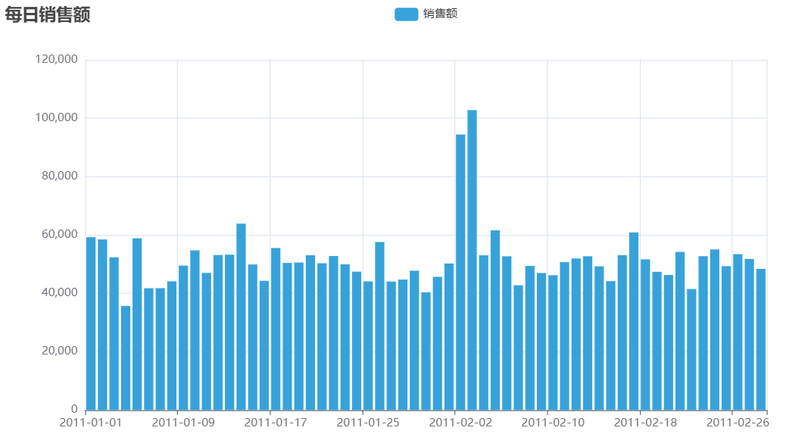
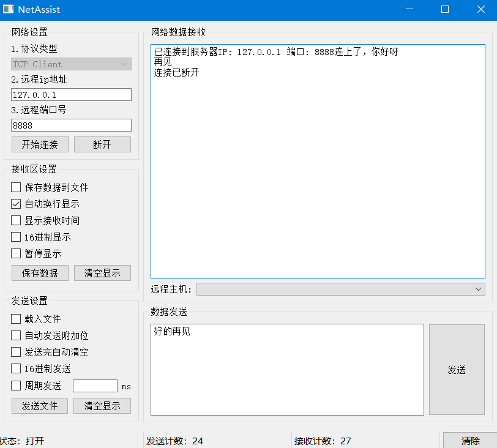

## 第一阶段

### 00 视频传送门

[第一阶段-第八章-01-文件编码概念\_哔哩哔哩\_bilibili](https://www.bilibili.com/video/BV1qW4y1a7fU?spm_id_from=333.788.videopod.episodes\&vd_source=50f2f5b2c83676d4a38697ecabf48753\&p=85)

### 08 文件

#### &#x20;8.1  打开文件 *open()*

```python
#打开文件 open()
f=open("C:/Users/lenovo/Desktop/桌面记事本.txt","r",encoding="UTF-8") #r只读/w只写/a追加

#查看文件类型
print(type(f)) #<class '_io.TextIOWrapper'>
```

#### 8.2 读取文件 read()

```python
#读取文件 read() 多次调用会在上一次结尾开始读取
print("读取10个字节："+f.read(10)) #hello pyth
print("读取全部内容："+f.read())
'''
读取全部内容：on
hello world
123456
'''
```

#### &#x20;8.3  读取文件 readlines()

```python
#读取文件 readlines() 读取文件的全部行，封装到列表中，从上一次读取结尾开始读取
lines=f.readlines()
print(type(lines)) #<class 'list'>
print(lines) #['hello python\n', 'hello world\n', '123456']
```

#### 8.4 读取文件 readline()

```python
#读取文件 readline() 一次读取一行，从上一次读取结尾开始读取
line1=f.readline()
line2=f.readline()
line3=f.readline()
print("第一行数据"+line1) #第一行数据hello python
print("第二行数据"+line2) #第二行数据hello world
print("第三行数据"+line3) #第三行数据123456
```

#### 8.5 for循环读取文件行

```python
#for循环读取文件行
for line in f:
    print(line)
'''
hello python

hello world

123456
'''
```

#### 8.6 关闭文件 close()

```python
#关闭文件 close() 解除文件的占用
f.close()
#如果不调用close，同时程序没用停止运行，文件会一直被py程序占用，无法删除或重命名等操作
```

#### 8.7 with open语法操作文件

```python
#with open语法操作文件
with open("C:/Users/lenovo/Desktop/桌面记事本.txt","r",encoding="UTF-8") as f:
    for line in f:
        print(line)
#执行完语句块，自动关闭文件
```

#### 8.8 文件写入 write()和flush()

```python
#打开文件 open()，不存在的文件
f=open("C:/Users/lenovo/Desktop/test.txt","w",encoding="UTF-8")
# w只写，清空原有内容再写
# a追加

#文件写入 write() 内容写到内存中
f.write("hello world!")

#刷新flush() 将内存中积攒的内容，写入到硬盘的文件中
f.flush()

#关闭文件 close() 解除文件的占用，内置flush()功能
f.close()
```

### 09 异常

#### 9.1 基本捕获语法

```python
try:
    f=open("C:/Users/lenovo/Desktop/1.txt","r",encoding="UTF-8")
except:
    print("出现异常了，因为文件不存在，修改为w模式")
    f = open("C:/Users/lenovo/Desktop/1.txt", "w", encoding="UTF-8")
else:
    print("没有异常的时候还会执行的代码")
finally: #一般用于资源关闭
    print("无论是否异常都会执行")
    f.close()
```

#### 9.2 捕获指定的异常

```python
try:
    print(name)
except NameError as e:
    print("出现了变量未定义的异常")
    print(e)
```

#### 9.3 捕获多个异常

```python
try:
    # print(name)
    1/0
except (NameError,ZeroDivisionError) as e:
    print("出现了变量未定义 或者 除以0 的异常")
    print(e)
```

#### 9.4 捕获所有的异常 &#x20;

```python
#except Exception as e: 或者 except:
try:
    f=open("C:/Users/lenovo/Desktop/1.txt","r",encoding="UTF-8")
except Exception as e:
    print("出现异常了")
```

#### 9.5 异常的传递性

```python
#定义一个出现异常的方法
def fun1():
    print("fun1开始执行")
    num = 1 / 0 #除0异常
    print("fun1结束执行")

#定义一个无异常方法，调用上面的方法
def fun2():
    print("fun2开始执行")
    fun1()
    print("fun2结束执行")

#定义一个方法，调用上面的函数
def main():
    try:
        fun2()
    except Exception as e:
        print(f"出现异常，异常信息是{e}")#出现异常，异常信息是division by zero
main()
```

#### 9.6 模块导入

```python
#import 导入time模块使用sleep函数
import time
time.sleep(5)

#from导入time的sleep函数
from time import sleep
sleep(5)

#使用*导入time模块中全部功能
from time import *
sleep(5)

#使用as给特定功能加上别名
import time as t
t.sleep(5)

#from导入time的sleep函数，并用别名
from time import sleep as sl
sl(5)
```

#### 9.7 自定义模块并导入

```python
if name == '__main__': 
#只有当程序是直接执行的才会进入if内部
#如果是被导入的，则if无法进入
#一般写在自定义模块中，将测试调用函数的代码写在这个if下面，则执行该自定义模块时，会调用函数
#但是将自定义模块导入到别的程序时，不会直接执行这些函数

__all__
#如果一个模块文件中有_all_变量，当使用from xxx import *导入时
#只能导入这个列表中的元素
```


#### 9.8 自定义python包

新建python包，自动生成\_init\_.py，标记这是一个包。\_\_all\_\_写在\_init\_.py中

```python
import my_package.my_module1
my_package.my_module1.fun1()

from my_package import my_module1
my_module1.fun1()

from my_package.my_module1 import fun1
fun1()

from my_package import * #通过__all__变量控制*
```

#### 9.9 安装第三方包

```python
#安装numpy
pip install -i https://pypi.tuna.tsinghua.edu.cn/simple numpy
```

### 10 json和pyecharts

#### 10.1   py数据类型转json

```python
import json

#准备列表，列表中每一个元素是字典，将其转换为json
data=[{"name":"小黑","age":10},{"name":"小白","age":20},{"name":"小黄","age":30}]
json_str=json.dumps(data,ensure_ascii=False) #ensure_ascii=False不使用assic码，中文正常显示
print(type(json_str)) #<class 'str'>
print(json_str) #[{"name": "小黑", "age": 10}, {"name": "小白", "age": 20}, {"name": "小黄", "age": 30}]

#准备字典，将其转换为json
d={"name":"小黑","age":10}
json_str=json.dumps(d,ensure_ascii=False)
print(type(json_str)) #<class 'str'>
print(json_str) #{"name": "小黑", "age": 10}
```

#### 10.2 json转py数据类型

```python
import json
#将json字符串转换为python数据类型列表
s='[{"name":"小黑","age":10},{"name":"小白","age":20},{"name":"小黄","age":30}]'
l = json.loads(s)
print(type(l)) #<class 'list'>
print(l) #[{'name': '小黑', 'age': 10}, {'name': '小白', 'age': 20}, {'name': '小黄', 'age': 30}]

#将json字符串转换为python数据类型字典
s='{"name":"小黑","age":10}'
d=json.loads(s)
print(type(d)) #<class 'dict'>
print(d) #{'name': '小黑', 'age': 10}
```

#### 10.3 pyecharts网站和安装

[pyecharts - A Python Echarts Plotting Library built with love.](https://pyecharts.org/#/zh-cn/intro)

[Document](https://gallery.pyecharts.org/#/README)

```python
pip install pyecharts
```

#### 10.4 pyecharts折线图

```python
#导包
from pyecharts.charts import Line
from pyecharts.options import TitleOpts,LegendOpts,ToolboxOpts,VisualMapOpts
#创建一个折线图对象
line=Line()
#给折线图对象添加x轴的数据
line.add_xaxis(["中国","美国","英国"])
#给折线图对象添加y轴的数据
line.add_yaxis("GDP",[30,20,10])
#设置全局配置项set_global_opts
line.set_global_opts(
    title_opts=TitleOpts(title="GDP展示",pos_left="center",pos_bottom="1%"), #标题
    legend_opts=LegendOpts(is_show=True),#图例
    toolbox_opts=ToolboxOpts(is_show=True), #工具箱
    visualmap_opts=VisualMapOpts(is_show=True)#视觉映射
)
#通过render方法，将代码生成为图形
line.render()
```


#### 10.5 练习（数据处理+绘制折线图）

json格式化与视图网站：[JSON在线视图查看器(Online JSON Viewer)](https://www.ab173.com/gongju/json/jsonviewernew.php)

```python
import json
from pyecharts.charts import Line
from pyecharts.options import TitleOpts,LabelOpts

#处理数据
f_us=open("地图数据/美国.txt","r",encoding="UTF-8")
us_data=f_us.read()
f_jp=open("地图数据/日本.txt","r",encoding="UTF-8")
jp_data=f_jp.read()
f_in=open("地图数据/印度.txt","r",encoding="UTF-8")
in_data=f_in.read()

#去掉不合json规范的开头
us_data=us_data.replace("jsonp_1629344292311_69436(","")
jp_data=jp_data.replace("jsonp_1629350871167_29498(","")
in_data=in_data.replace("jsonp_1629350745930_63180(","")

#去掉不合json规范的结尾
us_data=us_data[:-2]
jp_data=jp_data[:-2]
in_data=in_data[:-2]

#json转python字典
us_dict = json.loads(us_data)
jp_dict = json.loads(jp_data)
in_dict = json.loads(in_data)

#获取trend key
us_trend_data=us_dict['data'][0]['trend']
jp_trend_data=jp_dict['data'][0]['trend']
in_trend_data=in_dict['data'][0]['trend']

#获取日期数据，用于x轴，取2020年（到314下标结束）
us_x_data=us_trend_data["updateDate"][:314]
jp_x_data=jp_trend_data["updateDate"][:314]
in_x_data=in_trend_data["updateDate"][:314]

#获取确诊数据，用于y轴，到2020年（到314下标结束）
us_y_data=us_trend_data["list"][0]["data"][:314]
jp_y_data=jp_trend_data["list"][0]["data"][:314]
in_y_data=in_trend_data["list"][0]["data"][:314]

#生成图表
line = Line() #构建折线图对象

#添加x轴坐标
line.add_xaxis(us_x_data) #x轴公用，添加一个国家即可

#添加y轴坐标
line.add_yaxis("美国确诊人数",us_y_data,label_opts=LabelOpts(is_show=False)) #添加美国y轴坐标，不显示数值
line.add_yaxis("日本确诊人数",jp_y_data,label_opts=LabelOpts(is_show=False)) #添加日本y轴坐标，不显示数值
line.add_yaxis("印度确诊人数",in_y_data,label_opts=LabelOpts(is_show=False)) #添加印度y轴坐标，不显示数值

#设置全局选项
line.set_global_opts(
    #标题设置
    title_opts=TitleOpts(title="2020年美日印三国确诊人数对比折线图",pos_left="center",pos_bottom="1%")
)

#调用render,生成图表
line.render()

#关闭文件对象
f_us.close()
f_jp.close()
f_in.close()
```


### 11 数据可视化-地图

#### 11.1 pyecharts地图

```python
from pyecharts.charts import Map
from pyecharts.options import VisualMapOpts

#准备地图对象
map=Map()

#准备数据
data = [
    ("北京市",99),
    ("上海市",199),
    ("湖南省",299),
    ("台湾省",399),
    ("广东省",499)
]

#添加数据
map.add("测试地图",data,"china")

#设置全局选项
map.set_global_opts(
    visualmap_opts=VisualMapOpts(
        is_show=True, #省份数据颜色
        is_piecewise=True, #允许手动校准范围
        pieces=[ #手动划定范围
            {"min":1,"max":9,"lable":"1-9","color":"#CCFFFF"},
            {"min":10,"max":99,"lable":"10-99","color":"#FF6666"},
            {"min":100,"max":500,"lable":"100-500","color":"#990033"},
        ]
    )
)

#绘图
map.render()
```


#### 11.2 练习（全国疫情地图）

```python
import json
from pyecharts.charts import Map
from pyecharts.options import TitleOpts,VisualMapOpts

#读取数据文件
f=open("11 数据/疫情.txt","r",encoding="UTF-8")
data=f.read()

#关闭文件
f.close()

#取到各省份数据
#将字符串json转换为python字典
data_dict = json.loads(data)

#从字典中取出省份数据
province_data_list = data_dict["areaTree"][0]["children"]
# print(province_data_list)

#组装每个省份和确诊人数为元组，并各个省的数据都封装如列表
data_list = [] #绘图需要用的数据列表
for province_data in province_data_list:
    province_name = province_data["name"]+"省" #省份名称
    province_confirm = province_data["total"]["confirm"] #确诊人数
    data_list.append((province_name,province_confirm))
#print(data_list)

# #准备地图对象
map=Map()

#添加数据
map.add("各省份确诊人数",data_list,"china")

#设置全局配置，定制分段的视觉映射
map.set_global_opts(
    title_opts=TitleOpts(title="全国疫情地图"),
    visualmap_opts=VisualMapOpts(
        is_show=True, #是否显示
        is_piecewise=True, #是否分段
        pieces=[
            {"min": 1, "max": 99, "lable": "1-99人", "color": "#CCFFFF"},
            {"min":100,"max":999,"lable":"100-999人","color":"#FFFF99"},
            {"min":1000,"max":4999,"lable":"1000-4999人","color":"#FF9966"},
            {"min":5000,"max":9999,"lable":"5000-9999人","color":"#FF6666"},
            {"min":10000,"max":99999,"lable":"10000-99999人","color":"#CC3333"},
            {"min":100000,"lable":"100000+","color":"#990033"},
        ]
    )
)

#绘制地图
map.render("全国疫情地图.html") #生成地图网页的文件名称
```


json中省份名字原因，导致地图显示不全，如json中应为“重庆市”，实际为“重庆”

### 12 数据可视化-柱状图

#### 12.1 基础柱状图

```python
from pyecharts.charts import Bar
from pyecharts.options import LabelOpts

#使用Bar构建基础柱状图
bar = Bar()

#添加x轴数据
bar.add_xaxis(["中国","美国","英国"])

#添加y轴数据 数据显示在右侧
bar.add_yaxis("GDP",[30,20,10],label_opts=LabelOpts(position="right"))

#反转x和y轴
bar.reversal_axis()

#绘图
bar.render("基础柱状图.html")
```


#### 12.2 基础时间柱状图

```python
from pyecharts.charts import Bar,Timeline
from pyecharts.options import LabelOpts
from pyecharts.globals import ThemeType #主题

#使用Bar构建基础柱状图
bar1 = Bar()
bar1.add_xaxis(["中国","美国","英国"])
bar1.add_yaxis("GDP",[30,30,20],label_opts=LabelOpts(position="right"))
bar1.reversal_axis()

bar2 = Bar()
bar2.add_xaxis(["中国","美国","英国"])
bar2.add_yaxis("GDP",[50,50,50],label_opts=LabelOpts(position="right"))
bar2.reversal_axis()

bar3 = Bar()
bar3.add_xaxis(["中国","美国","英国"])
bar3.add_yaxis("GDP",[70,60,60],label_opts=LabelOpts(position="right"))
bar3.reversal_axis()

#构建时间线对象
timeline=Timeline({"theme":ThemeType.LIGHT}) #蓝黄粉主题

#在时间线内添加柱状图对象
timeline.add(bar1,"点1")
timeline.add(bar2,"点2")
timeline.add(bar3,"点3")

#自动播放设置
timeline.add_schema(
    play_interval=1000,#自动播放时间间隔，单位毫秒
    is_timeline_show=True,#是否在自动播放的时候显示时间线
    is_auto_play=True,#是否自动播放
    is_loop_play=True,#是否循环自动播放
)

#绘图
timeline.render("基础时间线柱状图.html")
```


#### 12.3 GDP动态柱状图绘制

拓展：列表的sort排序

```python
#列表的sort方法
my_list=[["a",33],["b",55],["c",11]]

#方法1：基于带名函数
def choose_sort_key(element):
    return element[1]
my_list.sort(key=choose_sort_key,reverse=True) #根据列表第2个元素从大到小排序
print(my_list) #[['b', 55], ['a', 33], ['c', 11]]

#方法2：基于lambda匿名函数
my_list.sort(key=lambda element:element[1],reverse=True)
print(my_list) #[['b', 55], ['a', 33], ['c', 11]]
```

```python
from pyecharts.charts import Bar,Timeline
from pyecharts.options import *
from pyecharts.globals import ThemeType

#读取数据
f = open("12 数据/1960-2019全球GDP数据.csv","r",encoding="GB2312")
data_lines = f.readlines()
#关闭文件
f.close()
#删除第一行数据
data_lines.pop(0)
#将数据转换为字典存储，格式为{年份：{[国家，gdp],[国家，gdp]},年份：{[国家，gdp],[国家，gdp]},...}
#先定义一个字典对象
data_dict={}
for line in data_lines:
    year = int(line.split(",")[0]) #年份
    country = line.split(",")[1] #国家
    gdp = float(line.split(",")[2]) #gdp数据，科学计数法用float
    #判断字典里面有没有规定的key,如1960年
    try:
        data_dict[year].append([country,gdp])
    except KeyError:
        data_dict[year]=[]
        data_dict[year].append([country,gdp])
#print(data_dict)
#创建时间线
timeline = Timeline({"theme":ThemeType.LIGHT})
#排序年份
sorted_year = sorted(data_dict.keys())
for year in sorted_year:
    data_dict[year].sort(key=lambda element:element[1],reverse=True)
    #取出本年份前8的国家
    year_data = data_dict[year][0:8]
    x_data = []
    y_data = []
    for country_gdp in year_data:
        x_data.append(country_gdp[0]) #x轴添加国家
        y_data.append(country_gdp[1])  # y轴添加gdp
    #构建柱状图
    bar = Bar()
    x_data.reverse()
    y_data.reverse()
    bar.add_xaxis(x_data)
    bar.add_yaxis("GDP(亿)",y_data,label_opts=LabelOpts(position="right"))
    #反转x轴和y轴
    bar.reversal_axis()
    #设置每一年的图标标题
    bar.set_global_opts(
        title_opts=TitleOpts(title=f"{year}年全球前8GDP数据")
    )
    timeline.add(bar,str(year))
#设置时间线自动播放
timeline.add_schema(
    play_interval=1000,#自动播放时间间隔，单位毫秒
    is_timeline_show=True,#是否在自动播放的时候显示时间线
    is_auto_play=True,#是否自动播放
    is_loop_play=True,#是否循环自动播放
)
#绘图
timeline.render("1960-2019全球GDP前8国家.html")
```


## 第二阶段

### 00 视频传送门

[第二阶段-第一章-01-初识对象\_哔哩哔哩\_bilibili](https://www.bilibili.com/video/BV1qW4y1a7fU?spm_id_from=333.788.videopod.episodes\&vd_source=50f2f5b2c83676d4a38697ecabf48753\&p=111)

### 01 面向对象

#### 1.1 初识对象和类的成员方法

```python
#设计一个类
class Student:
    name=None #记录姓名 成员属性
    age= None #记录年龄 成员属性
    def say_hi(self): #成员方法 必须有self
        print(f"我是{self.name}")
    def say_hi2(self,msg):
        print(f"我是{self.name},{msg}")
#创建一个对象
stu1=Student()
#对象属性赋值
stu1.name="cc"
stu1.age=10
#获取对象中记录的信息
print(stu1.name) #cc
print(stu1.age) #10
#调用成员方法
stu1.say_hi() #我是cc
stu1.say_hi2("再见") #我是cc,再见
```

#### 1.2 构造方法和其他魔术方法

\_\_init\_\_()方法，称为构造方法

可以实现：

1.在创建类对象（构造类）的时候，会自动执行

2.在创建类对象（构造类）的时候，将传入参数自动传递给\_\_init\_\_方法使用

构造方法也是成员方法，需要写self

```python
class Student:
    name = None  # 记录姓名 成员属性  有构造方法可不写
    age= None    #记录年龄 成员属性   有构造方法可不写
    def __init__(self,name,age): #构造方法，可用于创建类对象的时候设置初始化行为
        self.name=name
        self.age=age
        print("Student类创建了一个类对象")
    def __str__(self): #__str__字符串方法 用于实现类对象转字符串的行为
        return f"Student类对象，name:{self.name},age:{self.age}"
    def __lt__(self, other): #小于符号比较方法 用于两个类对象进行小于或大于比较
        return self.age < other.age
    def __le__(self, other): #用于两个类对象进行小于等于或大于等于比较
        return  self.age <= other.age
    def __eq__(self, other): #用于两个类对象进行相等比较
        return self.name == other.name

stu = Student("cc",10)
print(stu.name)
print(stu.age)
# Student类创建了一个类对象
# cc
# 10
print(stu) #Student类对象，name:cc,age:10
stu1 = Student("cc",20)
print(stu>stu1) #False
print(stu<=stu1) #True
print(stu==stu1) #True
```

#### 1.3 封装

定义私有成员：成员变量和成员方法的命名均以\_\_作为开头即可

私有成员的访问限制：类对象无法访问私有成员、类中的其他成员可以访问私有成员

```python
#设计一个类，用来描述手机
class Phone:
    #提供私有成员变量：__is_5g_enable
    __is_5g_enable = True
    #提供私有成员方法：__check_5g()
    def __check_5g(self):
        if self.__is_5g_enable:C  
            print("5g开启")
        else:
            print("5g关闭，使用4g网络")

    #提供公开成员方法：call_by_5g()
    def call_by_5g(self):
        self.__check_5g()
        print("正在通话中")
phone=Phone()
phone.call_by_5g()
# 5g开启
# 正在通话中
```

#### 1.4 继承和复写

继承另一个类的成员变量和成员方法

多继承中，如果父类有同名方法或属性，先继承的优先级高于后继承的

```python
class 类（父类1，父类2，父类3): #继承这三个类，
    类内容体
```

在子类中调用父类成员

1.方法1调用父类成员

父类名.成员变量&#x20;

父类名.成员方法(self)

2.方法2使用super()调用父类成员

super().成员变量

super().成员方法()

```python
class Phone:
    IMEI = None #序列号
    producer = "aa" #厂商
    def call_by_5g(self):
        print("父类使用5g")
class MyPhone(Phone):
    producer = "bb" #复写父类的成员属性
    def call_by_5g(self):
        print("子类的5g")
        print(f"父类的厂商{Phone.producer}") #父类成员属性
        Phone.call_by_5g(self) #调用父类成员方法
        print(f"父类的厂商{super().producer}")#父类成员属性
        super().call_by_5g() #调用父类成员方法

phone = MyPhone()
print(phone.producer)
phone.call_by_5g()
# bb
# 子类的5g
# 父类的厂商aa
# 父类使用5g
# 父类的厂商aa
# 父类使用5g
```

#### 1.5 类型注解

```python
import random
import json
from typing import *

var_1:int = 10
var_2:str = "123"
var_3:bool = True
#类对象类型注解
class Student:
    pass
stu:Student = Student()
#基础容器类型注解
my_list:list={1,2,3}
my_tuple:tuple=(1,2,3)
my_dict:dict = {"name":123}
#容器类型详细注解
my_list1: List[int] = [1, 2, 3]
my_tuple1:Tuple[int,str,bool]=(1,"123",True)
my_dict1:Dict[str,int]={"123",123}
#在注释中进行类型注解
var_4 = random.randint(1,10) #type:int
var_5=json.loads('{"name":"aa"}') #type:Dict[str,str]
def func():
    return 10
var_6=func() #type:int
#类型注解的限制
var_7:int="123" #不会报错
var_8:str=123  #不会报错
#函数注解
def add(x:int,y:int):
    return x+y
def fun(data:list)->list: #注解非强制性，仅提示
    return data
print(fun(1)) #1
#Union联合类型注解
from typing import Union
my_list2:List[Union[int,str]]=[1,2,"123"]
def func(data:Union[int,str])->Union[int,str]:
    pass
#func() #按ctrl+p可以看注解
```

#### &#x20;1.6 多态

多态：同一个行为，使用不同的对象，得到不同的状态

函数（方法）形参声明接受父类对象

实际传入父类的子类对象进行工作

即：

以父类做定义声明

以子类做实际工作

用以获得同一行为，不同状态

```python
#抽象类
class AC:
    def cool(self):
        pass
    def hot(self):
        pass
    def swing(self):
        pass

class Midea_AC(AC):
    def cool(self):
        print("美的制冷")
    def hot(self):
        print("美的制热")
    def swing(self):
        print("美的左右摆风")

class GREE_AC(AC):
    def cool(self):
        print("格力制冷")
    def hot(self):
        print("格力制热")
    def swing(self):
        print("格力左右摆风")

def make_cool(ac:AC):
    ac.cool()

midea_ac = Midea_AC()
gree_ac = GREE_AC()

make_cool(midea_ac) #美的制冷
make_cool(gree_ac) #格力制冷
```

#### 1.7 练习（文件读取+数值计算+可视化开发）

data\_define.py

```python
"""
数据定义的类
"""
class Record:
    def __init__(self, date, order_id, money, province):
        self.date = date            # 订单日期
        self.order_id = order_id    # 订单ID
        self.money = money          # 订单金额
        self.province = province    # 销售省份
    def __str__(self):
        return f"{self.date}, {self.order_id}, {self.money}, {self.province}"
```

file\_define.py

```python
"""
和文件相关的类定义
"""
import json
from data_define import Record
from typing import *


# 先定义一个抽象类用来做顶层设计，确定有哪些功能需要实现
class FileReader:
    def read_data(self) -> List[Record]:
        """读取文件的数据，读到的每一条数据都转换为Record对象，将它们都封装到list内返回即可"""
        pass


class TextFileReader(FileReader):
    def __init__(self, path):
        self.path = path            # 定义成员变量记录文件的路径

    # 复写（实现抽象方法）父类的方法
    def read_data(self) -> List[Record]:
        f = open(self.path, "r", encoding="UTF-8")
        record_list: list[Record] = []
        for line in f.readlines():
            line = line.strip()     # 消除读取到的每一行数据中的\n
            data_list = line.split(",")
            record = Record(data_list[0], data_list[1], int(data_list[2]), data_list[3])
            record_list.append(record)
        f.close()
        return record_list


class JsonFileReader(FileReader):
    def __init__(self, path):
        self.path = path            # 定义成员变量记录文件的路径
    def read_data(self) -> List[Record]:
        f = open(self.path, "r", encoding="UTF-8")
        record_list: list[Record] = []
        for line in f.readlines():
            data_dict = json.loads(line)
            record = Record(data_dict["date"], data_dict["order_id"], int(data_dict["money"]), data_dict["province"])
            record_list.append(record)
        f.close()
        return record_list

if __name__ == '__main__':
    text_file_reader = TextFileReader("2011年1月销售数据.txt")
    json_file_reader = JsonFileReader("2011年2月销售数据JSON.txt")
    list1 = text_file_reader.read_data()
    list2 = json_file_reader.read_data()
    for l in list1:
        print(l)
    for l in list2:
        print(l)
```

main.py

```python
"""
面向对象，数据分析案例，主业务逻辑代码
实现步骤：
1. 设计一个类，可以完成数据的封装
2. 设计一个抽象类，定义文件读取的相关功能，并使用子类实现具体功能
3. 读取文件，生产数据对象
4. 进行数据需求的逻辑计算（计算每一天的销售额）
5. 通过PyEcharts进行图形绘制
"""
from file_define import FileReader, TextFileReader, JsonFileReader
from data_define import Record
from pyecharts.charts import Bar
from pyecharts.options import *
from pyecharts.globals import ThemeType
from typing import *

text_file_reader = TextFileReader("2011年1月销售数据.txt")
json_file_reader = JsonFileReader("2011年2月销售数据JSON.txt")

jan_data: List[Record] = text_file_reader.read_data()
feb_data: List[Record] = json_file_reader.read_data()
# 将2个月份的数据合并为1个list来存储
all_data: List[Record] = jan_data + feb_data

# 开始进行数据计算
# {"2011-01-01": 1534, "2011-01-02": 300, "2011-01-03": 650}
data_dict = {}
for record in all_data:
    if record.date in data_dict.keys():
        # 当前日期已经有记录了，所以和老记录做累加即可
        data_dict[record.date] += record.money
    else:
        data_dict[record.date] = record.money

# 可视化图表开发
bar = Bar(init_opts=InitOpts(theme=ThemeType.LIGHT))

bar.add_xaxis(list(data_dict.keys()))       # 添加x轴的数据
bar.add_yaxis("销售额", list(data_dict.values()), label_opts=LabelOpts(is_show=False))      # 添加了y轴数据
bar.set_global_opts(
    title_opts=TitleOpts(title="每日销售额")
)

bar.render("每日销售额柱状图.html")
```


### 02 SQL

#### 2.1 下载与安装

下载网站：[MySQL Installer 8.0.42](https://dev.mysql.com/downloads/installer/)

安装教程：[Mysql下载安装教程(图文版)-CSDN博客](https://blog.csdn.net/m0_74823471/article/details/144252914)

下载后一直next即可，并设置密码

将Mysql安装目录的bin文件夹的路径，复制到环境变量path中

我的路径是C:\Program Files\MySQL\MySQL Server 8.0\bin

cmd中输入mysql -uroot -p回车后输入密码

我的密码是123456


图形化工具：DBeaver

下载网站：[Download](https://dbeaver.io/download/)

正常安装，可更换安装目录

打开后，新建数据库连接，选择mysql，输入密码，测试连接，下载驱动文件，完成

#### 2.2 SQL基础和数据定义DDL

写好sql后，选中可单独执行

F5刷新

```sql
-- 我是注释
/*
我是注释
*/
use aaa; #使用数据库
select database(); #aaa 查看当前使用的数据库
create database test1 charset utf8; #创建数据库charset utf8可选
show databases; #查看数据库
drop database test1; #删除数据库

use aaa;#使用数据库
show tables;#查看有哪些表
#创建表
create table student(
        id int,
        name varchar(10),
        age int
);
drop table student;#删除表
```

#### 2.3 数据操作DML

只支持单引号

```sql
create table student(
        id int,
        name varchar(10),
        age int
);
insert into student(id) values (1),(2),(3);
insert into student(id) values (4);
insert into student(id) values (5);
insert into student(id,name,age) values (6,'小黑',10),(7,'小白',20);
insert into student values (8,'小红',30),(9,'小蓝',40);

delete from student where id = 1;
delete from student where id > 6;
delete from student;

update student set name = '新名字' where id = 6; 
update student set name = '名字全改了';
```

#### 2.4 数据查询DQL

```sql
# select 字段列表|* from 表 where 条件判断;
select id from student;
select * from student where name='名字全改了';

# select 字段|聚合函数 from 表 [where 条件] group by 列;
select gender,avg(age),sum(age),min(age),max(age),count(*) from student group by gender;

#order by xxx asc 升序排序 不写asc默认升序， desc降序
select * from student where age > 20 order by age desc;

#select 列|聚合函数|* from 表 where xxx group by xxx order by xxx [asc|desc] limit n[,m]
#limit 从第x条数据开始的第x条数据
select age,count(*) from student where age > 20 group by age order by age limit 3;
```

#### 2.5 python和mysql

在python中，使用第三方库pymysql来完成对mysql数据库的操作

`pip install pymysql`

```python
from pymysql import Connection

#构建到mysql数据库的链接
conn = Connection(
    host = "localhost", #主机名(IP)
    port = 3306, #端口
    user = "root", #账户
    password = "123456", #密码
    autocommit = True #自动确认
)

print(conn.get_server_info()) #5.7.17

#执行非查询性质SQL
cursor = conn.cursor() #获取到游标对象
conn.select_db("aaa") #选择数据库
cursor.execute("create table test2(id int)")

# #执行查询性质SQL
cursor.execute("select * from student") #sql语句后面可以不写;
results = cursor.fetchall() #将查询结果封装到元组内
for r in results:
    print(r)

#数据插入,需要通过commit确认
cursor.execute("insert into student values(2,'bb',20)")
# conn.commit() #也可以自动确认autocommit = True

#关闭链接
conn.close();
```

## 第三阶段

### 00 视频传送门

[第三阶段-01-PySpark实战-前言介绍\_哔哩哔哩\_bilibili](https://www.bilibili.com/video/BV1qW4y1a7fU?spm_id_from=333.788.videopod.episodes\&vd_source=50f2f5b2c83676d4a38697ecabf48753\&p=139)

[第三阶段-01-闭包\_哔哩哔哩\_bilibili](https://www.bilibili.com/video/BV1qW4y1a7fU?spm_id_from=333.788.videopod.episodes\&vd_source=50f2f5b2c83676d4a38697ecabf48753\&p=154)

### 01 pyspark

#### 1.1  spark介绍

spark用于对海量数据进行大规模分布式计算

pyspark是spark的python实现

`pip install pyspark`

#### 1.2 基础准备

想要使用pyspark库完成数据处理，需要首先构建一个执行环境入口对象

```python
#获取pyspark的执行环境入库对象：SparkContext
#并通过SparkContext对象获取当前pyspark的版本

from pyspark import SparkConf,SparkContext
#创建SparkConf类对象
conf = SparkConf().setMaster("local[*]").setAppName("test_spark_app")
#以上的链式调用等价于
# conf = SparkConf()
# conf.setMaster("local[*]") #设置Spark的运行模式为本地模式，并利用所有可用的CPU核心
# conf.setAppName("test_spark_app") #给应用程序命名
#基于SparkConf类对象创建SparkContext对象
sc = SparkContext(conf=conf)
#打印pyspark的运行版本
print(sc.version) #3.4.4
#停止SparkContext对象的运行
sc.stop()
```

pyspark的编程模型：

数据输入-数据处理计算-数据输出

#### 1.3 数据输入

RDD对象：分布式弹性数据集，是pyspark中数据计算的载体

pyspark对象支持通过SparkContext对象的parallelize成员方法，将list、tuple、set、dict、str转换为pyspark的RDD对象

pyspark对象支持通过SparkContext对象的textFile成员方法，读取文本文件得到RDD对象

查看RDD里面有什么内容，需要用collect()方法

```python
#通过PySpark代码加载数据，即数据输入
from pyspark import SparkConf, SparkContext

conf = SparkConf().setMaster("local[*]").setAppName("test_spark")
sc = SparkContext(conf=conf)

# 通过parallelize方法将Python对象加载到Spark内，成为RDD对象
rdd1 = sc.parallelize([1, 2, 3, 4, 5])
rdd2 = sc.parallelize((1, 2, 3, 4, 5))
rdd3 = sc.parallelize("abcdefg") # 字符串会被拆分出1个个的字符，存入RDD对象
rdd4 = sc.parallelize({1, 2, 3, 4, 5})
rdd5 = sc.parallelize({"key1": "value1", "key2": "value2"}) #字典仅有key会被存入RDD对象
# 如果要查看RDD里面有什么内容，需要用collect()方法
print(rdd1.collect()) #[1, 2, 3, 4, 5]
print(rdd2.collect()) #[1, 2, 3, 4, 5]
print(rdd3.collect()) #['a', 'b', 'c', 'd', 'e', 'f', 'g']
print(rdd4.collect()) #[1, 2, 3, 4, 5]
print(rdd5.collect()) #['key1', 'key2']

# 用过textFile方法，读取文件数据加载到Spark内，成为RDD对象
rdd = sc.textFile("3-01 数据/3-01.txt")
print(rdd.collect()) #['a', 'bb', 'ccc', 'dddd']

sc.stop()
```

#### 1.4 数据计算

##### 1.4.1 map算子

接受一个处理函数，可用lambda表达式快速编写

对RDD内的元素逐个处理，并返回一个新的RDD

```python
from pyspark import SparkConf, SparkContext

#不加以下两行代码会报错Python worker failed to connect back.
#需要显式指定 PySpark 任务执行时使用的 Python 解释器路径
import os
os.environ['PYSPARK_PYTHON'] = "C:/Users/lenovo/AppData/Local/Programs/Python/Python37/python.exe"

conf = SparkConf().setMaster("local[*]").setAppName("test_spark")
sc = SparkContext(conf=conf)

# 准备一个RDD
rdd = sc.parallelize([1, 2, 3, 4, 5])

# 通过map方法将全部数据都乘以10
# def func(data):
#     return data * 10
# rdd2 = rdd.map(func)

#也可以简写为
rdd2 = rdd.map(lambda x: x * 10)

#若*10+5,则可以链式调用
#rdd2 = rdd.map(lambda x: x * 10).map(lambda x: x + 5)

print(rdd2.collect()) #[10, 20, 30, 40, 50]
```

##### 1.4.2 flatmap算子

对rdd执行map操作，然后进行解除嵌套操作

```go
from pyspark import SparkConf, SparkContext
import os
os.environ['PYSPARK_PYTHON'] = "C:/Users/lenovo/AppData/Local/Programs/Python/Python37/python.exe"
conf = SparkConf().setMaster("local[*]").setAppName("test_spark")
sc = SparkContext(conf=conf)

# 准备一个RDD
rdd = sc.parallelize(["我 爱 学 习","不 你 不 爱","开 摆 咯"])

#将RDD数据里面的一个个单词提取出来
# rdd2 = rdd.map(lambda x:x.split(" "))
# print(rdd2.collect()) #[['我', '爱', '学', '习'], ['不', '你', '不', '爱'], ['开', '摆', '咯']]
rdd2 = rdd.flatMap(lambda x:x.split(" "))
print(rdd2.collect()) #['我', '爱', '学', '习', '不', '你', '不', '爱', '开', '摆', '咯']
```

##### 1.4.3 reduceByKey算子

针对key value型RDD，自动按照key分组，然后根据提供的聚合逻辑，完成组内数据（value）的聚合操作

接受一个处理函数，对数据进行两两计算


```python
from pyspark import SparkConf, SparkContext
import os
os.environ['PYSPARK_PYTHON'] = "C:/Users/lenovo/AppData/Local/Programs/Python/Python37/python.exe"
conf = SparkConf().setMaster("local[*]").setAppName("test_spark")
sc = SparkContext(conf=conf)

# 准备一个RDD
rdd = sc.parallelize([('男', 99), ('男', 88), ('女', 99), ('女', 66)])

# 求男生和女生两个组的成绩之和
rdd2 = rdd.reduceByKey(lambda a, b: a + b)
print(rdd2.collect()) #[('男', 187), ('女', 165)]
```

##### 1.4.4 练习（统计单词个数）

```python
# 1. 构建执行环境入口对象
from pyspark import SparkContext,SparkConf
import os
os.environ['PYSPARK_PYTHON'] = "C:/Users/lenovo/AppData/Local/Programs/Python/Python37/python.exe"
conf = SparkConf().setMaster("local[*]").setAppName("test_spark")
sc = SparkContext(conf=conf)
# 2. 读取数据文件
rdd = sc.textFile("3-01 数据/3-01-02.txt")
# 3. 取出全部单词
word_rdd = rdd.flatMap(lambda x:x.split(" "))
# 4. 将所有单词都转换成二元元组，单词为Key，value设置为1
word_with_one_rdd  = word_rdd.map(lambda x:(x,1))
# 5. 分组并求和
result_rdd  = word_with_one_rdd.reduceByKey(lambda a,b:a+b)
# 6. 打印输出结果
print(result_rdd.collect()) #[('aa', 6), ('nice', 5), ('yes', 6), ('hello', 2), ('haha', 4)]
```

##### 1.4.5 filter算子

接受一个处理函数，可用lambda快速编写

函数对RDD数据逐个处理，得到True的保留至返回值的RDD中

```python
from pyspark import SparkContext,SparkConf
import os
os.environ['PYSPARK_PYTHON'] = "C:/Users/lenovo/AppData/Local/Programs/Python/Python37/python.exe"
conf = SparkConf().setMaster("local[*]").setAppName("test_spark")
sc = SparkContext(conf=conf)

# 准备一个RDD
rdd = sc.parallelize([1, 2, 3, 4, 5])
# 对RDD的数据进行过滤
rdd2 = rdd.filter(lambda num: num % 2 == 0)

print(rdd2.collect()) #[2, 4]
```

##### 1.4.6 distinct算子

对RDD内数据去重

```python
from pyspark import SparkContext,SparkConf
import os
os.environ['PYSPARK_PYTHON'] = "C:/Users/lenovo/AppData/Local/Programs/Python/Python37/python.exe"
conf = SparkConf().setMaster("local[*]").setAppName("test_spark")
sc = SparkContext(conf=conf)

# 准备一个RDD
rdd = sc.parallelize([1, 1, 3, 3, 5, 5, 7, 8, 8, 9, 10])
# 对RDD的数据进行去重
rdd2 = rdd.distinct()

print(rdd2.collect()) #[8, 1, 5, 9, 10, 3, 7]
```

##### 1.4.7 sortBy算子

排序

```python
# 1. 构建执行环境入口对象
from pyspark import SparkContext,SparkConf
import os
os.environ['PYSPARK_PYTHON'] = "C:/Users/lenovo/AppData/Local/Programs/Python/Python37/python.exe"
conf = SparkConf().setMaster("local[*]").setAppName("test_spark")
sc = SparkContext(conf=conf)
# 2. 读取数据文件
rdd = sc.textFile("3-01 数据/3-01-02.txt")
# 3. 取出全部单词
word_rdd = rdd.flatMap(lambda x:x.split(" "))
# 4. 将所有单词都转换成二元元组，单词为Key，value设置为1
word_with_one_rdd  = word_rdd.map(lambda x:(x,1))
# 5. 分组并求和
result_rdd  = word_with_one_rdd.reduceByKey(lambda a,b:a+b)

# 排序
final_rdd = result_rdd.sortBy(lambda x: x[1], ascending=True, numPartitions=1) #下标为1的元素，升序，全局排序设置分区数为1

# 6. 打印输出结果
print(final_rdd.collect()) #[('hello', 2), ('haha', 4), ('nice', 5), ('aa', 6), ('yes', 6)]
```

#### 1.5 数据输出

##### 1.5.1 将RDD输出为python对象

1.collect算子，输出RDD为list对象

2.reduce算子，对RDD进行两两聚合

3.take算子，取出RDD前N个元素，组成list返回

4.count，统计RDD内有多少条数据，返回值为数字

```python
from pyspark import SparkContext,SparkConf
import os
os.environ['PYSPARK_PYTHON'] = "C:/Users/lenovo/AppData/Local/Programs/Python/Python37/python.exe"
conf = SparkConf().setMaster("local[*]").setAppName("test_spark")
sc = SparkContext(conf=conf)
# 准备RDD
rdd = sc.parallelize([1, 2, 3, 4, 5])

# collect算子，输出RDD为list对象
rdd_list: list = rdd.collect()
print(rdd_list) #[1, 2, 3, 4, 5]
print(type(rdd_list)) #<class 'list'>

# reduce算子，对RDD进行两两聚合
num = rdd.reduce(lambda a, b: a + b)
print(num) #15

# take算子，取出RDD前N个元素，组成list返回
take_list = rdd.take(3)
print(take_list) #[1, 2, 3]

# count，统计RDD内有多少条数据，返回值为数字
num_count = rdd.count()
print(f"rdd内有{num_count}个元素") #rdd内有5个元素

sc.stop()
```

##### 1.5.2 将RDD输出到文件

```python
from pyspark import SparkContext,SparkConf
import os
os.environ['PYSPARK_PYTHON'] = "C:/Users/lenovo/AppData/Local/Programs/Python/Python37/python.exe"
# os.environ['HADOOP_HOME'] = "D:/dev/hadoop-3.0.0"
conf = SparkConf().setMaster("local[*]").setAppName("test_spark")
sc = SparkContext(conf=conf)
conf.set("spark.default.parallelism",1)#修改RDD分区为1，这样只生成一个文件,或者在下面的RDD后写1
# 准备RDD1
rdd1 = sc.parallelize([1, 2, 3, 4, 5], numSlices=1)

# 准备RDD2
rdd2 = sc.parallelize([("Hello", 3), ("Spark", 5), ("Hi", 7)], 1)

# 准备RDD3
rdd3 = sc.parallelize([[1, 3, 5], [6, 7, 9], [11, 13, 11]], 1)

# 输出到文件中
rdd1.saveAsTextFile("D:/output1")
rdd2.saveAsTextFile("D:/output2")
rdd3.saveAsTextFile("D:/output3")
```



### 02 高阶技巧

#### 2.1 闭包

定义双层嵌套函数，内层函数可以访问外层函数的变量

将内层函数作为外层函数的范围，此内层函数就是闭包函数

好处：

无需定义全局变量即可实现通过函数，持续的访问，修改某个值

闭包使用的变量位于外部函数内，难以被错误的调用修改

```python
# 使用闭包实现ATM小案例
def account_create(initial_amount=0): #initial_amount相当于一个全局变量

    def atm(num, deposit=True):
        nonlocal initial_amount #在闭包函数（内部函数中）想要修改外部函数的变量值
        if deposit:
            initial_amount += num
            print(f"存款：+{num}， 账户余额：{initial_amount}")
        else:
            initial_amount -= num
            print(f"取款：-{num}， 账户余额：{initial_amount}")
    return atm #将内层函数作为外层函数的范围，此内层函数就是闭包函数

atm = account_create()

atm(100) #存款：+100， 账户余额：100
atm(200) #存款：+200， 账户余额：300
atm(100, deposit=False) #取款：-100， 账户余额：200
```

#### 2.2 装饰器

使用创建一个闭包函数，在闭包函数内调用目标函数

可以达到不改变目标函数的同时，增加额外的功能

```python
# 装饰器
def outer(func):
    def inner():
        print("我睡觉了")
        func()
        print("我起床了")
    return inner
def sleep():
    import random
    import time
    print("睡眠中......")
    time.sleep(random.randint(1, 5))
fn = outer(sleep)
fn()
# 我睡觉了
# 睡眠中......
# 我起床了

# 装饰器(语法糖)
def outer(func):
    def inner():
        print("我睡觉了")
        func()
        print("我起床了")
    return inner
@outer
def sleep():
    import random
    import time
    print("睡眠中......")
    time.sleep(random.randint(1, 5))
sleep()
# 我睡觉了
# 睡眠中......
# 我起床了
```

#### 2.3 设计模式

##### 2.3.1 单例模式

确保某一个类只有一个实例存在，并提供一个访问它的全局访问点

非单例模式：

```python
class StrTools:
    pass

s1 = StrTools()
s2 = StrTools()
print(id(s1)) #2611240507080
print(id(s2)) #2611240542152
```

单例模式：

str\_tools.py

```python
class StrTools:
    pass
str_tool = StrTools()
```

test.py

```python
from str_tools import str_tool
s1 = str_tool
s2 = str_tool

print(id(s1)) #1623314711560
print(id(s2)) #1623314711560
```

##### 2.3.2 工厂模式

将对象的创建由使用原生类本身创建 转换到 特定的工厂方法来创建

好处：

大批量创建对象的时候有统一的入口，易于代码维护

发生修改时，仅修改工厂类的创建方法即可

```python
class Person:
    pass
class Worker(Person):
    pass
class Student(Person):
    pass
class Teacher(Person):
    pass
#工厂类
class PersonFactory:
    def get_person(self, p_type):
        if p_type == 'w':
            return Worker()
        elif p_type == 's':
            return Student()
        else:
            return Teacher()

pf = PersonFactory()
worker = pf.get_person('w')
stu = pf.get_person('s')
teacher = pf.get_person('t')
```

#### 2.4 多线程编程

threading模块实现多线程

```python
import time
import threading

def sing(msg):
    while True:
        print(msg)
        time.sleep(1)

def dance(msg):
    while True:
        print(msg)
        time.sleep(1)

if __name__ == '__main__':
    # 创建一个唱歌的线程 args以元组的方式给执行任务传参
    sing_thread = threading.Thread(target=sing, args=("我要唱歌 哈哈哈", ))
    # 创建一个跳舞的线程 kwargs以字典方式给执行任务传参
    dance_thread = threading.Thread(target=dance, kwargs={"msg": "我在跳舞哦 啦啦啦"})

    # 启动线程，让线程开始工作
    sing_thread.start()
    dance_thread.start()
# 我要唱歌 哈哈哈
# 我在跳舞哦 啦啦啦
# 我要唱歌 哈哈哈我在跳舞哦 啦啦啦
# 
# 我在跳舞哦 啦啦啦我要唱歌 哈哈哈
# 
# 我要唱歌 哈哈哈我在跳舞哦 啦啦啦
# ....
```

#### 2.5 socket服务端开发

下载初版网络调试助手：[github.com](https://github.com/nicedayzhu/netAssist/releases)

选择TCP Client

socket（简称套接字）是进程之间通信的一个工具

```python
import socket
# 创建Socket对象
socket_server = socket.socket()
# 绑定ip地址和端口
socket_server.bind(("localhost", 8888))
# 监听端口
socket_server.listen(1)
# listen方法内接受一个整数传参数，表示接受的链接数量
# 等待客户端链接
# result: tuple = socket_server.accept()
# conn = result[0]        # 客户端和服务端的链接对象
# address = result[1]     # 客户端的地址信息
conn, address = socket_server.accept()
# accept方法返回的是二元元组(链接对象， 客户端地址信息)
# 可以通过 变量1, 变量2 = socket_server.accept()的形式，直接接受二元元组内的两个元素
# accept()方法，是阻塞的方法，等待客户端的链接，如果没有链接，就卡在这一行不向下执行了

print(f"接收到了客户端的链接，客户端的信息是：{address}")

while True:
    # 接受客户端信息，要使用客户端和服务端的本次链接对象，而非socket_server对象
    data: str = conn.recv(1024).decode("UTF-8")
    # recv接受的参数是缓冲区大小，一般给1024即可
    # recv方法的返回值是一个字节数组也就是bytes对象，不是字符串，可以通过decode方法通过UTF-8编码，将字节数组转换为字符串对象
    print(f"客户端发来的消息是：{data}")
    # 发送回复消息
    msg = input("请输入你要和客户端回复的消息：")
    if msg == 'exit':
        break
    conn.send(msg.encode("UTF-8"))
# 关闭链接
conn.close()
socket_server.close()
# 接收到了客户端的链接，客户端的信息是：('127.0.0.1', 11086)
# 客户端发来的消息是：你好
# 请输入你要和客户端回复的消息：连上了，你好呀
# 客户端发来的消息是：厉害
# 请输入你要和客户端回复的消息：再见
# 客户端发来的消息是：好的再见
# 请输入你要和客户端回复的消息：exit
```


#### 2.6 socket客户端开发

socket服务端.py

```python
"""
演示Socket服务端开发
"""
import socket
# 创建Socket对象
socket_server = socket.socket()
# 绑定ip地址和端口
socket_server.bind(("localhost", 8888))
# 监听端口
socket_server.listen(1)
# listen方法内接受一个整数传参数，表示接受的链接数量
# 等待客户端链接
# result: tuple = socket_server.accept()
# conn = result[0]        # 客户端和服务端的链接对象
# address = result[1]     # 客户端的地址信息
conn, address = socket_server.accept()
# accept方法返回的是二元元组(链接对象， 客户端地址信息)
# 可以通过 变量1, 变量2 = socket_server.accept()的形式，直接接受二元元组内的两个元素
# accept()方法，是阻塞的方法，等待客户端的链接，如果没有链接，就卡在这一行不向下执行了

print(f"接收到了客户端的链接，客户端的信息是：{address}")

while True:
    # 接受客户端信息，要使用客户端和服务端的本次链接对象，而非socket_server对象
    data: str = conn.recv(1024).decode("UTF-8")
    # recv接受的参数是缓冲区大小，一般给1024即可
    # recv方法的返回值是一个字节数组也就是bytes对象，不是字符串，可以通过decode方法通过UTF-8编码，将字节数组转换为字符串对象
    print(f"客户端发来的消息是：{data}")
    # 发送回复消息
    msg = input("请输入你要和客户端回复的消息：")
    if msg == 'exit':
        break
    conn.send(msg.encode("UTF-8"))
# 关闭链接
conn.close()
socket_server.close()
```

socket客户端.py

```python
import socket
# 创建socket对象
socket_client = socket.socket()
# 连接到服务端
socket_client.connect(("localhost", 8888))

while True:
    # 发送消息
    msg = input("请输入要给服务端发送的消息：")
    if msg == 'exit':
        break
    socket_client.send(msg.encode("UTF-8"))
    # 接收返回消息
    recv_data = socket_client.recv(1024)        # 1024是缓冲区的大小，一般1024即可。 同样recv方法是阻塞的
    print(f"服务端回复的消息是：{recv_data.decode('UTF-8')}")
# 关闭链接
socket_client.close()
```

两个同时运行

#### 2.7 正则表达式-基础方法

```python
import re
s = "python haha 1python python"

# match 从头匹配 匹配第一个命中项
result = re.match("python", s)
print(result) #<re.Match object; span=(0, 6), match='python'>
print(result.span()) #(0, 6)
print(result.group()) #python

# search 搜索匹配 匹配第一个命中项
result = re.search("python2", s)
print(result) #None

# findall 搜索全部匹配 匹配全部命中项
result = re.findall("python", s)
print(result) #['python', 'python', 'python'] 找不到返回空列表
```

#### 2.8 正则表达式-元字符匹配



```python
import re

s = "itheima1 @@python2 !!666 ##itccast3"
print(re.findall(r'\d',s)) #['1', '2', '6', '6', '6', '3']  找数字
print(re.findall(r'\W',s)) #[' ', '@', '@', ' ', '!', '!', ' ', '#', '#']  找特殊字符
result = re.findall(r'[b-eF-Z3-9]', s)   # 字符串前面带上r的标记，表示字符串中转义字符无效，就是普通字符的意思
print(result) #['e', '6', '6', '6', 'c', 'c', '3']   找b-e F-Z 3-9

# 匹配账号，只能由字母和数字组成，长度限制6到10位
r = '^[0-9a-zA-Z]{6,10}$'
s = '123456'
print(re.findall(r, s)) #['123456']

# 匹配QQ号，要求纯数字，长度5-11，第一位不为0
r = '^[1-9][0-9]{4,10}$'
s = '123453678'
print(re.findall(r, s)) #['123453678']

# 匹配邮箱地址，只允许qq、163、gmail这三种邮箱地址
# abc.efg.daw@qq.com.cn.eu.qq.aa.cc
# abc@qq.com
# {内容}.{内容}.{内容}.{内容}.{内容}.{内容}.{内容}.{内容}@{内容}.{内容}.{内容}
r = r'(^[\w-]+(\.[\w-]+)*@(qq|163|gmail)(\.[\w-]+)+$)'
s = 'a.b.c.d.e.f.g@qq.com.a.z.c.d.e'   #<re.Match object; span=(0, 30), match='a.b.c.d.e.f.g@qq.com.a.z.c.d.e'>
#s = 'a.b.c.d.e.f.g@126.com.a.z.c.d.e'   #None
print(re.match(r, s))
```

#### 2.9 os模块

```python
os.listdir() 列出制定目录下的内容
os.path.isdir() 判断给定路径是否是文件夹，True/False
os.path.exists() 判断给定路径是否存在，True/False
```

