## 第0部分 前置

### 01 下载jupyter notebook

视频传送门

[Jupyter Notebook安装与简单使用入门\_哔哩哔哩\_bilibili](https://www.bilibili.com/video/BV1WdPpeBEs2/?spm_id_from=333.337.search-card.all.click\&vd_source=50f2f5b2c83676d4a38697ecabf48753)

1.`pip install notebook`安装

2.`jupyter notebook --generate-config`生成配置文件

显示`Writing default config to: C:\Users\lenovo\.jupyter\jupyter_notebook_config.py`

用vscode打开该路径的配置文件

3.先在目标路径创建一个空的文件夹，然后添加`c.NotebookApp.notebook_dir = 'f:\\Jupyter Notebook'`修改根目录路径

4.`pip install jupyterlab-language-pack-zh-CN`安装中文语言包

5.`jupyter notebook`启动

6.在该目录文件路径栏中输入即可以文件夹形式打开

## 第一部分 机器学习

### 00 视频传送门

[(超爽中英!) 2024公认最好的【吴恩达机器学习】教程！附课件代码 Machine Learning Specialization\_哔哩哔哩\_bilibili](https://www.bilibili.com/video/BV1Bq421A74G/?spm_id_from=333.788.top_right_bar_window_default_collection.content.click\&vd_source=50f2f5b2c83676d4a38697ecabf48753)

### 01 监督学习

监督学习：

数据集中的每个样本都有相应的“正确答案”。再根据这些样本作出预测。

将输入x映射到输出y，算法从正确答案中学习

监督学习的两大类型是回归和分类

回归问题：通过回归来推出一个连续的输出，比如预测房价，算法从无数可能得输出数字中预测数字

&#x20;分类问题：从一小组可能的输出中预测一个类别。例如用算法推测一个账号是 0 还是 1，因为只有少数的离散值，所以我把它归为分类问题。

### 02 无监督学习

聚类算法 是一种无监督学习算法，获取没有标签的数据并尝试自动将他们分组到集群中

### 03 线性回归

线性回归是一种利用数理统计中的回归分析，确定变量间线性依赖关系的统计分析方法，广泛应用于预测连续型目标变量。

#### 01 代价函数

在机器学习中,代价函数作用于整个训练集,是整个样本集的平均误差,对所有损失函数值的平均

1.为了得到训练逻辑回归模型的参数，需要一个代价函数，通过训练代价函数来得到参数。

2.用于找到最优解的目标函数。

#### 02 梯度下降

（1）梯度下降（Gradient Descent, GD）是一种迭代优化算法，核心思想是通过计算目标函数（如[损失函数](https://www.baidu.com/s?wd=%E6%8D%9F%E5%A4%B1%E5%87%BD%E6%95%B0\&usm=5\&ie=utf-8\&rsv_pq=e6bca1da021fb1ae\&oq=%E4%BB%80%E4%B9%88%E6%98%AF%E6%A2%AF%E5%BA%A6%E4%B8%8B%E9%99%8D\&rsv_t=dc2deWDER5bThyseJ1P3iJTgJWWQFk2DKB9H5e3xwnLZps48QBeWJQVr3sM\&rsv_dl=re_dqa_generate\&sa=re_dqa_generate)）的梯度（即函数对各参数的偏导数），并沿梯度的负方向逐步调整参数，从而逼近函数的最小值。

α 学习率 0-1之间的一个小的整数，可以说是0,01，表示下降的速度

（2）因为导数值有正负，所以当在右侧时，导数值为正，w减小，反之

（3）导数值减小，w下降的速度也会减小，当导数值为0时，w不变，即找到局部最小值

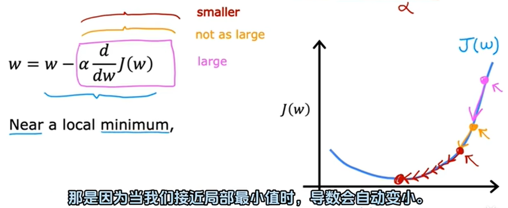

#### 03 多类特征

具有多个输入特征的线性回归模型称为多元线性回归

比如对应预测房价，有多个输入特征，如房子面积大小，房间数量，楼层，房子年份等输入特征

可以使用向量将表达式简化

#### 04 向量化

直接使用numpy中的`.dot()`函数可以简化代码，并且运行速度更快

#### 05 多元线性回归的梯度下降法

单变量线性回归的梯度下降表示 和 多元线性回归的梯度下降表示

单变量线性回归 和 多元线性回归 的梯度下降计算

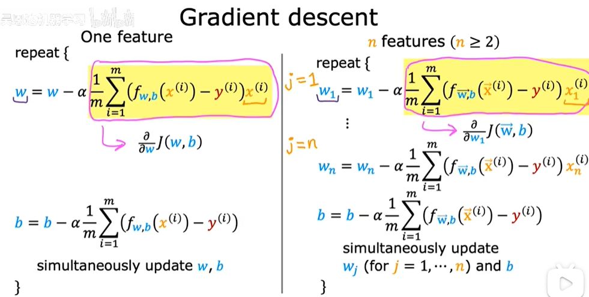

正规方程方法：一次性求解w和b，无需多次迭代。只适用于线性回归，数据量大时没有优势，机器学习库可能在后台使用这种复杂的方法求解w和b，但梯度下降法是最合适的。

#### 06 特征放缩

（1）当不同的特征取值范围差异很大时，可能导致梯度下降运行缓慢，但重新缩放不同的特征值，使他们都在相似的范围内取值，可以加快梯度下降的速度

（2）缩放的方法：

第一种：将每个原始`xi/范围最大值`

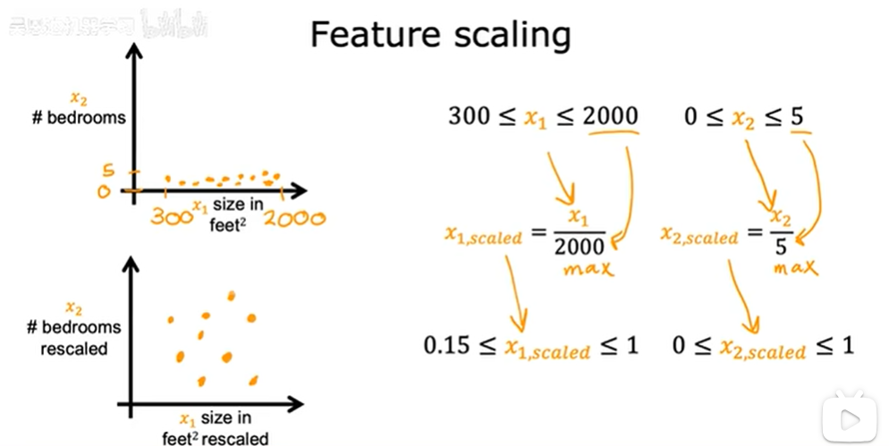

第二种：均值归一化，使缩放后的数据在0附近

首先找到x的均值称为μ1，将每个原始`(xi-μ1)/(范围最大-范围最小)`

第三种：z-score归一化

首先计算每个特征的均值μ1 和 标准差σ1，将每个原始`(x1-μ1)/σ1`

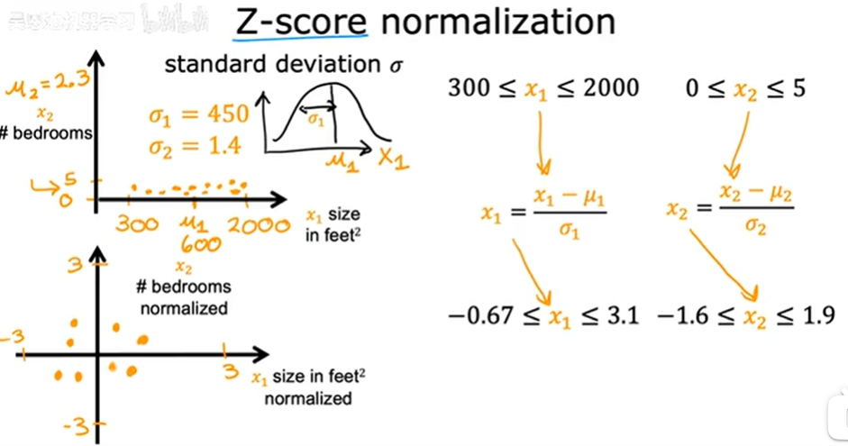

#### 07 检查梯度下降是否收敛

学习曲线：

迭代次数增加，代价函数的值都会趋向平稳，当学习曲线中代价函数的减小时小于ε时，则表示收敛

梯度下降算法收敛所需要的迭代次数根据模型的不同而不同，我们不能提前预知，我们可以绘制迭代次数和代价函数的图表来观测算法在何时趋于收敛。

梯度下降算法的每次迭代受到学习率α的影响

如果学习率α过小，则达到收敛所需的迭代次数会非常高

如果学习率α过大，每次迭代可能不会减小代价函数，可能会越过局部最小值导致无法收敛。

#### 08 特征工程

根据对应用的理解，有时并不仅仅限制于一开始拥有的特征，通过定义新的特征，可以得到一个更好的模型

#### 09 多项式回归

线性回归并不适用于所有数据，有时我们需要曲线来适应我们的数据。可以用次方或者根号

如果我们采用多项式回归模型，在运行梯度下降算法前，特征缩放非常有必要。

### 04 逻辑回归

逻辑回归用来处理分类问题，在分类问题中，我们尝试预测的是结果是否属于某一个类（例如正确或错误）

逻辑回归模型（逻辑函数）f(x):

输出结果在0-1之间，对于给定的输入变量，根据选择的参数计算输出变量=1的可能性

#### 01 决策边界

#### 02 逻辑回归的代价函数

代价函数提供一种衡量特定参数集与训练数据适合度的方法，进而提供一种选择更好参数的方法

平分误差代价函数不是逻辑回归的理想代价函数

因为得到的是一个非凸函数，这意味着代价函数有许多局部最小值，将影响梯度下降函数寻找全局最小值

重新定义逻辑回归的代价函数：

简化版代价函数：

#### 03 梯度下降实现

逻辑回归的梯度下降表达式看起来和多元线性回归的梯度下降表达式一样

但由于f(x)函数不同，所以两者并不相同

### 05 欠拟合和过拟合问题

#### 01 过拟合问题

（1）线性回归中的欠拟合和过拟合

第一个模型是一个线性模型，欠拟合，不能很好地适应我们的训练集；第三个模型是一个四次方的模型，过于强调拟合原始数据，而丢失了算法的本质：预测新数据。我们可以看出，若给出一个新的值使之预测，它将表现的很差，是过拟合，虽然能非常好地适应我们的训练集但在新输入变量进行预测时可能会效果不好；而中间的模型似乎最合适。

（2）逻辑回归中的欠拟合和过拟合

分类问题中也存在这样的问题

#### 02 解决过拟合

（1）收集更多的数据

（2）尝试选择和使用特定子集的特征。丢弃一些不能帮助我们正确预测的特征。可以是手工选择保留哪些特征，或者使用一些模型选择的算法来帮忙

（3）使用正则化来减少参数的大小。 保留所有的特征，但是减少参数的大小

#### 03 正则化代价函数

正是那些高次项导致了过拟合的产生，所以如果我们能让这些高次项的系数接近于 0 的话，我们就能很好的拟合了。

在一定程度上减小这些参数w的值，这就是正则化的基本方法

如果正则化参数λ过小，会导致过拟合，如果过大，会导致欠拟合

以对于正则化，我们要取一个合理的正则化参数λ的值，这样才能更好的应用正则化。

正则化线性回归代价函数：

#### 04 正则化线性回归

正则化线性回归的代价函数和梯度下降：

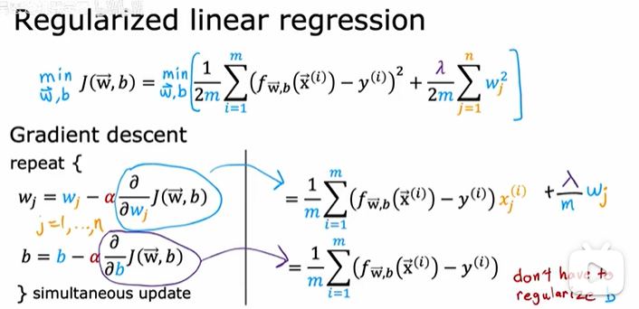

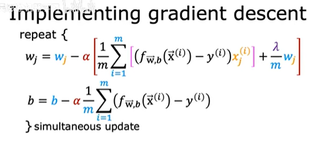

正则化在每一次迭代中，将w乘以一个稍微小于1的数字，效果是让wj的值稍微缩小一点

#### 05 正则化逻辑回归

正则化逻辑回归的代价函数和梯度下降：

## 第二部分 高级学习算法

### 01 神经网络的表述

#### 01 神经网络

神经网络工作原理：

输入层有一个特征向量，为图中四个变量，它被输入到隐藏层，隐藏层输出三个数字，用一个向量来表示隐藏层输出的激活向量，然后输入层将这三个数字作为输入并输出一个数字，这将是神经网络的最终激活或最终预测。

神经网络的一个非常好的特性是：当你从数据中训练它时，不需要明确决定哪些是特征，神经网络会自己找出这个隐藏层中想要使用的特征。

#### 02 神经网络中的层

该公式，可以根据前一层的激活值计算任意层的激活值

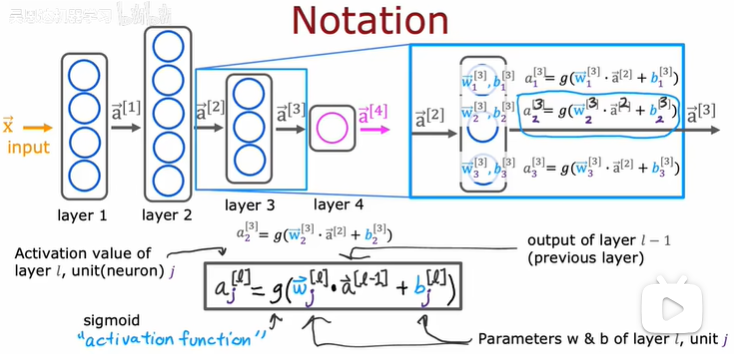

#### 03 向前传输算法

这种神经网络架构的类型一开始有更多的隐藏单元，然后数量逐渐减少，随着接近输出层，隐藏单元的数量逐渐减少

#### 04 代码中的推理

TensorFlow中进行推理的语法（数字识别模型为例）：

#### 05 TensorFlow中的数据

在之前的线性回归和逻辑回归中，使用一维数组，即第三个，只有一对中括号

在TensorFlow中，使用二维数字，即第一个和第二个，有两对中括号，因为TensorFlow用于处理大数据

数据在TensorFlow和NumPy中的表示方法不同，当把一个NumPy数组传入TensorFlow中时，TensorFlow会将其转换为自己的内部格式tensor，然后使用tensor高效地操作，读取数据时，要将tensor转换回NumPy数组，使用`numpy()`

#### 06 TensorFlow中构建一个神经网络

数字模型为例（两种方式）：

一种是显示写出每一层

另一种是将这些层放入顺序函数中， 创建一个顺序连接这三个层的模型

#### 07 在一个单层中的前向传播

用python和numpy实现向前传播

#### 08 前向传播的一般实现

矩阵变量用大写，向量变量用小写

#### 09 神经网络中前向传播的矢量化实现代码

矩阵变量，是二维数组，可以直接使用matmul()函数相乘，更高效实现代码

#### 10 矩阵乘法代码

使用`A.T`实现转置

使用`matmul()`函数或`@`实现矩阵乘法

### 02 神经网络的学习

#### 01 TensorFlow实现

第一步，指定模型，告诉TensorFlow如何进行推理计算

第二步，使用特定的损失函数编译模型，损失函数使用二进制交叉熵函数

第三步，训练模型，epochs是梯度下降的步数

逻辑回归和神经网络中模型训练的步骤：

第一步，指定如何根据输入x和参数计算输出

第二步，指定损失和代价函数

第三步，最小化代价函数，以此训练逻辑回归

#### 02 激活函数g(z)

（1）神经网络中输出层最常用的三种激活函数：线性激活函数，sigmoid,ReLU

（2）如何选择激活函数g(z)?

g(z)可取正值或负值：线性激活函数

二元分类问题:sigmoid

g(z)取非负值：ReLU

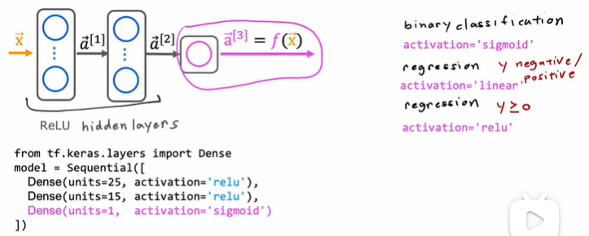

（3）为什么需要激活函数g(z)?

如果对所有隐藏层和输出层都使用线性激活函数，则该模型计算出的输出将完全等同于线性回归

如果对所有隐藏层都使用线性激活函数，对输出层使用sigmoid，则该模型计算出的输出将完全等同于逻辑回归，这个大的神经网络没有超出逻辑回归的能力

所以不要在隐藏层中使用线性激活函数

#### 03 多类和Softmax

（1）Softmax回归算法是逻辑回归算法的推广，能够处理多类别分类问题

（2）逻辑回归 和 Softmax回归函数 计算输出的区别：

逻辑回归的输出是为1的概率，则为0的概率用1去减即可

Softmax回归的输出取决于有几个输出

（3）逻辑回归 和 Softmax回归 的代价函数的区别：

（4）神经网络的Softmax输出

输出层为Softmax，例如手写数字识别，有0-9这些数字，则输出层有10units

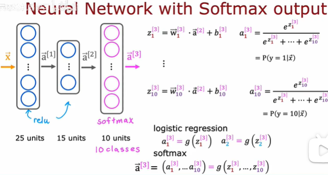

（5）神经网络中Softmax输出的代码实现

损失函数使用稀疏类别交叉熵函数

（6）神经网络中Softmax输出的代码实现（改进）

在逻辑回归中的改进：

将输出层设置为仅使用线性激活函数，并且同时防止激活函数，以及将这个交叉熵损失添加到此处的损失函数规范中

这样使得TensorFlow在计算时不计算中间值，直接用更精确的方式计算，减少了数值舍入误差

在Softmax中的改进：

（7）多标签分类问题 和 多类别分类问题 的区别

多类别分类问题：一个事物分成多类，如上

多标签分类问题：有多个问题，比如检测图形是否有行人、是否有汽车、是否有公交车。可以使用三个单独的神经网络，也可以一个神经网络有三个输出，如下

#### 04 高级优化算法Adam算法

（1）Adam算法：

可以自动调整学习率α的大小

如果参数wj或b似乎一直在大致相同的方向上移动，就增加学习率αj，在该方向上走的更快。

如果一个参数不断来回振荡，就减小学习率αj，在该方向上走的更慢。

（2）Adam算法在代码上的使用

#### 05 不同类型的层

（1）密集层

第二个隐藏层是前一层a1中每一个激活值的函数

（2）卷积层

每一层的每个单元只查看输入的有限窗口

### 03 应用机器学习的建议

#### 01 模型选择和训练交叉验证测试集

将数据集分成训练集、交叉验证集、测试集

在模型选择时，选择拟合参数或者选择模型架构，如神经网络架构或线性回归的多项式阶数时

只使用训练集和交叉验证集来做所有的决定，在做关于学习算法的决定时完全不看测试集

在确定一个模型后，用测试集评估它，

#### 02 诊断偏差和方差

当你运行一个学习算法时，如果这个算法的表现不理想，那么多半是出现两种情况： 要么是偏差比较大，要么是方差比较大。换句话说，出现的情况要么是欠拟合，要么是过拟合问题。

高偏差意味着在训练集上表现得不好

高方差意味着在交叉验证集上的表现比训练集差得多

训练集误差和交叉验证集误差近似时：偏差/欠拟合

交叉验证集误差远大于训练集误差时：方差/过拟合

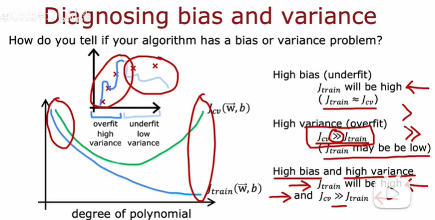

#### 03 正则化和偏差/方差

在我们在训练模型的过程中，一般会使用一些正则化方法来防止过拟合。但是我们可能会正则化的程度太高或太小了，即我们在选择 λ 的值时也需要思考与刚才选择多项式模型次数类似的问题。

当λ较小时，训练集误差较小（过拟合）而交叉验证集误差较大

随着λ的增加，训练集误差不断增加（欠拟合），而交叉验证集误差则是先减小后增加

#### 04 建立表现基准

查看训练误差是否很大是判断算法是否具有高偏差

某些数据（如有噪音的语音识别）中期望达到这种水平是不现实的

就需要建立表现基准，可以更准确了解训练差距距离希望达到的水平有多远

查看交叉验证误差是否远于训练误差可以判断算法是否具有高方差问题

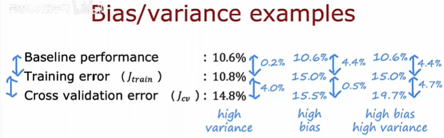

#### 05 学习曲线

用学习曲线来判断某一个学习算法是否处于偏差、方差问题

在高偏差/欠拟合的情况下，增加数据到训练集不一定能有帮助。用一条直线来适应下面的数据，可以看出，无论训练集有多么大误差都不会有太大改观

在高方差/过拟合的情况下，增加更多数据到训练集可能可以提高算法效果。使用一个非常高次的多项式模型，并且正则化非常小，可以看出，当交叉验证集误差远大于训练集误差时，往训练集增加更多数据可以提高模型的效果。

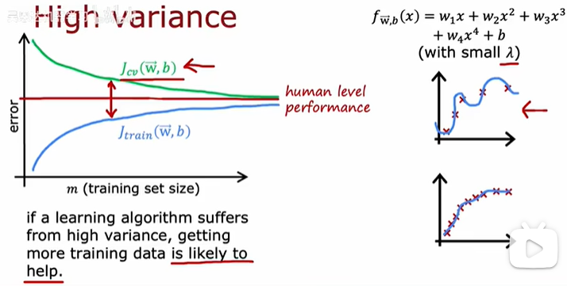

#### 06 改进学习算法

已经介绍了怎样评价一个学习算法，我们讨论了模型选择问题，偏差和方差的问题。那么这些诊断法则怎样帮助我们判断，哪些方法可能有助于改进学习算法的效果，而哪些可能是徒劳的呢？

获得更多的训练实例——解决高方差

尝试减少特征的数量——解决高方差

尝试获得更多的特征——解决高偏差

尝试增加多项式特征——解决高偏差

尝试减少正则化程度λ——解决高偏差

尝试增加正则化程度λ——解决高方差

用较小的神经网络，类似于参数较少的情况，容易导致高偏差和欠拟合，但计算代价较小

使用较大的神经网络，类似于参数较多的情况，容易导致高方差和过拟合，虽然计算代价比较大，但是可以通过正则化手段来调整而更加适应数据。

通常选择较大的神经网络并采用正则化处理会比采用较小的神经网络效果要好。

对于不同的层，可以选用不同的正则化参数λ

对于神经网络中的隐藏层的层数的选择，通常从一层开始逐渐增加层数，为了更好地作选择，可以把数据分为训练集、交叉验证集和测试集，针对不同隐藏层层数的神经网络训练神经网络， 然后选择交叉验证集代价最小的神经网络。

### 04 机器学习系统的设计

#### 01 机器学习的迭代发展

首先选择机器学习的模型，数据等

然后基于这些决策，实现并训练一个模型。第一次训练模型，不会如期望那样好用

通过观察算法的偏差、方差、误差分析，进行诊断

根据诊断做出决策，包括是否增大神经网络规模或更改λ正则化参数，或添加更多数据或添加更多特征或减少更多特征等

然后再次循环多次迭代

误差分析和偏差方差一样，可以帮助从一堆不同的方法中，选取合适的那一个。因此，你更有可能选择一个真正的好方法，能让你花上几天几周，甚至是几个月去进行深入的研究。

#### 02 误差分析

（1）构建一个学习算法的推荐方法为：

1.从一个简单的能快速实现的算法开始，实现该算法并用交叉验证集数据测试这个算法

2.绘制学习曲线，决定是增加更多数据，或者添加更多特征，还是其他选择

3.进行误差分析：人工检查交叉验证集中我们算法中产生预测误差的实例，看看这些实例是否有某种系统化的趋势

（2）推荐在交叉验证集上来做误差分析。

（3）以我们的垃圾邮件过滤器为例，误差分析要做的即是检验交叉验证集中我们的算法产生错误预测的所有邮件看：是否能将这些邮件按照类分组。例如医药品垃圾邮件，仿冒品垃圾邮件或者密码窃取邮件等。然后看分类器对哪一组邮件的预测误差最大，并着手优化。

（4）思考怎样能改进分类器。例如，发现是否缺少某些特征，记下这些特征出现的次数。例如记录下错误拼写出现了多少次，异常的邮件路由情况出现了多少次等等，然后从出现次数最多的情况开始着手优化。

#### 03 添加数据

使用数据增强技术生成更多图像或音频，来提高算法性能

例如检测字母A的算法，添加旋转、放大、缩小、镜像等数据，可以通过曲线扭曲，将一个图形或示例转换为训练示例。

例如音频识别算法，添加有噪音或失真的音频数据

使用数据合成技术创造更多的训练样本，来提高算法性能

例如图片识别文字算法，通过使用不同的字体再截图合成不同的文字，创建更多训练样本

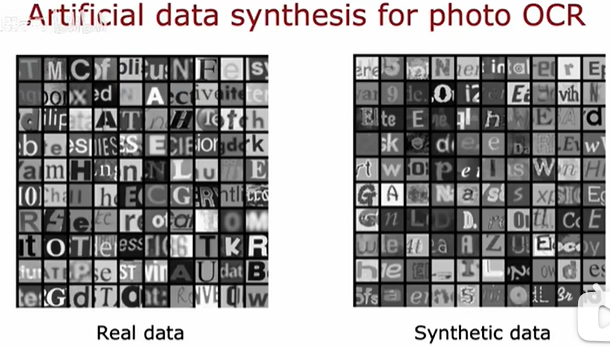

#### 04 迁移学习

（1）迁移学习即使用其他任务中的数据，比如识别数字的算法，可以使用大量有关猫的训练集

（2）迁移学习为什么有用？

对于识别手写数字来说，传入有关猫的训练集，神经网络的第一层可能会学习在图像中检测边缘，在下一层学习将边缘组合在一起以检测角点，再下一层学习检测更复杂但仍然通用的形状，学习检测这些相当通用的图像特征，对其他许多计算机视觉任务如识别手写数字是有用的

（3）迁移学习的两个步骤

1.下载一个具有相同输入的，其他人已经训练好的，在大型数据集上的神经网络，

2.在自己的数据上进一步训练或微调网络

#### 05类偏斜的误差度量

（1）类偏斜情况表现为我们的训练集中有非常多的同一种类的实例，只有很少或没有其他类的实例。

例如我们希望用算法来预测癌症是否是恶性的，在我们的训练集中，只有 0.5%的实例是恶性肿瘤。然而我们通过训练而得到的神经网络算法却有 1%的误差。这时，误差的大小是不能视为评判算法效果的依据的。

（2）查准率（Precision）和查全率（Recall） 我们将算法预测的结果分成四种情况：

1.正确肯定（True Positive,TP）：预测为真，实际为真

2.正确否定（True Negative,TN）：预测为假，实际为假

3.错误肯定（False Positive,FP）：预测为真，实际为假

4.错误否定（False Negative,FN）：预测为假，实际为真

（3）查准率 和 查全率

查准率=TP/(TP+FP)。例，在所有我们预测有恶性肿瘤的病人中，实际上有恶性肿瘤的病人的百分比，越高越好。

查全率=TP/(TP+FN)。例，在所有实际上有恶性肿瘤的病人中，成功预测有恶性肿瘤的病人的百分比，越高越好。

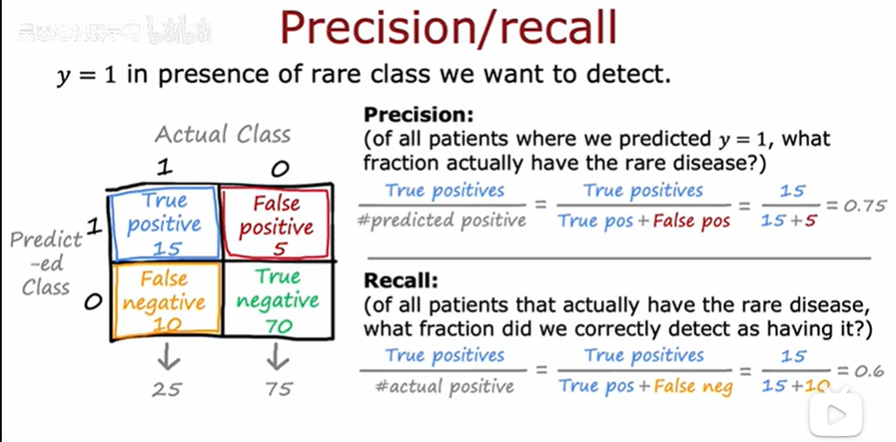

（4）查准率和查全率之间的权衡

如果我们希望只在非常确信的情况下预测为真（肿瘤为恶性），即我们希望更高的查准率，我们可以使用比 0.5 更大的阀值，如 0.7，0.9。这样做我们会减少错误预测病人为恶性肿瘤的情况，同时却会增加未能成功预测肿瘤为恶性的情况。

如果我们希望提高查全率，尽可能地让所有有可能是恶性肿瘤的病人都得到进一步地检查、诊断，我们可以使用比 0.5 更小的阀值，如 0.3。

将不同阀值情况下，查全率与查准率的关系绘制成图表，可以通过计算F1值来帮助我们选择这个阀值

### 05 决策树

#### 01 决策树模型

以下为 从根节点出发，根据特征向左或向右走，判断图片是否为猫的决策树

#### 02 构建决策树的整体过程

1.如何选择在每个节点进行划分的特征，确保划分后的子集是纯净的

2.何时停止划分（子集全部是一类、划分节点导致树超过最大深度、划分一个节点后纯度的提高低于阈值、一个节点的例子数量小于阈值）

#### 03 测量纯度

熵——它是对一组数据杂质的度量

定义p1是一组数据中为猫的占比，p0为不是猫的占比。

h(x)是熵函数，熵函数是一组数据杂质的度量，从零开始上升然后又回到零，作为样本中正面例子比例的函数，还有其他类似的函数，从零上升到1然后下降。这对于构建决策树也很有效。

h(x)为0时，表示是纯净的子集，即只有猫或只有狗

#### 04 选择拆分信息增益

构建决策树时，我们需要决定在节点上拆分什么特性，以此减少熵或减少杂质，或在决策树中最大化纯度。熵的减少称为信息增益。

通过计算熵的减少来决定是否有必要继续拆分。

在这个特殊的例子中，在耳朵形状上的分类导致熵的最大减少，所以我们会选择在根节点的耳朵形状特征上分类。

#### 05 构建决策树的完整过程

使用递归，在每个节点构建较小的决策树。从根节点开始，计算所有可能特征的信息增益，选择可以提供最高信息增益的特征进行划分，将数据集按照这个特征划分为两个子集，并创建左右两个分支，将数据集放到两个分支上，然后对这两个分支依次递归，直到超过最大深度或信息增益低于阈值或节点中的实例低于阈值，则不在划分。

#### 06 独热编码

对于某一个特征，可能不止两个分类。比如图像识别是否为猫的例子中，之前的耳朵形状只有圆和不圆，现在可以改为，耳朵是否为圆形，耳朵是否为椭圆形，耳朵是否为尖，每个特征只有两个离散值0和1，这种方式称为独热编码。

独热编码可以让决策树处理超过两个离散值的特征，也可以将这种方法应用于神经网络，线性回归或逻辑回归训练，但不适用于可取任何值的数值特征

#### 07 决策树处理连续数值特征

决策树处理连续数值特征的方法：尝试不同的阈值，进行常规的信息增益计算，并在选择的阈值上对连续值特征进行分割，如果它能提供最佳的信息增益，则根据此进行划分

例如对于动物的重量这一连续数值特征，可以通过计算信息增益，来决定如何划分构建决策树

#### 08 回归树

将[决策树](https://so.csdn.net/so/search?q=%E5%86%B3%E7%AD%96%E6%A0%91\&spm=1001.2101.3001.7020)推广为回归算法，来预测一个数字。在上面的例子中，动物的重量不再是输入，而是需要预测的值，即根据耳朵的形状，来预测动物的重量。

对于回归树，计算方差的减少，方差减少最多的，作为划分的特征，此例子中，选择动物耳朵的形状来划分。

#### 09 使用多个决策树

使用树的集成的原因是，由于拥有大量的决策树，使得整体算法对任何单棵树的影响变得不敏感，使得算法更加健壮。

例如在上面的例子中，仅仅修改一个猫，就有可能改变划分的特征，由根据耳朵形状划分变为根据胡子形状划分。

#### 10 有放回抽样

有放回抽样和无放回抽样的区别：有放回可以确保每轮抽取的结果不一定相同，无放回则每轮抽取的结果都相同

类似于从袋子里面抽球，抽一个后标记一下，然后放回去重新抽。

这样可以构造一个类似于最初训练集但又不同的新训练集，是构建决策树的关键构件。

#### 11 随机森林算法

将多个决策树结合在一起，每次数据集是随机有放回的选出，同时随机选出部分特征作为输入，所以该算法被称为随机森林算法。

我们只允许算法从子集k中选择信息增益最高的作为拆分特性的选择，如果所有特性n值很多时，对于k值得典型选择是$$k=\sqrt{n}$$

随机森林算法得好处是

1.降低关联性，减少决策树之间的相似性

2.提高计算效率，选择少部分特征可以减少计算的复杂度

3.减轻过拟合，较小的k值标注决策树更具随机性

#### 12 XGBoost

（1）XGBoost增强决策树算法，是比随机森林算法更强大的“增强的决策树”，计算效率很高、开源容易使用，在很多竞赛和商业实践中被使用。

（2）这个算法做的改进是，从第二次循环开始，不是以相等的概率选择每个训练示例，即不是以1/n的概率从所有m个概率相同的例子中挑选，而是更多选择先前训练过的表现比较差的树。也就是说在每一个训练中更关注上次训练中做的比较差的例子子集。

（3）在分类问题和回归问题中使用XGBoost

#### 13  什么时候使用决策树

决策树和神经网络的优缺点

| **决策树和集成树**                           | **神经网络**                                                                     |
| ------------------------------------- | ---------------------------------------------------------------------------- |
| 很好地处理表格数据/结构化数据，如房价预测，带有分类或连续值特征的表格数据 | 适用于所有类型的数据，包括表格或结构化数据、结构化与非结构化的混合数据                                          |
| 速度快                                   | 速度慢                                                                          |
| 小决策树容易被人类解释、可解释性比较强，但是如果树太多节点太多则不行    | 可以与迁移学习一起工作，可以在更大的数据集上进行预训练                                                  |
| 不建议在非结构化数据上使用，如图像、音频、文本               | 将多个神经网络串在一起更容易，可以构建更大的机器学习系统（根本原因是神经网络的结果是输出y或输入x的连续函数，串联不同的神经网络后可以同时使用梯度下降） |

## 第三部分 无监督学习、推荐系统和强化学习

### 00  视频传送门

[1.1 欢迎来到第三部分 无监督学习、推荐系统和强化学习\_哔哩哔哩\_bilibili](https://www.bilibili.com/video/BV1Bq421A74G?spm_id_from=333.788.videopod.episodes\&vd_source=50f2f5b2c83676d4a38697ecabf48753\&p=101)

笔记参考：[【吴恩达机器学习】无监督学习、推荐系统和强化学习\_吴恩达强化学习-CSDN博客](https://blog.csdn.net/2301_77253539/article/details/145722248)

### 01 聚类

#### 01 什么是聚类

聚类是一种无监督学习算法。

如下图，只是点，而不是用x和o表示的两类，所以无法告诉算法我们想要预测的正确答案y，相反，我们会要求算法发现数据中的一些特定的结构类型，尝试查看能否将其分组为聚类

#### 02 K-means算法的步骤

1.绘制一个数据集，包含30个未标记的训练示例

2.随机选取两个点（红色叉叉和蓝色叉叉），分别作为两个不同簇的质心。然后，将数据集中的每个点分配给离其最近的质心所在的簇。其中，簇的质心被称为簇质心。

3.针对每个簇，查看该簇内的所有点，并计算这些点的平均值，以此将簇中心移动到所得的平均位置，重新计算质心。

4.不断重复2、3两个步骤，直到簇不再发生变化，即表示K-means算法已经收敛

#### 03 K-means算法的实现

第一步，初始化质心：随机初始化k个质心`μ1，μ2..μk`

第二步，迭代：

1.分配点到簇中心：依次计算m个点到k个簇中心的距离，将其分配到最近的那个簇质心对应的簇

2.移动簇质心：对于1到k个簇，将每一簇质心μk移动到该簇的所有点的平均值处

&#x20;

#### 04 K-means的代价函数

`ci`:xi当前被分配的簇的索引（1-k）

`μk`:第k个簇的质心

`μci`:xi当前被分配的簇的质心

#### 05 初始化K-means

随机初始化：

1.选择簇的数量k\<m，即簇的数量要小于训练实例的总数m

2.从训练实例中随机选出k个训练实例

3.将k个簇的初始质心设置为这k个实例

尝试多个随机初始化后，运行K-means算法会得到不同的簇划分，通过计算每个划分后的成本函数J，找到成本函数最小的，来决定使用哪个初始化

即对于i=1到100{

随机初始化k-means算法

运行k-means，获得c1\~cm和μ1\~μk

计算每种随机初始化的代价函数

}

选择代价最低的簇

#### 06 选择聚类的个数

肘部法则是一种用于确定在k均值聚类算法中使用的质心数(k)的技术。

随着k值的增加，代价函数J逐渐减小，在k=3处出现拐点即肘部elbow，则k=3可能是一个合适的聚类个数。

当然，有时会根据具体的算法服务内容来决定，比如对T恤的尺寸进行分类，根据精细度可以分成3类或5类。

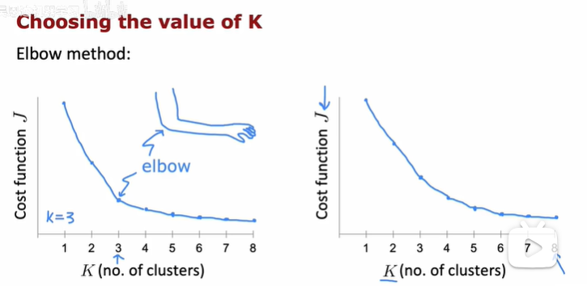

### 02 异常检测

#### 01 发现异常事件

例如飞机发动机的异常检测。飞机发动机的特征x1=产生的热量，x2=振动的强度...

新的发动机测试集为xtest，需要评估这个新的样本是否会发生异常。

进行异常检测的常见方法是密度估计。

蓝色的椭圆表示通过模型p(x)计算出的密度分度，越靠近中心密度越高，当测试集的密度分布小于阈值，则说明可能异常，否则不会异常。

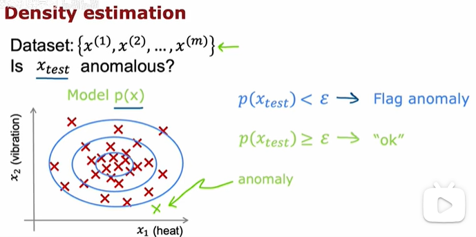

#### 02 高斯（正态）分布

曲线的中心由均值μ决定，曲线的标准差或宽度由方差参数σ决定，这条曲线显示的是p(x)或x的概率。

高斯分布的面积是1，所以当σ增大时，变宽，高度减小；当σ减小时，变窄，高度增加

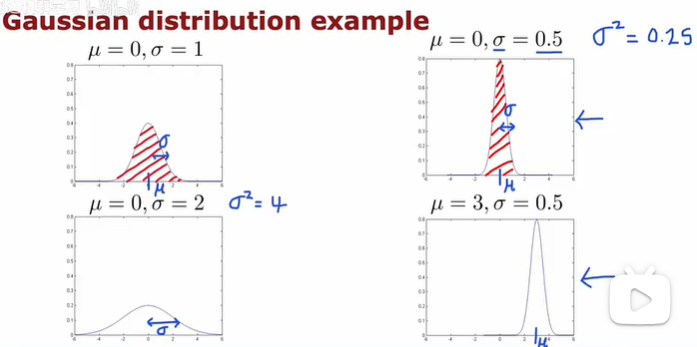

高斯分布中的参数（μ、σ）的估计：

#### 03 异常检测算法

当测试集有多个特征的时候，通过相乘计算p(x)

构建异常检测算法：

1.选择可能表示异常情况的特征xi

2.为n个特征拟合参数$${μ1-μn,σ1^2-σn^2}$$,其中μj是第j个特征的均值，$${σj^2}$$是第j个特征与μj之间差值的平分的平均值

3.计算概率密度p(x)

4.查看p(x)是否小于ε，若小于则异常

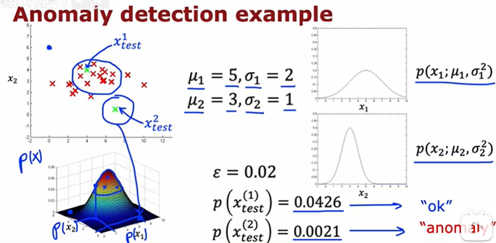

#### 04 开发和评估异常检测系统

在训练集x1-xm上你和模型p(x)，对于交叉验证或测试集中的每个样本x，预测结果y为1或0

可能的评估指标有：见2.4.5 类偏斜的误差度量[ 机器学习](https://ih60zp57kt.feishu.cn/docx/ZaIZdM0XFoqy7GxFsgqcAJiRnNS#share-OTR3dSnhzohZhWxwm39ciZucnvh)

1.真正例、假正例、假负例、真负例。这些指标用于描述模型预测结果与实际情况的符合程度。

2.精确率 / 召回率。精确率衡量预测为正例的样本中实际为正例的比例，召回率衡量实际正例中被正确预测为正例的比例。

3.F1 值，是精确率和召回率的调和平均数，能够综合评估模型的性能。

可以使用交叉验证集来选择合适的参数ε

#### 05 异常检测 vs 监督学习

异常检测试图找到可能与之前所见完全不同的新正例，而监督学习则会查看你的正例并尝试判断未来的例子是否与之前见过的正例相似

|      | 异常检测                                                        | 监督学习                                                                    |
| ---- | ----------------------------------------------------------- | ----------------------------------------------------------------------- |
| 样本数量 | 正样本（y=1，代表异常样本）数量极少，一般在 0 到 20 个较为常见，而负样本（y=0，代表正常样本）数量庞大。  | 拥有大量的正样本和负样本。                                                           |
| 样本特征 | 异常情况种类繁多，算法很难从少量的正样本中学习到异常的特征模式，而且未来出现的异常样本可能与已见过的异常样本完全不同。 | 正样本数量足够，使得算法能够学习到正样本的特征模式，并且未来遇到的正样本很可能与训练集中的正样本相似。                     |
| 应用场景 | 以欺诈检测（Fraud）为例，欺诈行为往往是少数且形式多样，难以通过少量的欺诈样本准确建模。              | 以垃圾邮件检测（Spam）为例，由于存在大量的垃圾邮件（正样本）和正常邮件（负样本），模型可以通过学习这些样本的特征，对新邮件进行准确分类 。 |
| 其他应用 | 欺诈检测、制造业-发现新的未知缺陷数据中心机器监控                                   | 垃圾邮件分类制造业-发现已知缺陷天气预测疾病分类                                                |

#### 06 选择要使用的特征

将非高斯分布的数据转换为更接近高斯分布的数据，有助于后续机器学习模型的应用。

在Python的Matplotlib库中,plt.hist()函数是实现直方图的绘制

当正常样本和异常样本计算出的概率p(x)相近（例如都较大）。这就导致模型难以通过概率值区分正常样本和异常样本，无法准确进行异常检测。

我们可以通过训练模型，观察交叉验证集中未被成功检测出的异常样本。分析这些样本，思考能否由此创建新的特征，使得算法在这些新特征上，能够发现异常样本具有异常大或异常小的值，进而准确地将它们标记为异常 。

### 03 推荐算法

#### 01 提出建议

电影推荐算法中,通过分析用户已有的评分数据，对于那些用户尚未评分的电影，我们尝试预测用户对它们的评分。基于这些预测，我们可以向用户推荐那些预测评分较高，例如可能被评为 5 星的电影 。

nu是用户数量

nm是电影数量

r(i,j)是用户j对电影i是否评分，评分为1，未评分为0，

y(i,j)是用户j对电影i的评分

#### 02 使用每项特征

为每个电影添加两个特征值，一个是浪漫程度，一个是动作程度。

则对于用户j，预测电影i的评分为wj\*xi+bj，类似于线性回归。其中xi是电影i的特征向量

代价函数：

nu是用户数量

nm是电影数量

r(i,j)是用户j对电影i是否评分，评分为1，未评分为0，

y(i,j)是用户j对电影i的评分

wj是用户j的参数向量

bj是用户j的偏置项

xi是电影i的特征向量

mj是用户j评价的电影数量

橙色的为正则化参数

只有当r(i,j)为1时才计算，否则没有评分无法计算

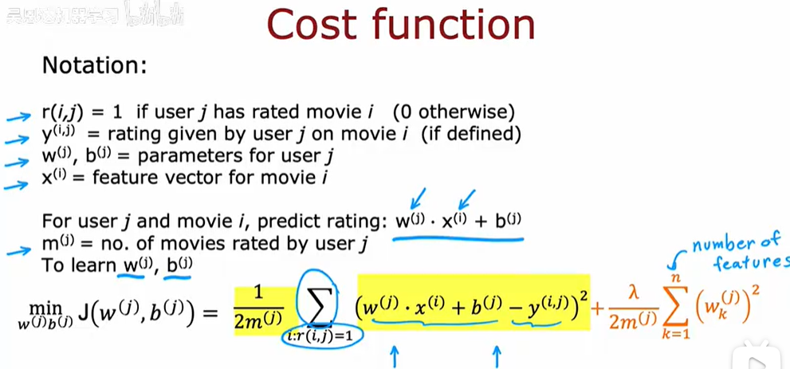

所有用户的代价函数，可以用来预测所有用户的电影评分

#### 03 协同过滤算法

电影的特征值x1和x2未知，可以根据已知评分，借助用户参数向量和特征向量的计算，来推断电影特征向量，进而预测未知评分。

若已知用户j的参数向量wj和偏置项bj，则可以根据已知的评分，预测电影的特征值

若未知用户的参数向量和偏置，第一个代价函数用于预测用户的参数向量和偏置，第二个代价函数用于预测电影的特征向量，最后将它们整合，用梯度下降最小化该代价函数

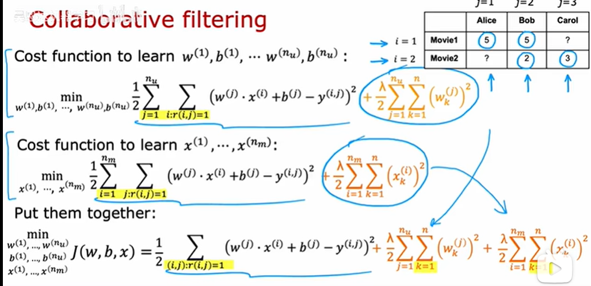

#### 04 二元标签

二元标签实例：

1.用户j看到商品后是否购买（1是，0否，？未展示给用户）

2.用户j是否收藏或喜欢该商品（1是，0否，？未展示给用户）

3.用户j是否在某项目上花费至少30秒时间（1是，0否，？未展示给用户）

4.用户j是否点击某商品（1是，0否，？未展示给用户）

对于二元标签，将预测y(i,j)等于1的概率，相当于之前是线性回归，现在二进制标签变成了逻辑回归。即将类似线性回归的协同过滤算法推广到适合二元分类的协同过滤算法

在线性回归中，我们直接预测一个连续值y(i,j)，通过线性组合来实现。

在二元分类中，我们需要预测一个概率值，表示某个事件发生的可能性。使用 sigmoid函数 g(z)将线性组合映射到 \[0, 1] 区间内，表示 y(i,j)=1 的概率。

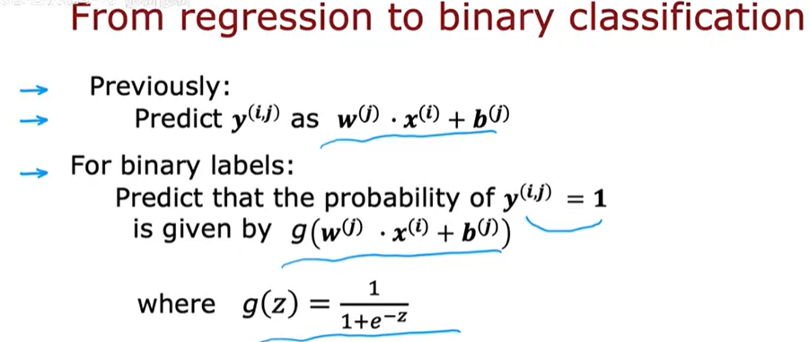

二元应用场景下协同过滤的代价函数：

#### 05 均值归一化

新用户（Eve），未对任何电影评分。在训练协同过滤算法时，最小化目标函数意味着要让参数w尽可能小。虽然我们没有对参数b进行正则化约束，但在初始化时将其设为 0，最终其值也会趋近于 0。当w和b都等于 0 时，算法会预测新用户对所有电影的评分均为 0，然而这样的预测结果实际帮助不大。

可以通过均值归一化来优化预测效果，将用户5对电影的初始评分预测为这些电影的平均分。在线性回归中也有均值归一化，见1.3.6 特征缩放[ 机器学习](https://ih60zp57kt.feishu.cn/docx/ZaIZdM0XFoqy7GxFsgqcAJiRnNS#share-PLUPdHcgkom3BvxtbNicIfmRn24)

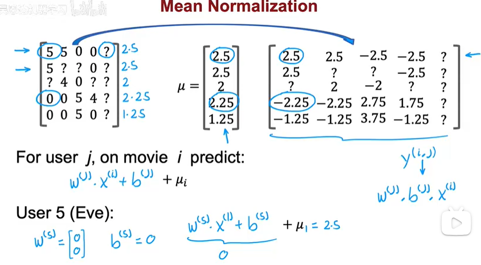

#### 06 协同过滤的TensorFlow实现

TensorFlow的强大的特性AutoDiff，自动求导（微分），会自动根据代价函数进行梯度下降计算。使用 TensorFlow 实现自定义训练循环，如图展示了梯度下降算法的TensorFlow实现。

1.定义变量

`w = tf.Variable(3.0)` 将 w 定义为一个 TensorFlow 变量，这是需要优化的参数，`iterations = 30` 表示训练迭代次数

`x = 1.0` 是输入值

`y = 1.0` 是目标值

`alpha = 0.01` 是学习率

2.记录计算步骤

使用 TensorFlow 的梯度带（Gradient Tape）来记录用于计算损失值 J 的步骤，以实现自动求导。

3.计算梯度

使用梯度带计算损失相对于参数 w 的梯度，即 `dJdw`。

4.更新参数

通过更新参数 w 的值（用参数 w 减去学习率与梯度的乘积）来执行一次梯度下降步骤，以减少损失。TensorFlow 变量需要使用特殊的函数才能进行修改。

协同过滤的TensorFlow实现（以电影评分预测为例）：

1.指定使用的是 Keras 优化器。这里实例化了一个 Adam 优化器，并将学习率设置为 0.1

2.`zip(grads, [X, W, b])` 将梯度列表 `grads` 和变量列表 `[X, W, b]` 中对应位置的元素组合成一个个元组，每个元组包含一个梯度和对应的变量。

3.`optimizer.apply_gradients()` 是优化器对象的一个方法，它接受一个由梯度和变量组成的元组列表作为输入，根据优化器的更新规则，使用这些梯度来更新对应的变量。

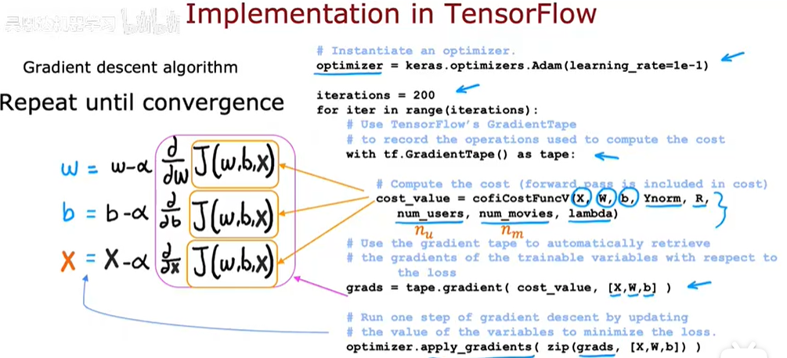

#### 07 寻找相关项目

（1）寻找相关项目

为了找到与项目 i 相关的其他项目，需要找到特征xk与xi相似的项目k 。例如找到其他动作程度高的电影。

计算项目 k 和项目 i 特征向量之间的欧几里得距离，距离越小，说明两个项目的特征越相似，也就认为它们是相关项目。

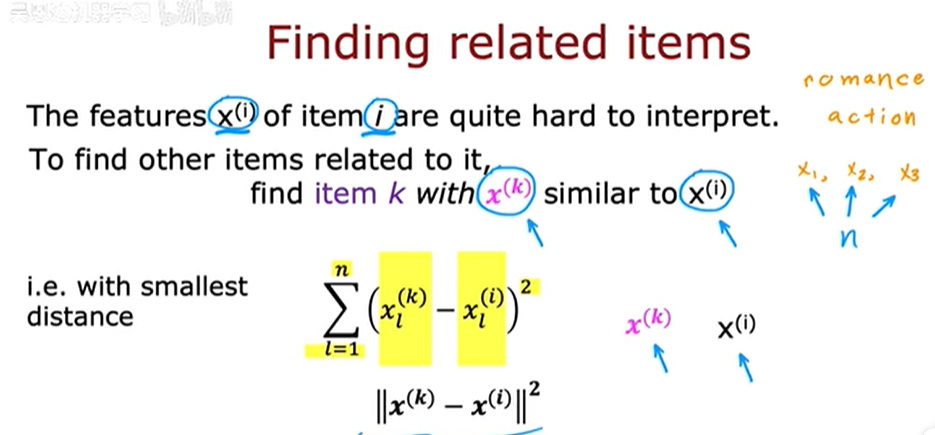

（2）协同过滤的局限性：

冷启动问题：有一个很少用户评分的新项目或有一个评分很少商品的新用户，协同过滤的结果可能不太准确

#### 08 协同过滤 vs 基于内容的过滤

协同过滤：推荐项目是基于 与你给出相似评分的 其他用户的 评分

基于内容的过滤：推荐项目是基于用户和项目的特征来寻找合适的匹配

预测用户j对电影i的评分:`wj*xi+bj`

在基于内容的过滤中，去掉`bj`通常不会损坏其性能

在基于内容的过滤中，用`vuj`（从用户特征`xuj`中计算出的数字列表，u下标代表一个用户）代替`wj`，用`vmi`（从用户特征`xmi`中计算出的数字列表，m下标代表一部电影）代替`xi`，`xuj`和`xmi`的维度可能不同，但`vuj`和`vmi`的维度必须相同，这样才能对它们取点积，通过点积运算来寻找两者之间的匹配度。

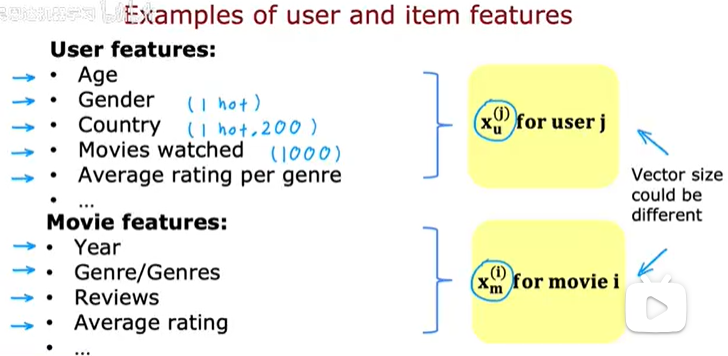

#### 09 深度学习在基于内容的过滤中的应用

（1）神经网络架构：

用户网络：输入用户特征向量`xu`，经过三个隐藏层，输出用户特征表示向量`vu`

电影网络：输入电影特征向量`xm`，经过三个隐藏层，输出电影特征表示向量`vm`

（2）预测过程：

将用户网络输出的`vuj`和电影网络输出的`vmi`点积，通过函数`g(vuj,vmi)`来预测`y(i,j)`为1的概率，表示用户j对电影i是否喜欢

（3）代价函数：

为了找到与电影 i 相似的电影，可以计算其他电影 k 的向量 `vmk` 与电影 i 的向量 `vmi `之间的平方距离，如果这个距离很小，则说明电影 k 与电影 i 很相似。

#### 10 从大目录中推荐

从大量项目中高效地找到推荐的两个关键步骤：检索和排序

（1）检索

生成大量的项目候选列表

例如：

1.对于用户最近观看的 10 部电影中的每一部，找到 10 部最相似的电影

2.针对用户观看次数最多的 3 种电影类型，分别找出排名前 10 的电影

3.找出该国最热门的前 20 部电影

将检索到的项目合并成一个列表，同时去除重复的项目以及用户已经观看过或购买过的项目

（2）排序

1.获取检索到的列表，并使用训练好的模型进行排序

2.向用户展示排好序的项目

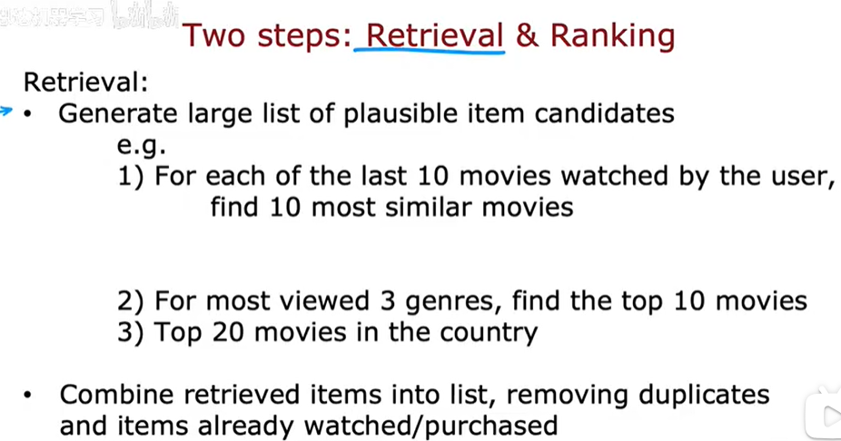

#### 11 基于内容过滤的TensorFlow 实现

1.创建用户神经网络模型，激活函数为relu

2.创建项目神经网络模型，激活函数为relu

3.创建用户特征输入层

4.将用户特征输入传递给用户神经网络，并进行L2归一化

5.创建项目特征输入层

6.将项目特征输入传递给项目神经网络，并进行L2归一化

7.计算用户特征向量和项目特征向量的点积，衡量相似度

8.定义整个模型，指定输入和输出

9.选择均方误差作为损失函数

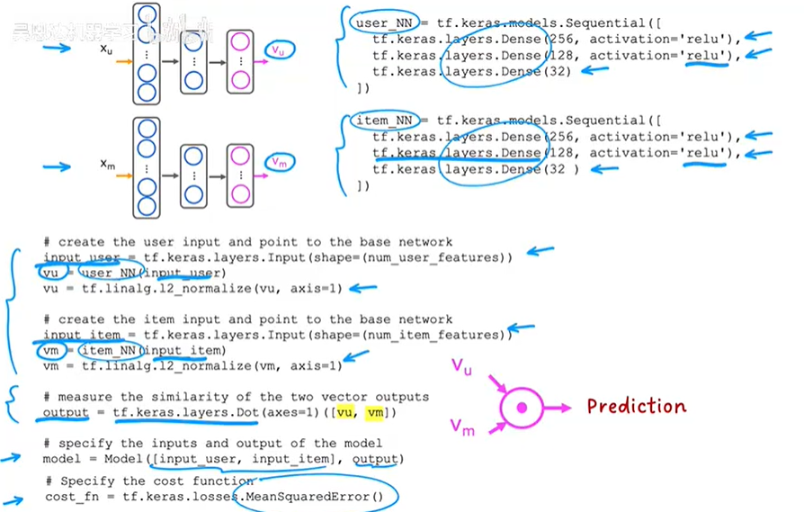

### 04 强化学习

#### 01 什么是强化学习

对于直升机控制为例，任务是根据直升机的位置决定如何移动控制杆，因此需要找到一个函数，将直升机的状态映射到一个动作，即确定两个控制杆应该推多远，以保持直升机在空中和飞行中的平衡。

不适合使用监督学习，因为很难获得足够准确的数据集来训练模型，特别是难以确定在给定状态下正确的动作是什么。

强化学习的一个关键输入是奖励函数，它告诉直升机何时做得好，何时做得不好。

强化学习算法的训练过程是这样的：找出如何获得更多的正向奖励和更少的负向奖励的结果。

例如在直升机飞行好的时候给予+1正反馈，飞的不好的时候给予-1000负反馈

#### 02 强化学习形式化

状态：状态 1 和状态 6 是终端状态，分别标记为 100 和 40，状态 2、3、4、5 是中间状态

动作：探测车可以向左移动或向右移动

奖励函数：如果探测车到达状态 1，获得 +100 的奖励；如果探测车到达状态 6，获得 +40 的奖励；在其他状态下，奖励为 0

状态转移：可以用元组`(s, a, R (s), s') `表示，具体到这个例子就是 (4, ←, 0, 3) ，其中 4 是当前状态 s，←是动作 a，0 是在当前状态执行该动作获得的奖励 R (s)，3 是转移后的新状态 s'

#### 03 强化学习的回报

回报是对各个时刻奖励的加权求和，权重由折现系数决定 。折现系数是一个小于1的数值，它体现了强化学习算法对未来奖励的 “不耐烦” 特性。如果没有折现，回报可能会过度依赖于初始奖励；而有了折现，后续时刻的奖励需要乘以一个小于1的系数（如0.9），这就使得随着时间推移，未来奖励在总回报中的权重逐渐降低。因此，越早获得奖励，对总回报的贡献越大。

如图为折现因子r为0.9或0.5时，从状态4到状态1的回报计算

#### 04 强化学习中的决策与策略制定

强化学习的目标是找到一个策略 π ，该策略能针对每个状态 s，给出应采取的行动 a（a = π(s)） ，从而使回报最大化 。例如`π（3）`即在状态3时希望采取的行动是向左走，可以获得更大的回报

#### 05 **马尔可夫决策过程（MDP）**

强化学习的形式化通常基于马尔可夫决策过程，用于描述智能体在一个环境中采取行动以最大化累积奖励的过程。

智能体（Agent）：是做出决策的实体，图中用 “Agent π” 表示，π 代表策略，即智能体根据当前状态选择行动的规则 。

环境（Environment / World）：是智能体所处的外部世界，智能体与环境进行交互。

状态（state s）：表示环境在某一时刻的状况，智能体能够感知到这些状态。

奖励（reward R）：是环境根据智能体的行动反馈给智能体的数值信号，用于衡量行动的好坏。

行动（action a）：是智能体在某个状态下采取的行为，行动会使智能体从一个状态转移到另一个状态。

箭头表示了信息和动作的流动方向：

1.智能体根据当前状态选择一个动作。

2.动作被发送到环境中。

3.环境根据动作更新状态，并返回一个新的状态和奖励给智能体。

4.这个过程不断重复，直到达到某个终止条件。

MDP的目标是找到一个最优策略π，使得智能体能够最大化其长期累积奖励。

#### 06 状态动作值函数定义

状态 - 动作价值函数，也称为 **Q 函数**（Q - function），表示在状态 s 下采取动作 a 一次，然后以最优策略行动后所能获得的回报。即：

1.从状态 s  开始

2.采取动作 a（仅一次）

3.之后以最优方式行动

智能体可以依据 Q 函数在不同状态下做出最优动作选择，以获取最大的长期回报。

#### 07 Bellman方程

贝尔曼方程：表示在状态 s 下采取动作 a 的价值 Q(s,a) 等于即时奖励 R(s)加上折扣因子 γ 乘以在新状态 s′ 下采取最优动作 a′ 的价值 Q(s′,a′)。

**s**：当前状态

**a**：当前动作

**s'**：采取动作 a 后到达的状态

**a'**：在状态 s' 下采取的动作&#x20;

**R(s)**：当前状态 s 对应的奖励

#### 08 随机环境

智能体采取的行动并不一定能确定性地到达预期的状态，而是以一定概率转移到不同状态，增加了环境的不确定性和复杂性。

如图所示，

1.当智能体选择向左行动时，有 0.9 的概率成功向左转移，有 0.1 的概率向右转移；

2.当智能体选择向右行动时，有 0.1 的概率向左转移，有 0.9 的概率成功向右转移。

强化学习算法的工作是选择一个策略，最大化预期回报的平均值。

E是后续状态s'下执行最优动作a'时的期望最大价值

#### 09 连续状态空间应用示例

离散状态：是由一系列分离的、可数的状态组成。例如，火星探测车可能处于几个特定的位置之一，而不能处于这些位置之间的任何其他位置

连续状态：是指系统状态可以在某个区间内任意取值的状态。例如，卡车的位置、速度和角度等参数可以是连续变化的，而不是跳跃式的。图中给出了一个状态向量 s，它包含多个变量：x,y,θ,x˙,y˙,θ˙。这些变量分别代表位置（x, y）、方向角（θ）、以及它们的变化率（x˙,y˙,θ˙），这些都是连续变化的参数。

#### 10 月球着陆器

月球着陆器目标是安全降落在两个旗帜之间的平坦区域。

向量 s 包含以下元素：

x,y：着陆器在二维空间中的位置坐标。

x˙,y˙：着陆器在两个方向上的速度。

θ：着陆器的姿态角，即相对于水平面的角度。

θ˙：着陆器姿态角的变化率，即角速度。

l,r：着陆器左右腿是否接地（二进制值）

奖励函数 ：

成功到达着陆平台可获得 100 到 140 的奖励分数。

朝着或远离着陆平台移动会有额外奖励。

如果着陆器坠毁，会得到 -100 的惩罚分数。

实现软着陆可获得 100 的奖励分数。

着陆器的腿接触地面可获得 10 的奖励分数。

启动主发动机，每次会扣 0.3 分。

启动侧推进器，每次会扣 0.03 分。

#### 11 学习状态-价值函数

（1）使用神经网络来计算状态-动作对的Q值，并选择最优动作。

输入向量 x 包含两部分：状态 s 和动作 a。

状态 s 包括多个变量，如位置、速度和角度等。

动作 a 是一个离散的动作，采用独热编码，例如“不做任何事”、“向左移动”、“主发动机点火”、“向右移动”。

在状态 s 中，使用神经网络计算： Q(s,nothing)，Q(s,left)，Q(s,main)，Q(s,right)，选择使得 Q(s,a) 最大的动作 a。

（2）使用神经网络 fw,b(x)≈y来逼近目标Q值，网络的输入是状态和动作对 (s,a)，输出是对应的Q值

（3）深度Q网络（Deep Q-Network, DQN）算法

随机初始化一个神经网络作为 Q(s,a) 的猜测

重复以下步骤：

1.在月球着陆器环境中执行动作，获取四元组`(s, a, R (s), s') ` （分别表示当前状态、执行的动作、在该状态下获得的即时奖励、下一个状态）。

2.存储最近的 10000 个四元组，这种只存储最新示例的技术有时称为“经验回放缓冲区”或者简称为 “回放缓冲区”。

训练神经网络：

1.使用回放缓冲区中的 10000 个样本创建训练集。

2.对于每个样本 (s,a,R(s),s′)，定义输入 x=(s,a)和目标输出

3.训练新的Qnew，使Qnew(s,a)尽可能接近y

将Q更新为Qnew

#### 12 算法优化：改进的神经网络架构&#x20;

输出层：4 个输出单元，分别对应四个动作

当处于 s 状态时，同时计算四个可能动作对应的 Q 值，这样做效率更高，因为对于给定状态，仅需一次推理，就能获取这四个 Q 值，随后可快速选择能使状态 s 下 Q 值最大化的动作 a。

#### 13 算法优化：ε- 贪婪策略

在学习过程中如何选择动作？

选择1：

选择使 Q(s,a)最大的动作 a。

选择2：

以概率 0.95 选择使 Q(s,a)最大的动作 a。这种选择被称为“贪心”或“利用”。

以概率 0.05 随机选择一个动作 a。这种选择被称为“探索”。

**ε-贪婪策略：**

在某个状态 s 下，初始时 ϵ 设为较高值（例如 1.0），此时随机探索的概率较大；然后逐渐减少到较低值（例如 0.01），这意味着随着时间推移，随机采取行动的可能性降低，智能体更倾向于依据对 Q 函数的改进估计来选择合适的动作。

#### 14 算法优化： 小批量和软更新

（1）小批量

当训练集规模非常庞大时，传统的梯度下降算法可能会变得相当缓慢。小批量梯度下降提供了一种解决方案：不是在每次迭代中使用全部训练样本 m，而是选择一个较小的子集 m′。因此，在每次迭代中，梯度下降只处理这 m′个样本，而不是整个数据集 m，每一步计算所需的时间大幅减少，进而产生了一个更为高效的算法。

批量梯度下降：

使用整个数据集来计算梯度，并更新参数。

路径较为平滑，但每次迭代需要处理大量数据，计算成本较高。

小批量梯度下降：

每次迭代只使用一小部分数据（小批量）来计算梯度，并更新参数。

路径较为曲折，但每次迭代所需的时间较少，计算成本低，整体上可以更快地收敛。

（2）软更新

传统的硬更新方式是直接将的Q设为Qnew，即Q=Qnew，对应的权重更新也是直接用新权重Wnew完全替换旧权重W，偏置也类似。

软更新方式并非直接替换，而是通过加权平均的方式来更新参数。这种方式使得更新过程更为平滑，新参数对旧参数的影响较为缓和，有助于防止模型因更新幅度过大而出现不稳定的情况 。

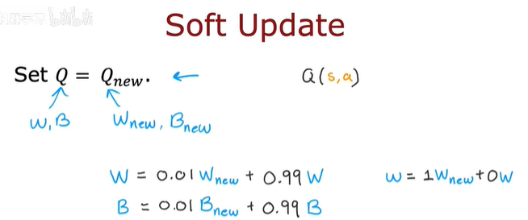

