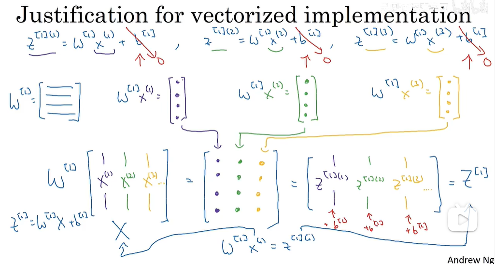
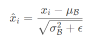
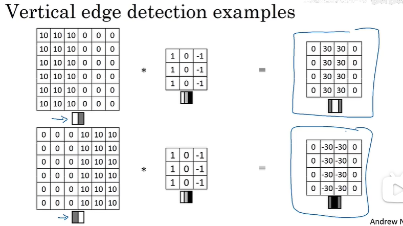
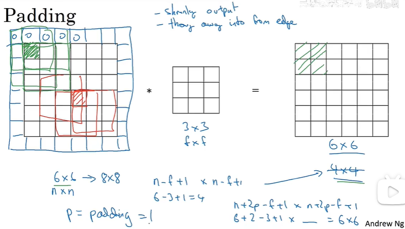
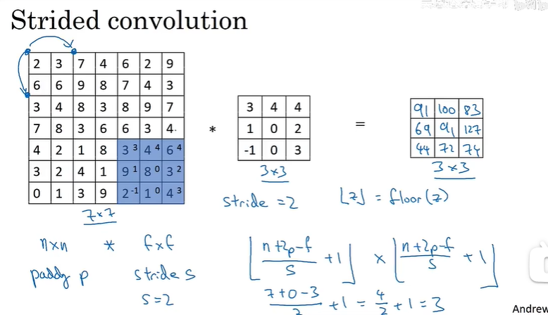
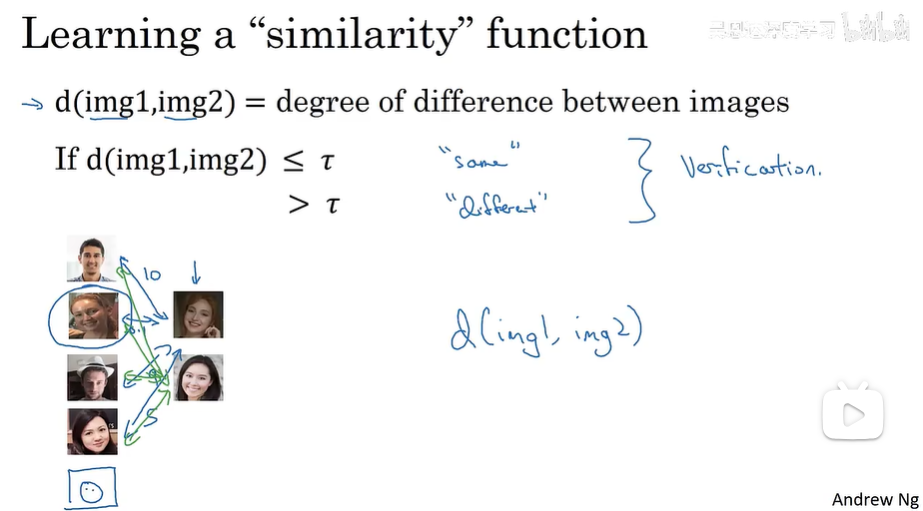
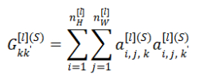
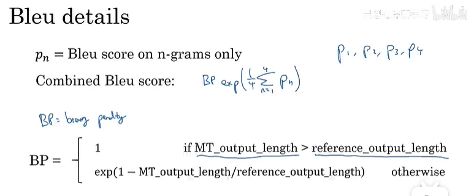

## 第一部分 神经网络和深度学习

### 01 深度学习概论

#### （1）ReLU

ReLU（Rectified Linear Unit，修正线性单元）是一种常用的激活函数，广泛应用于深度学习领域。修正是指取不小于0的值。

优先用ReLU：

优先用Sigmoid：

#### （2）不同类型的神经网络模型

根据不同的问题和应用场合，应该使用不同类型的神经网络模型

一般的监督式学习（房价预测和线上广告问题）——标准的神经网络模型

图像识别处理问题 —— 卷积神经网络（Convolution Neural Network），即CNN

处理类似语音这样的序列信号 —— 循环神经网络（Recurrent Neural Network），即RNN

其它的例如自动驾驶这样的复杂问题 —— 复杂的混合神经网络模型。

CNN和RNN是比较常用的神经网络模型。下图给出了Standard NN，Convolutional NN和Recurrent NN的神经网络结构图。

CNN：卷积神经网络 常用于图像数据

RNN：循环神经网络 处理一维序列数据，其中包含时间成分

#### （3）**结构化数据和非结构化数据**

**结构化数据（Structured Data）**&#x662F;数据的数据库，意味着每个特征都有清晰的定义，比较容易理解。

**非结构化数据（Unstructrued Data）**，通常指的是比较抽象的数据，比如音频、原始音频、图像、文本。

### 02 神经网络基础

#### （1）Sigmiod函数

1.$$w^T x + b
$$线性输出区间为整个实数范围，而逻辑回归要求输出范围在\[0,1]之间，所以需要进行转换。

引入Sigmiod函数，让输出限定在\[0,1]之间。

Sigmiod函数是一种非线性的S型函数，输出范围是\[0,1]，通常在神经网络中当**激活函数（Activation function）**。

2.表达式和曲线：$$\sigma(x) = \frac{1}{1 + e^{-x}}$$

从曲线可以看出，当z很大时，函数值趋于1；

当z很小时，函数值趋于0；

且当z=0时，函数值为0.5。

3.Sigmoid函数的一阶导数可以用自身表示：

$$\frac{d}{dx} \sigma(x) = \sigma'(x) = \sigma(x) \left(1 - \sigma(x)\right)$$

#### （2）logistic回归损失函数

**1.损失函数**L，是在单个训练样本中定义的，它衡量了在单个训练样本上的表现

**2.成本函数**J，它衡量的是在全体训练样本上的表现。

**3.成本函数(cost function)**&#x662F;关于未知参数w和b的函数，我们的目标是在训练模型时，要找到合适的w和b，让成本函数J尽可能的小。

#### （3）梯度下降

梯度下降算法每次迭代更新，w和b的修正表达式为：

其中，alpha是**学习因子（learning rate）**，表示梯度下降的步进长度，其值越大，w和b每次更新的“步伐”更大一些；越小，更新“步伐”更小一些。在程序代码中，我们通常使用dw来表示。

梯度下降算法能够保证每次迭代w和b都能向着J(w,b)全局最小化的方向进行。

#### （4）逻辑回归中的梯度下降

1.对单个样本而言，逻辑回归**损失函数(Loss function)**&#x8868;达式如下：

2.该逻辑回归的正向传播过程非常简单。根据上述公式，例如输入样本x有两个特征(x1,x2)，相应的权重w维度也是2，即(w1,w2)。则z=w1x1+w2x2+b。

3.计算该逻辑回归的反向传播过程，即由**损失函数(Loss function)**&#x8BA1;算参数w和b的偏导数。

4.知道了dz之后，就可以直接对w1，w2和b进行求导了。

5.则梯度下降算法可表示为：

更新w1为w1减去学习率乘以dw1；更新w2为w2减去学习率乘以dw2；更新b为b减去学习率乘以db。这就是单个样本实例的一次梯度更新步骤。

#### （5）m个样本的梯度下降

1.如果有m个样本，其成本函数表达式如下：

2.Cost function关于w和b的偏导数可以写成和平均的形式：

3.但使用for循环计算效率很低，可以使用向量化

#### （6）向量化logistic回归

一个矩阵X来作为你的训练输入，维度是(n\_x,m)。即行为特征数量，列为样本数。

一个1\*m的矩阵Z来作为你的训练输出

w是一个n\_x\*1的矩阵，即列向量，转置之后w^T的维度是(1,n\_x)，即行向量

b是一个常数值，标量 (1,1) 或广播为 (1,*m*)

#### （7）python中的广播

**广播（broadcasting ）**&#x662F;一种手段，可以让你的代码更快。

python中可以对不同维度的矩阵进行四则混合运算，但至少保证有一个维度是相同的。

#### （8）关于python numpy 向量的说明

生成的a的维度是(5，)，这是所谓的python中秩为1的数组，称为rank 1 array，它既不是行向量也不是列向量，这导致它有一些略微不直观的效果。不建议使用。

如下，定义(5,1)的列向量

如果得到了一个“rank 1 array”，可以用reshape转换成5\*1数组：

#### （9）logistic成本函数的解释

1.首先，预测输出y帽可以写成：

2.y帽可以看成是给定训练样本x条件下y=1的概率：

那么，当y=1时：

当y=0时，

3.把两个式子整合到一个式子中，得到：

4.若所有 *m* 个样本独立同分布，其联合概率（似然函数）为：

极大似然估计的目标就是让所有样本的预测概率 *P*(*y*(*i*)∣*x*(*i*)) 的乘积最大化。

5.为避免数值下溢，先取对数（单调递增，不改变优化方向）

6.我们希望上述概率P越大越好，加上负号就是单个成本的损失函数，我们希望越小越好，这与之前介绍的一致，转化为最小化问题，如下式：

此即**交叉熵损失（Cross-Entropy Loss）**，衡量预测概率分布与真实分布的差异。

7.归一化后的平均损失：

8.核心概念区分

### 03 浅层神经网络

#### （1）概念

浅层神经网络（Shallow Neural Network）通常指仅包含**一个隐藏层**的神经网络（有时也泛指隐藏层较少的网络，如1-2层）。它是深度学习中最基础的模型之一，介于简单的线性模型（如逻辑回归）和深层神经网络（如深度卷积网络）之间。

感知机是浅层神经网络的**特例**（当隐藏层数为0时）。浅层神经网络可视为**多个感知机的堆叠**（隐藏层由多个感知机单元组成）。两者都是**前馈网络**（数据单向传播）。

#### （2）神经网络表示

把隐藏层输出记为a^\[1]，上标从0开始。用下标表示第几个神经元，注意下标从1开始。例如a^\[1]\_1表示隐藏层第1个神经元（节点）。

上面的例子可以说这是一个“三层的”神经网络，因为它有输入层、隐藏层和输出层。当你在研究论文时发现，一般称为**双层神经网络**，因为我们不把输入层看作一个标准的层，即输入层是第0层。

**隐藏层**对应的权重W^\[1]和常数项b^\[1]，W^\[1]的纬度是（4,3）。这里4对应着隐藏层神经元个数，3对应输入层特征向量x的元素个数。

常数项b^\[1]的纬度是（4,1），4也对应着隐藏层神经元个数。

**输出层**对应的权重W^\[2]和常数项b^\[2]，W^\[2]的纬度是（1,4）。这里1对应着输出层神经元个数，4对应隐藏层特征向量x的元素个数。

常数项b^\[2]的纬度是（1,1），因为输出只有1个神经元。

**总结**：第i层的权重W^\[i]维度的行等于i层神经元的个数，列等于i-1层神经元的个数；第i层常数项b^\[i]的行等于第i层神经元的个数，列始终为1。

#### （3）计算神经网络的输出

每个节点的计算都对应着一次逻辑运算的过程，分别由计算z和a两部分组成。

向量化后可以提高计算效率。

#### （4）多个例子中的向量化

用上标(i)表示第i个样本，当有多个样本时，则需要用for循环，从1到样本数m。

为了去除for循环，可以把x向量堆叠到矩阵各列构成X矩阵，对于z同理。**矩阵的行数表示神经元个数，列数表示样本数目m。**

#### （5）激活函数

在隐藏层和输出层可以选择激活函数，介绍几个不同的激活函数g(x)。

**1.sigmoid函数**-（0,1）

**2.tanh函数（双曲正切函数）**-（-1,1）

**3.ReLU函数（修正线性单元）**

**4.Leaky ReLU函数（泄漏的ReLU）**

**5.总结**

1.sigmoid函数除非用在二元分类的输出层，不然绝对不要用，或者几乎从来不用。

2.tanh函数几乎在所有场合都更优越。

3.最常用的默认激活函数是ReLU，如果你不确定用哪个，你就用这个，或者也可以试试带泄漏的ReLU。斜率参数 *α* 通常设为 0.01（即负区间输出 0.01*z*），但也可以调整。

4.如果你用线性激活函数（恒等激活函数），那么神经网络只是把输入线性组合再输出（假设激活函数为g(z)=z，经过推导我们发现a^\[2]仍是输入变量x的线性组合）。事实证明，如果你使用线性激活函数或者没有激活函数，那么无论你的激活函数有多少层，一直在做的只是计算线性激活函数，所以不如去掉全部隐藏层。使用神经网络与直接使用线性模型的效果并没有什么两样。因此，隐藏层的激活函数必须要是非线性的。如果所有的隐藏层全部使用线性激活函数，只有输出层使用非线性激活函数，那么整个神经网络的结构就类似于一个简单的逻辑回归模型。

#### （6）激活函数的导数

**1.sigmoid函数的导数**

**2.tanh函数的导数**

**3.ReLU函数的导数：**

**4.Leaky ReLU函数：**

#### （7）随机初始化

你有两个输入特征，设置W和b为零，导致两个神经元得到相同的结果，因为两个隐藏单元都在做完全一样的计算。在这种情况下，多个隐藏单元没有意义。对于多个输入特征也是一样的。

**0.01怎么来的？**&#x5B9E;际上我们通常把权重矩阵初始化成非常小非常小的随机值，因为如果使用tanh函数或sigmoid激活函数，权重太大是计算出来的值可能落在平缓部分，梯度的斜率非常小，意味着梯度下降法会非常慢，学习过程也会非常慢。

### 04 深层神经网络

#### （1） 深度神经网络

上图是一个四层的有三个隐藏层的神经网络，然后隐藏层中的单元数目是5,5,3，然后有一个输出单元。

我们用大写的L表示神经网络的总层数，这里L=4，n^\[l]表示l层上的单元数（节点数），所以当我们把输入层标为第0层时，则n^\[1]表示第一个隐藏层的单元数为5，同样n^\[2]=5，n^\[3]=3，n^\[4]=n^\[L]=1，对于输入层n^\[0]=n\_x=3，表示3个输入特征x1,x2,x3。

对于第l层，用a^\[l]表示l层的激活函数输出，由a^\[l]=g(z^\[l])计算得到。用W^\[l]来表示在a^\[l]中计算z^\[l]值的权重，b^\[l]也一样。

输入特征用x表示，x也是第0层的激活函数，所以x=a^\[0]。最后一层的激活函数a^\[L]=y帽（预测输出，这个神经网络预测出来的y帽）。

#### （2）矩阵的维数

向量化后，第l层的维度：（其中m是样本数）

w的维度是（下一层的维数，前一层的维数）：

#### （3）搭建深层神经网络块

对于神经网络所有层，整体的流程块图正向传播过程和反向传播过程如下所示：

#### （4）超参数

什么是超参数？比如算法中的learning rate α（学习率）、iterations N(梯度下降法循环的数量)、L（神经网络层数）、n^\[l]（各层的神经单元数目）、choice of activation function（激活函数的选择）都需要你来设置，这些数字实际上控制了最后的参数W和b的值，所以它们被称作超参数（hyperparameters）。

## 第二部分 改善深层神经网络：超参数调试、正则化以及优化

### 01 深度学习的实践

#### （1）训练集、验证集、测试集

1.通常将所有的样本数据分成三个部分：Train/Dev/Test sets。

**训练集（Train sets）**&#x7528;来执行训练算法；

**验证集（Dev sets）**&#x6216;简单交叉验证集选择最好的模型，经过充分验证不同算法的表现情况，选定了最终模型；

**测试集（Test sets）**&#x8FDB;行评估，用来测试最好算法的实际表现，作为该算法的无偏估计。

2.为了无偏评估算法的运行状况，**小数据量时**机器学习一般三七分，即70%训练集30%测试集。如果有验证集，则设置比例依次为60%、20%、20%。如果数量为100、1000或10000，这是比较科学的。

但是在**大数据时代**，数据量是百万级的，那么验证集和测试集占总数据量的比例会趋向于变小。例如对于百万级数据样本，Train/Dev/Test sets的比例通常可以设置为98%/1%/1%。

3.要确保验证集和测试集的数据来自**同一分布**

4.数据没有测试集也没关系，测试集的目的是对所选定的神经网络系统做出无偏评估，如果不需要无偏评估，也**可以不设置测试集**，在验证集（test sets）上选择合适的模型。

#### （2）偏差和方差

**1.两者区别**

**高偏差**：两条曲线收敛到高误差。模型“太笨”，连训练数据都学不好。

**高方差**：两条曲线间差距大，训练误差低但验证误差高。模型“太敏感”，把噪声当规律。

**2.解决方法**

**高偏差**（欠拟合）：

**高方差**（过拟合）：

#### （3）正则化

在机器学习中，**L1正则化（Lasso）**&#x548C;**L2正则化（Ridge）**&#x662F;两种常用的正则化技术，用于防止模型过拟合。

**1.L1正则化（Lasso）**

在损失函数中增加权重的**绝对值之和**作为惩罚项：

*λ*：正则化强度（超参数）。

*wi*：模型权重。

**2.L2正则化（Ridge）**

在损失函数中增加权重的**平方和**作为惩罚项：

*λ*：正则化强度（超参数）。

*wi*：模型权重。

**3.两者区别**

**L1正则化（稀疏性）**

由于绝对值惩罚在0处不可导，优化时会**强制某些权重归零**，从而实现特征选择。
**适用场景**：特征维度高，且希望自动选择重要特征时（如线性回归+特征剔除）。

**L2正则化（平滑性）**

平方惩罚使得权重**整体缩小但不归零**，避免某些权重过大。
**适用场景**：特征间相关性较强，或需要保留所有特征时（如防止过拟合的回归/分类）。

**4.为什么正则化可以减少过拟合？**

如果正则化参数很大，参数w很小，z也会相对变小，此时忽略b的影响，z会相对变小，实际上z的取值范围很小，tanh函数会**相对呈线性**，整个神经网络会计算离线性函数近的值，这个线性函数非常简单，并不是一个极复杂的高度非线性函数，不会发生过拟合。

增大正则化系数 λ 会迫使模型权重 W 趋向于更小的值，甚至趋近于 0。这种现象可以从优化目标（成本函数）和梯度下降的更新规则两个角度直观理解。优化目标（成本函数）角度，当 λ 增大，模型会更倾向于最小化权重的平方和，因为这会显著降低总成本，成本函数几乎完全由正则化项主导，最优解会强制所有权重 w约等于0，模型退化为简单的常数预测（高偏差状态）。从梯度下降角度，每次更新时，权重会额外减去 *αλ*W，相当于不断“衰减”权重，λ 越大，衰减力度越强，权重会更快速地向 0 靠近。

**5.Dropout&#x20;**

Dropout 是一种用于防止神经网络过拟合的正则化技术。它的核心思想是在训练过程中**随机丢弃（关闭）一部分神经元**，从而减少神经元之间的复杂共适应关系（Co-adaptation），增强模型的泛化能力。

**6.Inverted Dropout（反向随机失活）**

Inverted Dropout 是 Dropout 的一种改进实现方式，核心思想是**在训练阶段对未被丢弃的神经元进行放大（而非测试阶段缩小）**，从而简化测试阶段的处理。

keep-prob是一个具体数字，它表示保留某个隐藏单元的概率。

假设第三隐藏层上有50个单元（神经元），在一维上a^\[3]是50，通过因子分解拆分为50\*m维的，保留和删除它们的概率分别为80%和20%，这意味着最后被删除或归零的单元平均有10（50×20%=10）个。z^\[4]=w^\[4]\*a^\[3]+b^\[4]，a^\[3]减少了20%，为了不影响z^\[4]的期望值，将w^\[4]\*a^\[3]除以0.8，它将会修正或弥补我们所需的那20%，a^\[3]的期望值不变，划线部分（上图a3 /= keep-prob）就是所谓的dropout方法，这样使测试阶段变得更容易，因为它的数据扩展问题变少。

**传统方式**：训练时放大（`1/(1-p)`），测试时缩小（`1-p`）。

**Inverted方式**：训练时**提前对输入数据除以&#x20;**`(1-p)`，测试时无需调整。
→ 相当于把测试时的缩放操作“反向”提前到训练阶段。

**7.为什么 Dropout 能起到正则化作用？**

Dropout 之所以能防止过拟合（即起到正则化作用），主要基于以下 **4 个核心机制**：

**（1）破坏神经元的协同适应性（Co-adaptation）**

**问题背景**：在普通神经网络中，某些神经元可能过度依赖其他神经元（例如“A神经元只在B神经元激活时才有效”），导致模型对训练数据中的噪声或特定模式过于敏感。

**Dropout 的解决方式**：
随机丢弃神经元迫使每个神经元**独立学习更有用的特征**，不能依赖“队友”的存在。这类似于团队中每个人必须全能，而不是只擅长特定协作。

**（2）隐式模型平均（Implicit Model Averaging）**

**训练时**：每次迭代使用不同的子网络（因神经元随机丢弃），相当于训练了多个共享权重的模型。

**测试时**：整合所有子网络的结果（通过权重缩放或直接平均），类似集成学习（Ensemble Learning）的效果。
**数学体现**：
若丢弃概率为 p，测试时输出是所有可能子网络的几何平均（乘以 1−*p*）。

**（3）引入噪声，增强鲁棒性**

**类似数据增强**：Dropout 在训练时为网络注入随机噪声（通过神经元开关），迫使模型学习对输入扰动不敏感的特征。

**对比其他正则化**：

**（4）稀疏化激活（Activation Sparsity）**

**效果**：Dropout 使得神经元的激活变得稀疏（部分神经元输出为0），类似于 L1 正则化诱导的稀疏性。

**优势**：减少冗余特征，提升模型泛化能力。

**8.其他正则化方法**

**数据扩增**。通过旋转、放大、扭曲图片增加训练集。

**early stopping。**&#x5F53;你还未在神经网络上运行太多迭代过程的时候，参数w接近0，因为随机初始化w值时，它的值可能都是较小的随机值，所以在你长期训练神经网络之前w依然很小，在迭代过程和训练过程中w的值会变得越来越大，所以early stopping要做就是在中间点停止迭代过程

#### （4）归一化输入

1.归一化输入是神经网络和机器学习中一种重要的数据预处理技术，目的是**将输入特征的尺度统一到相同范围**，从而加速模型训练并提升性能。

**2.归一化的常用方法**

标准化：将数据调整为**均值为0，标准差为1**的分布：

*μ*：特征的均值。

*σ*：特征的标准差。

**3.归一化的优势**

**加速收敛**：梯度下降方向更直接指向最优解。

**提高数值稳定性**：避免某些特征主导权重更新。

**统一学习率**：所有特征可共用相同的学习率。

#### （5）梯度消失于梯度爆炸

**梯度消失，**&#x53CD;向传播时，梯度逐层急剧减小，导致浅层网络的权重几乎不更新。梯度连乘导致趋近于0。

应对：使用ReLU族激活函数，避免Sigmoid的饱和区，导数恒为1（正输入时）

**梯度爆炸，**&#x68AF;度逐层指数级增大，导致权重更新幅度过大。梯度连乘导致趋近于∞

应对：权重初始化，根据激活函数调整初始化范围

#### （6）梯度检验

1.梯度检验是一种**数值验证方法**，用于确保手动实现的**反向传播（Backpropagation）**&#x8BA1;算的梯度是正确的。

**2.梯度检验的实现**

假设你的网络中有下列参数，梯度检验首先要做的是W^\[1],b^\[1],...,W^\[L],b^\[L]这些矩阵构造成一维向量，然后将这些一维向量组合起来构成一个更大的一维向量θ。这样cost function J(W^\[1],b^\[1],...,W^\[L],b^\[L])就可以表示成J(θ)。然后将反向传播过程通过梯度下降算法得到的dW^\[1],db^\[1],...,dW^\[L],db^\[L] 按照一样的顺序构造成一个一维向量 dθ。 dθ的维度与 θ一致。具体分析如下图：

为了实施梯度检验，你要做的就是循环执行，从而对每个i也就是对每个θ组成元素计算的值，这个值应该逼近dθ\[i]=偏J/偏θ\_i（成本函数J的偏导数），如何定义两个向量是否真的接近彼此？**计算两个向量的欧式距离**。分母只是用于预防这些向量太小或太大，分母使得这个方程式变成比率，如果你发现上面方程式得到的值为或更小，这就很好，这就意味着导数逼近很有可能是正确的，它的值非常小。

**3.梯度检验时要注意的**

（1）仅在调试阶段使用，梯度检验计算成本高，训练时需关闭。

（2）如果算法的梯度检验失败，要检查所有项，检查每一项，并试着找出bug。注意θ的各项与b和w的各项都是一一对应的。

（3）在实施梯度检验时，如果使用正则化，请注意正则项。

（4）梯度检验不能与dropout同时使用，随机性会导致数值梯度不稳定。因为每次迭代过程中，dropout会随机消除隐藏层单元的不同子集，难以计算dropout在梯度下降上的代价函数J。

### 02 优化算法

#### （1）mini-batc&#x68;**（小批量梯度下降）**

Mini-batch 是深度学习中**平衡计算效率和梯度稳定性**的核心技术，介于批量梯度下降（Batch GD）和随机梯度下降（SGD）之间。

你需要决定的变量之一是mini-batch的大小，即每次迭代的样本量，m就是训练集的大小，极端情况下：如果为m，即为batch梯度下降法（BGD），只包含一个子集；如果为1，即为随机梯度下降法（SGD），每次只处理一个训练样本，每个样本就是一个子集，共有m个子集。

用mini-batch梯度下降法，多次迭代，它不会总朝向最小值靠近，但它比随机梯度下降要更持续地靠近最小值的方向，它也不一定在很小的范围内收敛或者波动，如果出现这个问题，可以慢慢减少学习率（learning rate）。

**Mini-batch 核心优势：**

**内存友好**：分批加载数据，避免全量数据内存溢出（尤其适合GPU显存限制）。

**梯度更稳定**：相比SGD，噪声减少，收敛更平滑。

**并行计算**：可利用GPU对batch内样本并行计算（矩阵运算优化）。

#### （2）指数加权平均

指数加权平均是一种在时间序列数据中广泛使用的平滑技术，特别适合处理**噪声数据**和**非平稳序列**。在深度学习中，它被用于优化算法（如动量法、RMSprop、Adam）和模型监控（如损失平滑）。

如果要计算趋势的话，即温度的局部平均值（移动平均值)。例如我们设V\_0 = 0，当成第0天的气温值，每天需要使用0.9的加权前一天的数值，再加上当天温度的0.1倍（公式如上图）。现在将0.9记为β，约考虑最近10个数据点，0.1记为（1-β），则即为红色线。当β为0.98时，约考虑最近50个数据点即为绿色线。

β值（衰减系数（通常 0.9 \~ 0.999），控制历史数据的权重衰减速度）越大，你得到的曲线要平坦一些，原因在于你多平均了几天的温度，所以这个曲线，波动更小，更加平坦，缺点是曲线进一步右移，因为现在平均的温度值更多，要平均更多的值，指数加权平均公式在温度变化时，适应地更缓慢一些，所以会出现一定延迟。

**指数加权平均的核心好处：**

高效计算，极低内存占用。仅需保存 上一个状态，O（1）计算和存储

抗噪声能力强，平滑短期波动。通过调整 *β* 控制平滑强度。*β* 越大（如 0.98），曲线越平滑，但滞后明显（适合长期趋势）。*β* 越小（如 0.9），对近期变化更敏感（适合短期分析）。

自适应权重分配，强调近期信息。历史数据的权重按指数衰减，越近的数据影响越大。

深度学习优化算法的基石。Momentum、Adam 等依赖 EWA 实现快速收敛。

偏差修正解决初期偏差

#### （3）**Momentum**

Momentum 是一种用于**加速梯度下降**和**减少震荡**的优化算法，通过累积历史梯度的指数加权平均来调整参数更新方向，显著提升模型训练效率。

**Momentum 更新规则**：

*vt*：当前时刻的速度（梯度加权平均）。

*β*：动量系数（通常 0.9），控制历史梯度的保留比例。

*α*：学习率。

**优势：**

**加速收敛**：在梯度方向一致的维度上累积速度。

**减少震荡**：抑制梯度方向的频繁变化（如鞍点附近）。

**逃离局部极小值**：动量可能帮助跳出浅层局部最优。

**局限性：**

**可能 overshooting**：惯性导致参数越过最优解（需调小学习率）。

**需调参**：*β* 和 *α* 需配合调整。

#### （4）**RMSprop**

RMSprop 是一种自适应学习率优化算法，专门解决**梯度幅度差异大**导致的训练不稳定问题。它通过动态调整各参数的学习率，显著提升模型收敛速度。

当某些梯度大（如陡峭方向）、某些梯度小（如平坦方向）时，训练效率低下。RMSprop 对每个参数，计算其**梯度平方的指数加权平均**，并以此调整学习率，历史梯度大的参数 → 减小学习率（避免震荡）。历史梯度小的参数 → 增大学习率（加速更新）。

*st*：梯度平方的加权平均。

*β*：衰减率（通常 0.9 或 0.99）。

*ϵ*：平滑项（防除零）。

希望在横轴（W方向）学习速度快，而在纵轴（b方向）减缓摆动，所以有了S\_dW和S\_db，所以我们W要除以一个较小的数（S\_dW会相对较小），同理b要除以较大的数（S\_db较大），这样就可以减缓纵轴上的变化。这些微分中，db较大，dW较小，也可观察函数的倾斜程度，纵轴要大于在横轴，公式处理的结果就是纵轴上的更新要被一个较大的数相除，就能消除摆动，而水平方向的更新则被较小的数相除。

#### （5）Adam算法

Adam 结合了 **Momentum（一阶矩）** 和 **RMSprop（二阶矩）** 的优点，是深度学习中最常用的自适应学习率优化算法之一。

**1.计算一阶矩（动量项）**

**2.计算二阶矩（梯度平方项）**

**3.偏差修正**

**4.参数更新**

#### （6）**Momentum、RMSprop、Adam区别**

**Momentum**：
像滑雪下坡时利用惯性加速，遇到反向坡度时减速，但不会急转弯。

梯度方向一致，但幅度差异大时使用。惯性帮助穿越平坦区域或逃离局部极小值。

**RMSprop**：
像根据不同路况（陡坡/缓坡）自动调整步幅，陡坡迈小步，缓坡迈大步。

梯度方向一致，但幅度差异大时使用。自适应学习率能平衡不同参数的更新速度。

**Adam**：
既利用惯性加速，又自适应调整步幅，综合二者优势。

通用场景（默认选择）**。**&#x7ED3;合 Momentum 和 RMSprop，适应大多数任务。

#### （7）学习率衰减

通过在训练过程中逐步降低学习率，平衡**初期快速收敛**和**后期精细调参**的需求。

慢慢减少α的本质在于，在学习初期，你能承受较大的步伐，但当开始收敛的时候，小一些的学习率能让你步伐小一些。

#### （8）局部最优问题

在深度学习的优化过程中，梯度为零的点（临界点）并不一定是局部最优解，更常见的是**鞍点**。

**鞍点是什么**：梯度为零但非局部最优的点，某些方向上升、某些方向下降。

**如何应对鞍点：**

动量优化。积累历史梯度方向，帮助参数冲出鞍点平坦区。

自适应学习率。Adam/RMSprop 调整步长，在负曲率方向增大更新幅度。

随机噪声。SGD 的mini-batch噪声提供随机扰动。

二阶方法。使用Hessian矩阵信息（但计算成本高，适合小规模问题）。

### 03 超参数调试和Batch Norm及框架

#### （1）调试处理

**1.随机取值**（sampling at random）而不是网格取值（sampling in the grid）表明，可以探究了更多重要超参数的潜在值，无论结果是什么。

例如超参数1是学习率α，超参数2是Adam算法分母中的ε，这种情况下α的取值很重要，而ε取值则无关紧要。如果采用上述方法，你能试验的α只有5个；但是如果你随机取值，可以试验25个独立的α，似乎你更可能发现效果更好的那个。这是两个参数的情况，如果超参数不止两个，你搜索的是一个立方体，在三维立方体中取值，三个超参数都可以试验大量的更多的值。

某些超参数需要选择不同的合适尺度进行随机采样。假设你在搜索超参数α（学习速率），假设你怀疑其值最小是0.0001或最大是1。如果你画一条从0.0001到1的数轴，沿其随机均匀取值，那90%的数值将会落在0.1到1之间，结果就是，在0.1到1之间，应用了90%的资源，而在0.0001到0.1之间，只有10%的搜索资源，这看上去不太对。反而，用对数标尺搜索超参数的方式会更合理，因此这里不使用线性轴，分别依次取0.0001，0.001，0.01，0.1，1，在对数轴上均匀随机取点，这样，在0.0001到0.001之间，就会有更多的搜索资源可用，还有在0.001到0.01之间等等。

动量梯度因子β（用于计算指数的加权平均数）的取值也是一样，在超参数调试的时候也需要进行非均匀采样，因为当β越接近1时，所得结果的灵敏度（sensitivity）会变化，即使只有微小的变化，所以需要更加密集地取值。一般β的取值范围在\[0.9, 0.999]之间，那么1−β的取值范围就在\[0.001, 0.1]之间。那么直接对1−β在\[0.001, 0.1]区间内进行log变换即可

**2.由粗糙到精细的策略。**&#x5C31;是放大表现较好的区域（小蓝色方框内），再对此区域做更密集的随机采样。

#### （2）超参数调试实践：Pandas vs Caviar

一种是照看一个模型，通常有庞大的数据组，但是没有许多计算资源或足够的CPU和GPU，这样的话一次试验一个模型或者一小批模型，然后每天花时间观察它，不断调整参数。总之，这是一个人们照料一个模型的方法，观察它的表现，耐心地调试学习率，但那通常是因为没有足够的计算能力，不能在同一时间试验大量模型时才采取的办法。

另一种方法则是同时试验多种模型，已经设置了一些超参数，让它自己运行，或者是一天甚至多天，然后会获得像这样的学习曲线，这可以是损失函数J或训练误差的损失或数据误差的损失，但都是曲线轨迹的度量。同时你可以开始一个有着不同超参数设定的不同模型，所以，你的第二个模型会生成一个不同的学习曲线，也许是像这样的一条（紫色曲线）。与此同时，你可以试验第三种模型，其可能产生一条像这样的学习曲线（红色曲线），还有另一条（绿色曲线），等等。用这种方式可以试验许多不同的参数设定，然后只是最后快速选择工作效果最好的那个。

左边的方法称为熊猫方式；右边称之为鱼子酱方式。

总结，这两种方式的选择，是由你拥有的计算资源决定的，如果你拥有足够的计算机去平行试验许多模型，那绝对采用鱼子酱方式，尝试许多不同的超参数，看效果怎么样。但在一些应用领域，比如在线广告设置和计算机视觉应用领域，那里的数据太多了，你需要试验大量的模型，所以同时试验大量的模型是很困难的，它的确是依赖于应用的过程，所以会使用熊猫方式，一次照看一个模型。

#### （3）**批归一化/批量归一化Batch Normalization**

Batch Normalization（简称 **BN**）是深度学习中一种重要的归一化技术，它通过对神经网络每一层的输入进行标准化，显著加速训练并提升模型性能。

**1.原因：**

**（1）内部协变量偏移（Internal Covariate Shift）**：
神经网络训练时，每一层的输入分布会随着前一层参数更新而不断变化，导致后续层需要不断适应新的数据分布，降低训练效率。

**（2）梯度消失/爆炸**：
深度网络中，梯度在反向传播时可能因层间输入尺度差异过大而变得不稳定。

**2.实现：**

对每一层的输入进行**标准化**（减均值、除标准差），强制使其分布稳定在均值为0、方差为1的标准正态分布附近，从而：

**（1）加速收敛**：减少对参数初始化的依赖。

**（2）允许更大的学习率**：梯度更稳定，避免震荡。

**（3）缓解过拟合**：轻微的正则化效果（类似Dropout）。

**（4）减少对权重初始化的依赖。**&#x8F93;入数据被标准化后，权重初始化即使较差（如随机初始化），也能通过BN的缩放参数（*γ*）和偏移参数（*β*）调整分布。

**3.步骤**

假设输入数据为一个小批量（mini-batch）

**（1）计算均值和方差**：

**（2）标准化**：

（*ϵ* 是为防止除零的小常数，如1e-5）

**（3）缩放与偏移（可学习参数）：**

*γ*（scale）和 *β*（shift）是模型学习的参数，用于恢复数据的表达能力（避免标准化后丢失非线性）。

#### （4）将Batch Norm拟合进神经网络

1.假设这样一个神经网络，可以认为每个单元负责两件事情：先计算z，然后应用到激活函数中计算a，每个圆圈代表两步的计算过程。（如上图）使用Batch归一化，将z^\[1]的值进行Batch归一化，简称BN，此过程由γ^\[1]和β^\[1]两个参数控制，这一操作之后得到新规范化的z^\[1]，然后将其输入激活函数中得到a^\[1]。这是第一层的计算，Batch归一化发生在z和a之间。接下来应用a^\[1]计算z^\[2]，此过程由W^\[2]和b^\[2]两个参数控制，接着对z^\[2]进行Batch归一化，此过程由γ^\[2]和β^\[2]两个参数控制，得到新规范化的z^\[2]

2.Batch归一化通常和训练集的mini-batch一起使用

使用第一个mini-batchX^{1}，然后计算z^\[1]；接着，第二个mini-batchX^{2}，Batch归一化会减去均值，除以标准差，由γ^\[1]和β^\[1]重新缩放，得到新规范化的z^\[1]（z^\[1]\~）。

mini-batch进行归一化，要由γ和β重新缩放，这意味着无论b^\[l]的值为多少，都会被减去，因此在使用Batch归一化时，可以消除这个参数，或者设置为0。

#### （5）Softmax回归

**1.Softmax回归**（Softmax Regression），也称为**多类逻辑回归**（Multinomial Logistic Regression），是用于**多分类问题**的经典机器学习方法。它通过将线性预测转换为概率分布，实现对多个类别的分类。

**2.问题场景：**

**输入**：特征向量 **x**（例如图像像素、文本词向量）。

**输出**：离散类别 *y*∈{1,2,...,*K*}（例如手写数字识别中的0\~9）。

**3.模型形式：**

**（1）线性预测**：对每个类别 *k*，计算一个得分（score）：

**w***k* 是类别 *k* 的权重向量，*bk* 是偏置项。

**（2）Softmax函数**：将得分转换为概率分布：

所有类别的概率和为1

#### （6）训练一个Softmax分类器

训练集中某个样本的真实标签是\[0 1 0 0]，上个视频中这表示猫，目标输出y帽=\[0.3 0.2 0.1 0.4]，这里只分配20%是猫的概率，所以这个神经网络在本例中表现不佳。那么你想用什么损失函数来训练这个神经网络？在Softmax分类中，我们一般用到的损失函数是：

对上面的样本而言，y1=y3=y4=0，y2=1，于是有：

这就意味着，如果你的学习算法试图将损失函数L变小，因为梯度下降法是用来减少训练集的损失的，要使它变小的唯一方式就是使y2帽尽可能大。

#### （7）深度学习框架TensorFlow的基本使用流程

## 第三部分 结构化机器学习

### 01 机器学习策略（1）

#### （1）正交化

&#x20;超参数调参正交化(Orthogonal Hyperparameter Tuning)是一种系统化的超参数优化方法，旨在独立地调整不同超参数，使它们的影响相互正交(不相互干扰)，从而提高调参效率。

**正交化调参步骤：**

**1.分类超参数**：将超参数分为几类互不相关的组

**2.分阶段调参**：

**3.组内调参方法**：

#### （2）单一数字评估指标

**查准率**的定义是在你的分类器标记为猫的例子中，有多少真的是猫。所以如果分类器A有95%的查准率，这意味着你的分类器说这图有猫的时候，有95%的机会真的是猫。

**查全率**定义就是，对于所有真猫的图片，你的分类器A正确识别出了多少百分比。实际为猫的图片中，有多少被系统识别出来？如果分类器A查全率是90%，这意味着对于所有的图像，比如说你的开发集都是真的猫图，分类器准确地分辨出了其中的90%。

结合查准率和查全率的标准方法是**F1分数**（P和R的调和平均数），公式为：

除了F1 分数之外，我们还可以使用**平均值**（average）作为单值评价指标来对模型进行评估。

如下图所示，A, B, C, D, E, F六个模型对不同国家样本的错误率，可以计算其平均性能，然后选择平均错误率最小的那个算法（C算法）。

#### （3）满足和优化指标

有A、B、C三个分类器，如果你只看中分类准确度，你可以使用F1分数或者其他衡量准确度的指标。但是如果除了准确度，还需要考虑运行时间，会发现这两个指标的线性加权求和可能太刻意，Accuracy和Running time这两个指标不太合适综合成单值评价指标。因此，我们可以说准确度是一个优化指标（optimizing metric），因为你想要准确度最大化（maximize accuracy），你想做的尽可能准确，但是运行时间就是我们所说的满足指标（satisficing metric），意思是它必须足够好，它只需要小于100毫秒，达到之后，你不在乎这指标有多好，或者至少你不会那么在乎。所以这是一个相当合理的权衡方式，或者说将准确度和运行时间结合起来的方式。实际情况可能是，只要运行时间少于100毫秒，你的用户就不会在乎运行时间是100毫秒还是50毫秒，甚至更快。

一般地说，如果你要考虑N个指标，有时候选择其中**一个指标做为优化指标**是合理的。你想尽量优化那个指标，然后剩下**N-1个指标都是满足指标**，只要满足设定的阈值就好。

#### （4）训练集、开发集、测试集的划分

**1.训练集（Training Set）**

用于 训练模型参数（如神经网络的权重、线性回归的系数等）。

**2.开发集/验证集（Development/Validation Set）**

模型选择（Model Selection）：比较不同算法或架构（如选择ResNet还是VGG）。

超参数调优（Hyperparameter Tuning）：调整学习率、正则化系数、batch size等。

监控过拟合：如果训练误差下降但开发集误差上升，说明模型过拟合。

**3.测试集（Test Set）**

仅在 最终评估 时使用一次，提供无偏的性能估计。

绝对不能用于调参或模型选择，否则会导致结果过于乐观（数据泄露）。

**4.注意：**

开发集应该与测试集来自同一分布

#### （5）**机器学习性能随时间演变的典型曲线**

**1.机器学习性能随时间演变的典型曲线**

**快速提升期**：初期模型远低于人类水平时，通过基础优化就能获得显著提升

**超越人类点**（Human-level performance）：关键转折点

**增速放缓期**：超越人类后改进空间逐渐缩小

**渐近线**：逼近贝叶斯（给定数据分布下，任何模型（包括理论上完美模型）能达到的最低错误率）最优错误率

2.如下图所示，x轴是时间，在很多机器学习任务中，当你在一个任务上付出了很多时间，可能是很多个月甚至很多年，在前一阶段进展是很快的，当这个算法表现比人类更好时，那么进展和精确度的提升就变得更慢了。也许它还会越来越好，但是在超越人类水平之后，它还可以变得更好，但性能增速，准确度上升的速度这个斜率，会变得越来越平缓，我们都希望能达到理论最佳性能水平。随着时间的推移，当你继续训练算法时，发现性能无法超过某个理论上限（theoretical limit），这就是所谓的贝叶斯最优错误率（Bayes optimal error）。所以贝叶斯最优错误率一般认为是理论上可能达到的最优错误率。

**可避免偏差**= 训练误差 - 贝叶斯最优误差模型在训练集上的表现与理论极限的差距

解决方案：

1.使用更大/更深的模型

2.延长训练时间

3.尝试更先进的优化器（如AdamW）

4.调整网络架构（如增加注意力机制）

**可避免方差**= 开发集误差 - 训练集误差模型从训练集到开发集的泛化能力损失

解决方案：

1\. 增加正则化（L2/dropout）
2\. 数据增强
3\. 获取更多训练数据
4\. 早停（Early Stopping）

### 02 机器学习策略（2）

#### （1）错误分析

**错误分析**是机器学习项目中至关重要的环节，它帮助开发者理解模型失败的原因，并指导改进方向。

**错误分析是指系统地检查模型预测错误的过程，目的是：**

1.识别错误的模式和类型

2.量化不同错误类型的比例

3.确定改进模型的优先级

**错误分析的实施步骤：**

1.收集错误样本：从验证集或测试集中识别错误预测

2.标注错误类型：人工或半自动分类错误原因

3.量化分析：统计各类错误的比例和影响

4.根本原因分析：深入探究导致错误的数据或模型因素

5.制定改进策略：根据分析结果确定优化方向

#### （2）数据分布不匹配时的偏差与方差的分析

当训练集和开发集、测试集不同分布时，分析偏差和方差的方式可能不一样。

以猫分类器为例，人类在这个问题上做到几乎完美，所以认为贝叶斯错误率几乎是0%，所以要进行错误率分析，你通常需要看训练误差（training error），也要看看开发集的误差（dev error）。比如，训练集误差是1%，开发集误差是10%，**如果开发集和训练集分布一样**，显然模型存在**很大的方差问题**（variance），模型处理训练集很好，但是泛化能力却很弱。但如果你的**训练数据和开发数据来自不同的分布**，就不**能再放心下这个结论**了。所以**也许算法没有方差问题，这只不过反映了开发集包含更难准确分类的图片**。所以这个分析的问题在于，当你看训练误差，再看开发误差，有两件事变了。首先，算法只见过训练集数据，没见过开发集数据。第二，开发集数据来自不同的分布。而且因为你同时改变了两件事情，很难确认这增加的9%误差率有多少是因为算法没看到开发集中的数据导致的，这是问题方差的部分，有多少是因为开发集数据就是不一样。

为了分辨清楚两个因素的影响，定义一组新的数据是有意义的，我们称之为**训练-开发集**（training-dev set），所以这是一个新的数据子集。从训练集的分布里挖出来，但你不会用来训练你的网络。现在进行误差分析时，你需要关注**训练集误差、训练-开发集误差和开发集误差**。

**训练集误差是1%，训练-开发集误差是9%，开发集误差是10%**，这样得到结论算法存在**方差问题**（variance），因为训练-开发集的错误率是在和训练集来自同一分布的数据中测得的。

**训练误差为1%，训练-开发误差变为1.5%，开发集错误率10%**。现在算法的方差问题就很小了，因为从训练数据转到训练-开发集数据，错误率只上升了一点点（1.5%-1%=0.5%）。但开发集的错误率就大大上升了，这是**数据不匹配的问题**。

**训练误差、训练-开发误差、开发误差分别为10%，11%，12%**，要记住，**人类水平对贝叶斯错误率的估计大概是0%**，这样的情况存在偏差问题（bias），存在**可避免偏差问题**，因为算法做的比人类水平差很多。

**训练集错误率是10%，训练-开发错误率是11%，开发错误率是20%**，那么这其实有两个问题。第一，可避免偏差相当高（10%-0%=10%）。这里方差似乎很小（11%-10%=1%），但数据不匹配问题（20%-11%=9%）很大，所以对于这个样本，算法有很大的偏差或者**可避免偏差问题**，还有**数据不匹配问题**。下面总结一下一般原则。

**结论：**

训练集误差 和 人类水平误差 反映**可避免偏差**；

训练-开发集误差 和 训练集误差 反映**方差**；

开发集误差 和 训练-开发集误差 反映**数据不匹配**问题；

测试集误差 和 开发集误差 反映**开发集过拟合**的程度；

#### （3）处理数据不匹配问题

数据不匹配(Data Mismatch)是指训练数据与实际应用场景(测试/开发数据)存在分布差异的问题，这是实际项目中常见的挑战。

**判断依据：**

1.训练集表现良好，但开发/测试集表现差

2.训练集和开发集来自不同来源（如：训练用网络图片，开发用真实用户上传图片）

3.人工检查开发集中大量错误样本后发现与训练数据特征明显不同

**解决方案框架：**

**1.数据层面解决方案**

a. 收集匹配数据

优先收集与目标场景一致的真实数据

若成本高，可先收集小规模代表性数据（如开发集规模的10%）

b. 数据混合策略

创建"训练-开发集"（与训练集同分布，不用作训练）

比较：训练集误差 vs 训练-开发集误差 vs 开发集误差

若训练-开发集误差接近训练集但远低于开发集误差，则确认是数据不匹配

c. 数据合成与增强

使用GANs生成更接近目标分布的数据

应用领域特定的数据增强（如语音添加背景噪声）

使用模拟器生成数据（如自动驾驶的虚拟环境）

**2.算法层面解决方案**

a. 领域适应(Domain Adaptation)

特征转换：学习将源域和目标域映射到共同空间

使用Domain Adversarial Neural Networks (DANN)

梯度反转层(Gradient Reversal Layer)

b. 迁移学习

在源数据上预训练，在目标数据上微调

分层解冻技巧（CNN中先解冻最后几层）

c. 多任务学习

同时学习主任务和辅助任务（如数据来源分类）

**3.评估策略调整**

a. 创建匹配的评估集

确保开发/测试集完全代表实际场景

宁可减小评估集规模也要保证质量

b. 人工错误分析

对开发集错误样本分类：

#### （4）迁移学习

神经网络可以从一个任务中学习知识，并将这些知识应用到另一个独立的任务中。例如，也许你已经训练好一个神经网络，能够识别像猫这样的对象，然后使用那些知识，或者部分知识去帮助更好地阅读x射线扫描图，这就是所谓的**迁移学习**

**迁移学习**是指将源领域(source domain)和源任务(source task)中学到的知识，应用于改善目标领域(target domain)中目标任务(target task)的学习性能。

预训练(Pretraining)和微调(Fine-tuning)是迁移学习中的两个关键阶段

**预训练**是指在大规模通用数据集上预先训练模型的过程，目的是让模型学习通用的特征表示能力。

**微调**是指在预训练模型的基础上，使用特定领域的数据进行进一步训练，使模型适应目标任务的过程。

**什么时候迁移学习是有意义的：**

1.目标领域数据量不足时（目标任务标注数据少（如医疗影像仅几百例））

2.源领域与目标领域存在相关性时（如输入模态相同（如图像→图像，文本→文本））

3.计算资源有限时（如微调比从头训练节省90%+计算资源）

4.源领域数据质量/规模远超目标领域时

5.处理数据分布偏移时（如晴天训练→雨天测试的自动驾驶模型）

#### （5）多任务学习

**多任务学习**是指单个模型同时学习多个相关任务，通过任务间的知识共享提升泛化能力。

假设你在研发无人驾驶车辆，那么你的无人驾驶车可能需要同时检测不同的物体，比如检测行人、车辆、停车标志，还有交通灯各种其他东西。输入图像x，输出y，现在不是一个标签，而是4个标签。

你现在可以做的是训练一个神经网络，来预测这些y值，你就得到这样的神经网络，输入x，现在输出是一个四维向量y。请注意，这里输出有四个节点，所以第一个节点就是我们想预测图中有没有行人，然后第二个输出节点预测的是有没有车，这里第三个输出节点预测有没有停车标志，这里第四个输出节点预测有没有交通灯，所以这里是y帽四维的。

**多任务学习什么时候是有意义的：**

1.任务间存在潜在关联时（任务输入相同或相似，输出维度不同但语义相关）

2.某些任务数据稀缺时（如医疗影像分析（常见病种数据辅助罕见病诊断））

3.需要共享特征表示时（任务需要相似的低级特征（如边缘/纹理/语法结构））

4.实时系统需要联合预测时（避免重复计算共享特征）

5.任务间存在层级关系时（先学习基础任务（如物体检测）、逐步引入高级任务（如行为识别））

#### （6）端到端的深度学习

**端到端深度学习**是使用单个神经网络模型直接从输入数据映射到最终输出，无需人工设计中间处理步骤。

语音识别传统流程：音频 → 特征提取(MFCC) → 音素识别 → 词典匹配 → 文本输出

端到端流程：原始音频 → \[单一神经网络] → 文本输出

**优点：**

1.简化系统设计（只需训练一个模型，减少工程复杂度。）

2.自动学习最优特征（神经网络自动从数据中学习最相关的特征。）

3.全局优化，避免次优解（整个系统联合优化，直接最小化最终任务的损失函数。）

4.减少人工干预（不需要领域专家设计复杂的特征提取规则）

5.适应性强（模型可以自动适应数据分布的变化（如不同口音的语音识别））

**缺点：**

1.需要大量标注数据（端到端模型参数多，依赖大数据训练，否则容易过拟合。）

2.计算资源消耗大（大模型（如GPT-3、ViT）需要GPU/TPU集群训练。）

3.可解释性差（端到端模型是"黑箱"，难以理解内部决策逻辑。）

4.可能学习到虚假关联（模型可能依赖数据中的偏见或无关特征。）

5.训练难度大

**适合端到端的场景：**

1.数据量充足（如互联网规模数据）

2.任务复杂，难以手工设计特征（如自然语言理解）

3.需要全局优化（如自动驾驶、机器人控制）

## 第四部分 卷积神经网络

### 01 卷积神经网络基础

#### （1）卷积边缘示例

**卷积运算（convolutional operation）**&#x662F;卷积神经网络最基本的组成部分

这是一个6×6的灰度图像。因为是灰度图像，所以它是6×6×1的矩阵，为了检测图像中的垂直边缘，需要构造一个3×3矩阵。在共用习惯中，在卷积神经网络的术语中，它被称为过滤器（filter），也被称为核（kernel）。对这个6×6的图像进行卷积运算，卷积运算用星号“\*”来表示，用3×3的过滤器对其进行卷积。

python中，卷积用conv\_forward()表示；tensorflow中，卷积用tf.nn.conv2d()表示；keras中，卷积用Conv2D()表示。

对于这个3×3的过滤器（左边）来说，这是其中的一种数字组合。也可以使用Sobel的过滤器（中间），它的优点在于增加了中间一行元素的权重，这使得结果的鲁棒性会更高一些。或者Scharr过滤器（右边），它有着和之前完全不同的特性，实际上也是一种垂直边缘检测，如果你将其翻转90度，你就能得到对应水平边缘检测。

随着深度学习的发展，我们学习的其中一件事就是当你真正想去检测出复杂图像的边缘，你不一定要去使用那些研究者们所选择的这九个数字，把这矩阵中的9个数字当成9个参数，并且在之后你可以学习使用反向传播算法，其目标就是去理解这9个参数。

#### （2）Padding

如果我们有一个n×n的图像，用f×f的过滤器做卷积，那么**输出的维度**就是(n - f + 1) × (n - f + 1)。例如如果你用一个3×3的过滤器卷积一个6×6的图像，你最后会得到一个4×4的输出，也就是一个4×4矩阵。

这样的话会有两个缺点，第一个缺点是每次做卷积操作，你的图像就会缩小。第二个缺点是那些在角落或者边缘区域的像素点在输出中采用较少，意味着你丢掉了图像边缘位置的许多信息。

在左图中，可以在卷积操作之前填充这幅图像。在这个案例中，你可以沿着图像边缘再填充一层像素。如果你这样操作了，那么6×6的图像就被你填充成了一个8×8的图像。如果你用3×3的图像对这个8×8的图像卷积，你得到的输出就不是4×4的，而是6×6的图像，就得到了一个尺寸和原始图像6×6的图像。习惯上，你可以用0填充，如果p表示填充的数量，在这个例子中，p=1，因为在周围都填充了一个像素点。

在右图中，选择填充多少像素，通常有两个选择，分别叫做**Valid卷积**和**Same卷积**。

Valid卷积意味着不填充。

Same卷积，那意味你填充后，你的输出大小和输入大小是一样的。利用n+2p-f+1=n求解，使得输出和输入大小相等，那么p = (f - 1)/2。

#### （3）卷积步长

一个n x n的图像或者矩阵，与一个f x f的过滤器卷积，padding为p，步幅为s，输出的大小如下图

#### （4）三维卷积

在左图中，第一个6代表图像**高度（height）**，第二个6代表**宽度（width）**，这个3代表**通道的数目（channels）**。同样过滤器（filter）也有高，宽和通道数，并且图像的通道数必须和过滤器的通道数匹配，所以这两个数（紫色方框标记的两个数）必须相等。

不同通道的滤波算子可以不相同。如果你想检测图像红色通道的边缘，那么可以设置绿色和蓝色通道的元素全部为0。或者也可以将三个通道的过滤器全部设置为水平边缘检测。

在右图中，如果你想同时用多个过滤器怎么办？（第一个黄色表示）这可能是一个垂直边界检测器或者是学习检测其他的特征。第二个过滤器橘色表示，它可以是一个水平边缘检测器。这样的输出是一个4×4×2的立方体，这里的2的来源于用了两个不同的过滤器。

如果有一个n × n × n\_c的输入图像，这里是6×6×3，这里n\_c是通道数目，然后卷积一个f × f × n\_c，这里是3×3×3，然后得到结果的维度为（假设步幅是1，并且没有padding）：（n-f+1）×（n-f+1）×nc

#### （5）单层卷积网络

假设使用第一个过滤器进行卷积，得到第一个4×4矩阵，形成一个卷积神经网络层，然后增加偏差（bias），它是一个实数（real number），通过Python的广播机制给这16个元素都加上同一偏差。然后应用非线性函数，它是一个非线性激活函数ReLU，输出结果是一个4×4矩阵。

对于第二个4×4矩阵，我们加上不同的偏差，它也是一个实数，16个数字都加上同一个实数，然后应用非线性函数，也就是一个非线性激活函数ReLU，最终得到另一个4×4矩阵。重复我们之前的步骤，把这两个矩阵堆叠起来，最终得到一个4×4×2的矩阵。

通过计算，从6×6×3的输入推导出一个4×4×2矩阵，它是卷积神经网络的一层，把它映射到标准神经网络中四个卷积层中的某一层或者一个非卷积神经网络中。

这里的过滤器用变量W^\[1]表示。卷积的输出结果是一个4×4矩阵，它的作用类似于W^\[1]\*a^\[0]，然后加上偏差。这一部分（图中蓝色边框标记的部分）就是应用激活函数ReLU之前的值，它的作用类似于z^\[1]，最后应用非线性函数（non-linearity），得到的这个4×4×2矩阵，成为神经网络的下一层，也就是激活层（activation layer）。

这就是a^\[0]到a^\[1]的演变过程，首先执行线性函数，然后所有元素相乘做卷积，具体做法是运用线性函数再加上偏差，然后应用激活函数ReLU。

上标\[l]用来标记l层，f^\[l]表示过滤器大小，p^\[l]表示padding的数量，s^\[l]表示步幅。输入为上一层的激活值，所用图片的高度和宽度可能不同，分别用下标H和W标记，即

输出图像的大小为：

l层输出图像的高度和宽度分别为：

如果有2个过滤器，输出图像就是4×4×2，它是二维的，如果有10个过滤器，输出图像就是4×4×10。输出图像中的通道数量就是神经网络中这一层所使用的过滤器的数量。因此，输出通道数量就是输入通道数量，所以过滤器维度为：

加上偏差和应用非线性函数之后，这一层的输出等于它的激活值a^\[l]，它的输出维度为：

当你执行批量梯度下降或小批量梯度下降算法时，如果有m个例子，就是有m个激活值的集合，那么输出表示为：

权重也就是所有过滤器的集合再乘以过滤器的总数量，即

每个过滤器都有一个偏差参数，它是一个实数。即

#### （6）简单卷积网络示例

假设有一张图片，你想做图片分类或图片识别，输入定义为x，输出为0或1，来判断有没有猫。这里用了一张比较小的图片，大小是39×39×3，高度和宽度都等于39，第0 层的通道数为3。

假设第一层用一个3×3的过滤器来提取特征，步长为1，采用valid卷积，有10个过滤器

这（37×37×10）是第一层激活值的维度。

然后下一个卷积层，这次我们采用的过滤器是5×5的矩阵，步幅为2，p=0，有20个过滤器

这（17×17×20）是第一层激活值的维度。

最后一个卷积层，假设过滤器还是5×5，步幅为2，假设使用了40个过滤器。padding为0，40个过滤器，最后结果为7×7×40。

到此，这张39×39×3的输入图像就处理完毕了，为图片提取了7×7×40个特征，计算出来就是1960个特征。然后对该卷积进行处理，可以将其平滑或展开成1960个单元。平滑处理后可以输出一个向量，其填充内容是logistic回归但愿还是softmax回归单元，完全取决于我们是想识图片上有没有猫，还是想识别K种不同对象中的一种，用y帽表示最终神经网络的预测输出。明确一点，最后这一步是处理所有数字，即全部的1960个数字，把它们展开成一个很长的向量。为了预测最终的输出结果，我们把这个长向量填充到softmax回归函数中。

一个卷积网络通常有三层，一个是**卷积层（convolution layer）**，我们常常用**Conv**来标注。一个是**池化层（pooling layer）**，我们称之为**POOL**。最后一个是**全连接层（fully connected layer）**，用**FC**表示。

#### （7）池化层

除了卷积层，卷积网络也经常使用池化层来缩减模型的大小，提高计算速度，同时提高所提取特征的鲁棒性。

输入是5×5×2，那么输出是3×3×2。计算**最大池化**的方法就是分别对每个通道执行刚刚的计算过程。如上图，第一个通道保持不变，第二个通道做同样的运算，画在下面。最大化操作的功能就是只要在任何一个象限内提取到某个特征，它都会保留在最大化的池化输出里。

另外还有一种类型的池化，**平均池化**，但是并不常用，运算时选取的不是每个过滤器的最大值，而是平均值。

#### （8）卷积神经网络示例

随着层数增加，高度和宽度都会减小，从32×32到28×28，到14×14，到10×10，再到5×5；而通道数量会增加，从3到6到16不断增加，然后得到一个全连接层。

#### （9）为什么使用卷积？

1.**参数共享**。特征检测如垂直边缘检测如果适用于图片的某个区域，那么它也可能适用于图片的其他区域。

2.**稀疏连接**。这个0（等式右端输出结果矩阵的第一个元素，绿色圆圈标记）是通过3×3的卷积计算得到的，它只依赖于这个3×3的输入的单元格，右边这个输出单元（元素0）仅与36个输入特征中9个相连接。而且其它像素值都不会对输出产生任影响，这就是稀疏连接的概念。

卷积神经网络（CNN）在计算机视觉任务中的核心优势之一——**平移不变性**。使得CNN对图像中目标的小幅平移（如几个像素的移动）具有鲁棒性。

卷积核通过滑动窗口方式扫描整张图像，每个窗口仅关注局部区域。无论目标出现在图像的左上角还是右下角，相同的卷积核都会检测到相似的低级特征（如边缘、纹理）。

池化（如Max Pooling）进一步减少空间维度，保留最显著特征。小幅平移后，局部最大值可能仍落入同一池化窗口，使输出特征图几乎不变。

### 02 卷积神经网络示例模型

#### （1）经典网络（LeNet-5、AlexNet和VGGNet）

**1.LeNet-5**

假设有一张32×32×1的图片（输入），LeNet-5可以识别图中的手写数字，比如像这样手写数字7。LeNet-5是针对灰度图片训练的，所以图片的大小只有32×32×1。实际上LeNet-5的结构和我们上周讲的最后一个范例非常相似，使用6个5×5的过滤器，步幅为1。由于使用了6个过滤器，步幅为1，padding为0，输出结果为28×28×6，图像尺寸从32×32缩小到28×28。然后进行池化（pooling）操作，在这篇论文发布的那个年代，人们更喜欢使用平均池化，而现在我们可能用最大池化更多一些。在这个例子中，我们进行平均池化，过滤器的宽度为2，步幅为2，图像的尺寸，高度和宽度都缩小了2倍，输出结果是一个14×14×6的图像。这张图片应该不是完全按照比例绘制的，如果严格按照比例绘制，新图像的尺寸应该刚好是原图像的一半。

接下来是卷积层，用一组16个5×5的过滤器，新的输出结果有16个通道。LeNet-5的论文是在1998年撰写的，当时人们并不使用padding，或者总是使用valid卷积，这就是为什么每进行一次卷积，图像的高度和宽度都会缩小，所以这个图像从14到14缩小到了10×10。然后又是池化层，高度和宽度再缩小一半，输出一个5×5×16的图像。将所有数字相乘，乘积是400。

下一层是全连接层，在全连接层中，有400个节点，每个节点有120个神经元，这里已经有了一个全连接层。但有时还会从这400个节点中抽取一部分节点构建另一个全连接层，就像这样，有2个全连接层。

最后一步就是利用这84个特征得到最后的输出，我们还可以在这里再加一个节点用来预测y帽的值，y帽有10个可能的值（对应识别0-9这10个数字）。在现在的版本中则使用softmax函数输出十种分类结果，而在当时，LeNet-5网络在输出层使用了另外一种，现在已经很少用到的分类器。

从左往右看，随着网络越来越深，图像的高度和宽度在缩小，从最初的32×32缩小到28×28，再到14×14、10×10，最后只有5×5。与此同时，随着网络层次的加深，通道数量一直在增加，从1增加到6个，再到16个。

**2.AlexNet**

用一张227×227×3的图片作为输入（实际上原文中使用的图像是224×224×3），但是如果你尝试去推导一下，你会发现227×227这个尺寸更好一些。第一层使用96个11×11的过滤器，步幅为4，因此尺寸缩小到55×55，缩小了4倍左右。然后用一个3×3的过滤器构建最大池化层，f = 3，步幅为2，卷积层尺寸缩小为27×27×96。接着再执行一个5×5的卷积，padding之后，输出是27×27×276。然后再次进行最大池化，尺寸缩小到13×13。再执行一次same卷积，相同的padding，得到的结果是13×13×384，384个过滤器。再做一次same卷积。再做一次同样的操作，最后再进行一次最大池化，尺寸缩小到6×6×256。6×6×256等于9216，将其展开为9216个单元，然后是一些全连接层。最后使用softmax函数输出识别的结果，看它究竟是1000个可能的对象中的哪一个。

**AlexNet神经网络与LeNet有很多相似之处，不过AlexNet要大得多**。

**3.VGG-16**

假设要识别这个图像224×224×3，在最开始的两层用64个3×3的过滤器对输入图像进行卷积，输出结果是224×224×64，因为使用了same卷积，通道数量也一样。（注意这里没有画出所有的卷积层）进行第一个卷积之后得到224×224×64的特征图，接着还有一层224×224×64，得到这样2个厚度为64的卷积层，意味着我们用64个过滤器进行了两次卷积。接下来创建一个池化层，池化层将输入图像进行压缩，从224×224×64缩小到112×112×64。然后又是若干个卷积层，使用129个过滤器，以及一些same卷积，输出112×112×128。然后进行池化，可以推导出池化后的结果是这样（56×56×128）。接着再用256个相同的过滤器进行三次卷积操作，然后再池化，然后再卷积三次，再池化。如此进行几轮操作后，将最后得到的7×7×512的特征图进行全连接操作，得到4096个单元，然后进行softmax激活，输出从1000个对象中识别的结果。

VGG-16的16，就是指这个网络中包含16个卷积层和全连接层。

#### （2）残差网络

**1.残差网络（ResNet）**&#x662F;由微软研究院的何恺明（Kaiming He）等人于2015年提出的深度卷积神经网络架构，解决了传统深度神经网络（如VGG、AlexNet）在**层数加深时出现的梯度消失/爆炸和退化问题**（Degradation Problem），使得训练极深层网络（如100+层）成为可能。

如下图的紫色部分，我们直接将a^\[l]向后，到神经网络的深层，在ReLU非线性激活函数前加上a^\[l]，将激活值a^\[l]的信息直接传达到神经网络的深层，不再沿着主路进行，加上a^\[l]后产生了一个残差块（residual block）。插入的时机是在线性激活之后，ReLU激活之前。除了捷径（shortcut），你还会听到另一个术语“跳跃连接”（skip connection），就是指a^\[l]跳过一层或者好几层，从而将信息传递到神经网络的更深层。

**2.残差网络为什么有用？**

残差网络（ResNet）通过跳跃连接和残差学习，让深层神经网络更容易训练：

1.解决梯度消失：梯度可直接回传，避免深层网络训练失败。

2.防止网络退化：即使深层网络学不到新东西，也能保持和浅层一样的性能。

3.提升效率：复用底层特征，训练更快，效果更好。

**3.普通网络和残差网络对比**

下图第一行是一个普通网络，给它输入一张图片，它有多个卷积层，最后输出了一个Softmax。

下图第二行，添加跳跃连接（skip connection），普通网络转化为ResNets。注意几个细节，这个网络有很多层3×3卷积，而且它们大多都是same卷积，这就是添加等维特征向量（equal dimension feature vectors）的原因。所以这些都是卷积层，而不是全连接层，因为它们是same卷积。当然也会有池化层或类池化层。普通网络和ResNets网络常用的结构是：卷积层-卷积层-卷积层-池化层-卷积层-卷积层-卷积层-池化层……依此重复。直到最后，有一个通过softmax进行预测的全连接层。

#### （3）网络中的网络以及 1×1 卷积

如下图第一行，输入一张6×6×1的图片，然后对它做卷积，过滤器大小为1×1×1，这里是数字2，结果相当于把这个图片乘以数字2，所以前三个单元格分别是2、4、6等等。用1×1的过滤器进行卷积，似乎用处不大，只是对输入矩阵乘以某个数字。但这仅仅是对于6×6×1的一个通道图片来说，1×1卷积效果不佳。

如下图第二行，如果输入是一张6×6×32的图片，那么使用1×1过滤器进行卷积效果更好。具体来说，1×1卷积所实现的功能是遍历这36个单元格，计算左图中32个数字和过滤器中32个数字的元素积之和，然后应用ReLU非线性函数。

所以1×1卷积可以从根本上理解为对这32个不同的位置都应用一个全连接层，全连接层的作用是输入32个数字（在这36个单元上重复此过程）,输出结果是6×6×#filters（过滤器数量），以便在输入层上实施一个非平凡计算（non-trivial computation）。

例如：假设这是一个28×28×192的输入层，该如何把它压缩为28×28×32维度的层呢？你可以用32个大小为1×1的过滤器，严格来讲每个过滤器大小都是1×1×192维，因为过滤器中通道数量必须与输入层中通道的数量保持一致。在某些网络中1×1卷积是如何压缩通道数量并减少计算的。

#### （4）谷歌 Inception 网络简介

Inception 网络（又称 GoogLeNet）是由 Google 团队在 2014 年提出的深度卷积神经网络架构，其核心思想是**多尺度并行卷积，通过不同大小的卷积核同时提取特征，提高网络的表达能力，同时控制计算量**。

28×28×192维度的输入层，Inception网络或Inception层的作用就是代替人工来确定卷积层中的过滤器（filter）类型，或者确定是否需要创建卷积层（conv）或池化层（pooling）。

如果使用**1×1卷积**，输出结果会是28×28×#（某个值），假设输出为28×28×64（绿色），并且这里只有一个层。

如果使用**3×3的过滤器**，那么输出是28×28×128（蓝色）。然后我们把第二个值堆积到第一个值上，为了匹配维度，我们应用same卷积，输出维度依然是28×28，和输入维度相同，即高度和宽度相同。

如果希望提升网络的表现，用**5×5过滤器**或许会更好，不妨试一下，输出变成28×28×32（紫色），我们再次使用same卷积，保持维度不变。

或许你不想要卷积层，那就可以使用**池化层**，这里用最大池化操作，得到一些不同的输出结果，我们把它也堆积起来，这里的池化输出是28×28×32（橘色）。为了匹配所有维度，对最大池化使用padding，它是一种特殊的池化形式，因为如果输入的高度和宽度为28×28，则输出的相应维度也是28×28。然后再进行池化，padding不变，步幅为1。

有了这样的Inception模块，你就可以输入某个量，这里的最终输出为32+32+128+64=256（因为它累加了所有数字）。Inception模块的输入为28×28×192，输出为28×28×256。这就是Inception网络的核心内容（heart）

基本思想是Inception网络不需要人为决定使用哪个过滤器或者是否需要池化，而是由网络自行确定这些参数，你可以给网络添加这些参数的所有可能值，然后把这些输出连接起来，让网络自己学习它需要什么样的参数，采用哪些过滤器组合。

#### （5）Inception网络

只截取其中一个环节，就会发现这是Inception模块。所以Inception网络只是很多这些你学过的模块在不同的位置重复组成的网络。

在网络的最后几层，通常称为全连接层（fully connected layer），在它之后是一个softmax层来做出预测，这些分支所做的就是通过隐藏层来做出预测，所以这其实是一个softmax输出。这是另一条分支（绿色的），它也包含了一个隐藏层，通过一些全连接层，然后有一个softmax来预测，输出结果的标签。这个可以看做Inception网络的一个细节，它确保了即便是隐藏单元和中间层也参与了特征计算，它们也能预测图片的分类。在Inception网络中，起到一种调整的效果，并且能防止网络发生过拟合。

**迁移学习在卷积网络中的三种应用策略**

**1.小数据集场景（冻结全部底层）**

方法：

将预训练网络（如ImageNet模型）的softmax前一层作为固定特征提取器，预计算所有训练样本的特征向量并存储，仅训练一个新的浅层softmax分类器。

优点：

避免重复计算特征，极大加速训练。
适合计算资源有限的小数据集（如几百张图）。

适用条件：

数据量极小（如医学图像），且与预训练任务相似（如自然图像→自然图像）。

**2.中等数据集场景（部分微调）**

方法：

优点：

平衡特征复用与新任务适应。

适用条件：

数据量中等（如几千\~几万张），与预训练任务领域相关（如猫狗→野生动物）。

**3.大数据集场景（全网络微调）**

方法：

优点：

充分利用大数据优化所有层，达到最优性能。

适用条件：

数据量极大（如10万+张），或任务与预训练差异大（如自然图像→卫星图像）。

#### （6） 数据增强

1.垂直jing

2.随机裁剪

3.旋转、剪切、局部弯曲等

4.彩色转换（给R、G和B三个通道上加上不同的**失真值**）

颜色失真或者是颜色变换方法，这样会使得你的学习算法对照片的颜色更改更具鲁棒性。

影响颜色失真的算法是PCA，即主成分分析，有时候被称作PCA颜色增强，大概含义是，如果你的图片呈现紫色，即主要含有红色和蓝色，绿色很少，然后PCA颜色增强算法就会对红色和蓝色增减很多，绿色变化相对少一点，所以使总体的颜色保持一致。

### 03 目标监测

#### （1）目标定位

下图中，y是一个向量，第一个p\_c表示是否含有对象，在这里如果对象属于前三类（行人（pedestrian）、汽车（car）、摩托车（motorcycle）），则p\_c=1，如果是背景（background），则图片中没有要检测的对象，则p\_c=0。我们可以认为它表示被检测对象属于某一类的概率，背景分类除外。如果检测到对象，输出被检测对象的边界框参数b\_x,b\_y,b\_h和b\_w，同时输出c\_1、c\_2和c\_3，表示该对象属于1-3类中的哪一类（行人、汽车或者摩托车）。

只有一辆车（紫色框）和背景图像（绿色框，当p\_c=0时，y的其它参数变得毫无意义，这里都写成问号，表示“毫无意义”的参数（so this is a don’t care））。

**神经网络的损失函数（loss function）**，参数为网络输出y帽和类别y，采用**平方误差策略（squared error）**，则损失值等于每个元素相应差值的平方和

当y\_1=1时，平方误差策略为这8个元素预测值和实际输出结果之间差值的平方。当y\_1=0时，y中的后7个元素都不用考虑，只需要考虑神经网络评估yy\_1（即p\_c）的准确度。

#### （2）特征点检测

神经网络也可以通过输出图片上**特征点的(x,y)坐标**来实现对目标特征的识别

**特征点的特性（identity）在所有图片中必须保持一致**，例如，特征点1始终是右眼的外眼角，特征点2是右眼的内眼角，特征点3是左眼内眼角，特征点4是左眼外眼角等等。

#### （3）目标监测

采用**基于滑动窗口的目标检测算法，通过卷积网络进行目标检测**

滑动窗口目标检测，以某个步幅滑动这些方框窗口遍历整张图片，对这些方形区域进行分类，判断里面有没有汽车。

1.首先选定一个特定大小的窗口（pick a certain  window sizes），将这个红色小方块（a small rectangular region）输入卷积神经网络，卷积网络开始进行预测，即判断红色方框内有没有汽车。

2.接下来会继续处理第二个图像，即红色方框稍向右滑动之后的区域，并输入给卷积网络，因此输入给卷积网络的只有红色方框内的区域，再次运行卷积网络。

3.然后处理第三个图像，依次重复操作，直到这个窗口滑过图像的每一个角落。

缺点：计算成本。因为你在图片中剪切出太多小方块，卷积网络要一个个地处理。如果你选用的步幅很大，显然会减少输入卷积网络的窗口个数，但是粗糙间隔尺寸可能会影响性能。反之，如果采用小粒度或小步幅，传递给卷积网络的小窗口会特别多，这意味着超高的计算成本。

#### （4）滑动窗口的卷积实现

将一个传统的全连接层（Fully Connected Layer）替换为等效的卷积层（Convolutional Layer），从而将整个网络转换为全卷积网络（Fully Convolutional Network, FCN）。这种转换的核心目的是让网络能够处理任意尺寸的输入图像，而不再受限于固定尺寸（例如原网络可能要求输入必须是 `14×14`）。

**1.原网络结构（第一行描述）**

原网络是一个典型的目标检测网络，结构如下：

输入：`14×14×3` 的图像（宽高 14，3 通道）。

卷积层：

池化层：

全连接层：

输出层：

**2.转换为全卷积网络（第二行描述）**

将全连接层替换为卷积层，步骤如下：

（1）替换第一个全连接层（400 个神经元）

原全连接层：输入 `5×5×16` 展平为 `400` 维向量，权重矩阵形状为 `(400, 5×5×16)`。

等效卷积层：

（2）替换第二个全连接层（未说明大小）

假设第二个全连接层是 `400 → 400`，可以等效为：

（3）输出层（softmax）

原输出层是 `4` 个神经元（`softmax`），替换为：

使用 `4` 个 `1×1×400` 的卷积核。

输入：`1×1×400`。

输出：`1×1×4`（再对 `4` 个通道做 `softmax`）。

**3.应用意义：**

目标检测：输出可以是 `H×W×4`，表示每个空间位置（如 `4×4` 网格）的类别概率。

语义分割：直接输出像素级分类（如 `1×1×4` 扩展为 `H×W×4`）。

效率提升：避免重复计算（如滑动窗口检测时，全卷积网络只需一次前向传播）。

在卷积神经网络（CNN）中应用滑动窗口算法（Sliding Window）是一种经典的目标检测方法（如早期的R-CNN、OverFeat等）。它的核心思想是通过在输入图像上滑动一个固定大小的窗口，对每个窗口内的区域进行分类或检测。然而，直接使用滑动窗口计算效率极低（因为需要重复计算重叠区域）。而全卷积网络（FCN）通过卷积层的共享计算特性，可以高效地实现滑动窗口的效果。

在这个16×16×3的小图像上滑动窗口，卷积网络运行了4次，于是输出了4个标签。结果发现，这4次卷积操作中很多计算都是重复的。最终，在输出层这4个子方块中，蓝色的是图像左上部分14×14的输出（红色箭头标识），右上角方块是图像右上部分（绿色箭头标识）的对应输出，左下角方块是输入层左下角（橘色箭头标识），也就是这个14×14区域经过卷积网络处理后的结果，同样，右下角这个方块是卷积网络处理输入层右下角14×14区域(紫色箭头标识)的结果。

所以该卷积操作的原理是不需要把输入图像分割成四个子集，分别执行前向传播，而是把它们作为一张图片输入给卷积网络进行计算，其中的公共区域可以共享很多计算，就像这里我们看到的这个4个14×14的方块一样。

#### （5）Bounding Box预测

YOLO（You Only Look Once）是一种基于单阶段（one-stage）目标检测的算法，其核心思想是将目标检测任务转化为一个端到端的回归问题，直接在图像上预测边界框（Bounding Box）和类别概率。相比传统的滑动窗口或两阶段（如R-CNN系列）方法，YOLO以极高的速度和较好的精度著称。

最后，9个格子中（3×3的网格）的任何一个都会得到一个8维输出向量，总的输出尺寸是3×3×8。

这个算法的**优点在于神经网络可以输出精确的边界框**。

将这个对象分配到其中点所在的格子，所以即使对象可以横跨多个格子，也只会被分配到9个格子其中之一，就是3×3网络的其中一个格子

#### （6）交并比

**并交比（intersection over union）函数**，可以用来评价目标检测算法是否运作良好

交并比（loU）函数做的是计算**两个边界框交集和并集之比**。

一般来说，IoU大于等于0.5，那么结果是可以接受的，就说检测正确。如果预测器和实际边界框完美重叠，loU就是1，因为交集就等于并集。一般约定，**0.5是阈值（threshold）**，用来判断预测的边界框是否正确。loU越高，边界框越精确。

#### （7）非极大值抑制

在目标检测中可能出现的问题是对同一个对象做出多次检测。**非极大值抑制（non-max suppression）**&#x8FD9;个方法可以确保你的算法对每个对象只检测一次。

首先看概率最大的那个，这个例子（右边车辆）中p\_c是0.9，然后就说这是最可靠的检测（most confident detection），所以我们就用高亮标记，表明这里找到了一辆车。这么做之后，非极大值抑制就会逐一审视剩下的矩形，所有和这个最大的边框有很高交并比，高度重叠的其他边界框，那么这些输出就会被抑制。所以这两个矩形（p\_c分别是0.6和0.7），和淡蓝色矩形重叠程度很高，所以会被抑制，变暗，表示它们被抑制了。

这就是非极大值抑制（non-max suppression），**非最大值意味着你只输出概率最大的分类结果，但抑制很接近，但不是最大的其他预测结果**。

**步骤：**

1.第一件事是，去掉所有p\_c小于某个阈值的边界框，这里假设是0.6，所以只是抛弃所有低概率（low probability）的边界框。

2.接下来使用非极大值抑制，while循环的第一步你就一直选择概率p\_c最高的边界框，取一个边界框，让它高亮显示，这样做出有一辆车的预测。

3.while循环的第二步是上一步变暗的那些边界框以及和高亮标记的边界重叠面积很高的那些边界框抛弃掉。

#### （8）Anchor Boxes

Anchor Boxes 是目标检测中的一种关键技术，主要用于解决同一网格内多目标检测问题，显著提升模型对重叠物体和小目标的检测能力。

对于这张图片，继续使用3×3网格，注意行人的中点和汽车的中点几乎在同一个地方，两者都落入到同一个格子中。在检测这三个类别（行人、汽车和摩托车）时，它将无法输出检测结果，所以必须从两个检测结果中选一个。

而anchor box的思路是预先定义两个不同形状的anchor box，把预测结果和这两个anchor box关联起来。一般来说，你可能会用更多的anchor box，可能要5个甚至更多，但对于这个视频，我们就用两个anchor box。此时y的类别标签不再是左侧的，而是重复两次，即右侧的。

前8个（上图中绿色方框标记的参数）是和anchor box 1关联的8个参数，后面的8个参数（橙色方框标记的元素）是和anchor box 2相关联。因为行人的形状更类似于anchor box 1的形状，而不是anchor box 2的形状，所以你可以用这8个数值（前8个参数），编码p\_c=1，代表有个行人。然后是车子，因为车子的边界框比起anchor box 1更像anchor box 2的形状，这里第二个对象是汽车，那么绿色方框的所有参数和检测汽车相关。

如果你有更多对象，那么y的维度会更高。

#### （9）YOLO 算法

这里有3个类别标签（行人、汽车和摩托车），如果你要用两个anchor box，那么输出y就是3×3×2×8，其中3×3表示3×3个网格，2是anchor box的数量，8是向量维度，所以最终输出尺寸就是3×3×16。

输入图像，你的神经网络的输出尺寸是这个3×3×2×8，对于9个格子，每个都有对应的向量。对于左上的格子（对应右边蓝色的y向量），这里没有任何对象，则神经网络输出的第一个和第二个p\_c为0，剩下的输入一些数字，但这些数字基本上会被忽略，因为神经网络告诉你，那里没有任何东西，所以输出是不是对应一个类别的边界框无关紧要，所以基本上是一组数字，多多少少都是噪音。对于有汽车的那个格子（对应右边绿色的y向量），第一个p\_c为0和一下噪音，第二个p\_c是1和指定一个相对准确边界框的b\_x等参数，这就是神经网络做出预测的过程。最后你要运行一下这个非极大值抑制。

1.如果你使用两个anchor box，那么对于9个格子中任何一个都会有两个预测的边界框，注意有一些边界框可以超出所在格子的高度和宽度（编号1所示）

2.接下来你抛弃概率很低的预测，去掉这些连神经网络都说，这里很可能什么都没有，所以你需要抛弃这些（编号2所示）。

3.最后，如果你有三个目标检测类别，你希望检测行人，汽车和摩托车，那么你要做的是，对于每个类别单独运行非极大值抑制，处理预测结果所属类别的边界框，用非极大值抑制来处理行人类别，用非极大值抑制处理车子类别，然后对摩托车类别进行非极大值抑制，运行三次来得到最终的预测结果。

#### （10）候选区域

候选区域（Region Proposal）是目标检测中的一种关键技术，主要用于高效定位图像中可能包含物体的区域，从而减少计算量并提升检测效率。

**什么是候选区域？**

预筛选的潜在目标区域：一组可能包含物体的边界框（通常为矩形），避免对整张图像进行密集计算。

非分类、仅定位：候选区域生成阶段不判断类别，只确定“哪里可能有物体”。

**为什么需要候选区域？**

解决滑动窗口的低效问题：传统滑动窗口需要遍历所有可能的位置和尺度，计算量极大（如Viola-Jones人脸检测）。

减少计算冗余：仅对候选区域进行后续分类和回归，显著提升速度。

R-CNN的算法，即带区域的卷积网络（regions with convolutional network），也称带区域的CNN。R-CNN算法尝试提前选出一些区域，然后在这些区域上运行卷积网络分类器，所以这里不再针对每个滑动窗运行检测算法，而是只选择在少数窗口上运行卷积网络分类器。

选出候选区域的方法是运行图像分割算法（segmentation algorithm），得到的分割结果在最右边。比如说，分割算法在这里得到一个色块（blob），所以你可能会选择这样蓝色的边界框（编号1），然后在这个色块上运行分类器，还有这个绿色的色块（编号2），也运行一次分类器，看看有没有东西。在这种情况下，如果在蓝色色块上（编号3）运行分类器，希望你能检测出一个行人，如果你在青色色块(编号4)上运行算法，也许你可以发现一辆车。

这个细节就是所谓的分割算法，先找出可能2000多个色块，然后在这2000个色块上放置边界框并运行分类器，这样需要处理的位置可能要少的多，可以减少卷积网络分类器运行时间，比在图像所有位置运行一遍分类器要快。

### 04 人脸识别和神经风格转换

#### （1）Similarity 函数

Similarity 函数（相似度函数）是用于衡量两个对象之间相似程度的数学工具，广泛应用于信息检索、机器学习、自然语言处理等领域。

以两张图片作为输入，然后输出这两张图片的差异值。如果输入同一个人的两张照片，你希望输出一个很小的值；如果输入两个长相差别很大的人的照片，则希望输出一个很大的值。在识别过程中，一般设置阈值，它是一个超参数。如果d大于阈值，则预测是两个不同的人。这是解决人脸验证的一个可行方法。

要注意这个过程中是如何解决一次学习问题的，只要你能学习这个函数d，通过输入一对图片，它将会告诉你这两张图片是否是同一个人。如果之后有新人加入，只需将他的照片加入数据库，系统依然能照常工作。

#### （2）Siamese 网络（孪生神经网络）

上一小节中，函数d的作用就是输入两张人脸图片，然后输出相似度。实现这个功能的一个方式就是用Siamese网络。

**典型结构：**

输入图片x^(1)，然后经过卷积层、池化层和全连接层，最终得到特征向量。假如它有128个数，它是由网络深层的全连接层计算出来的，给这128个数命个名字，f(x^(1))，可以看成是图像x^(1)的编码。

建立一个人脸识别系统的方法就是：如果要比较两个图片的话，把第二张图片x^(2)喂给有同样参数的神经网络，然后得到一个不同的128维向量。这里x^(1)和x^(2)仅代表两个输入图片，是任意两个图片。

对于两个不同的输入，运行相同的卷积神经网络，然后比较它们，这一般叫做Siamese网络架构

由于两个网络有相同的参数，因此就是训练一个网络。你要做的就是学习参数，如果两张图片是同一个人，那两个编码的距离就很小；如果是不同的人，编码距离就大一些。

#### （3）三元组损失函数（Triplet Loss）

三元组损失是深度学习中用于学习有效嵌入表示的重要损失函数，特别适用于人脸识别、图像检索等需要学习相似性度量的任务。

**核心思想：**

通过同时考虑：

1.锚点样本（Anchor）

2.正样本（Positive）：与锚点同类

3.负样本（Negative）：与锚点不同类

目标是使锚点与正样本的距离小于锚点与负样本的距离。

**数学表达式：**

`L = max(0, d(a,p) - d(a,n) + margin)`

`d(a,p)`：锚点与正样本的距离（通常用L2距离）

`d(a,n)`：锚点与负样本的距离

`margin`：设定的安全边界（超参数），作用是它拉大了Anchor和Positive 图片对和Anchor与Negative 图片对之间的差距。

max函数的作用是只要你能使画绿色下划线部分小于等于0，只要你能达到这个目标，那么这个例子的损失就是0。

如果绿色下划线部分大于0，则它是最大值，得到一个正的损失值，通过最小化损失函数使得这部分小于或等于0。

**三元组选择策略：**

离线挖掘：训练前选择困难样本

在线挖掘：在batch内动态选择困难样本

加权采样：根据难度加权采样

#### （4）面部验证与二分类

另一个训练神经网络的方法是选取一对神经网络，选取Siamese网络，使其同时计算这些嵌入（embedding），比如说128维的嵌入，或者更高维，然后将其输入到逻辑回归单元，然后进行预测，如果是相同的人，那么输出是1，若是不同的人，输出是0。这就把人脸识别问题转换为一个二分类问题，训练这种系统时可以替换Triplet loss的方法。

把这128个元素当作特征（features），然后把他们放入逻辑回归中，最后的逻辑回归可以增加参数w\_i和b，就像普通逻辑回归一样。你将在这128个单元上训练合适的权重，用来预测两张图片是否是一个人，这是一个很合理的方法来学习预测0或者1，即是否是同一个人。

当然，图中绿色标记（这两个编码取元素差的绝对值）也可以用卡方公式来代替（卡方平方相似度）

#### （5）代价函数

要构建一个神经风格迁移系统，需要为生成的图像定义一个**成本函数（cost function）**，通过最小化成本函数，可以生成你想要的任何图像。

给定一个内容图像C和一个风格图片S，目标是生成一个新图片G。为了实现神经风格迁移，定义一个关于G的成本函数J(G)来评判生成图像的好坏，然后使用梯度下降法最小化J(G)来生成新的图像G。定义成本函数的公式如下：

第一部分被称作内容代价（content cost），这是一个关于内容图片和生成图片的函数，它是用来度量生成图片G的内容与内容图片C的内容有多相似。第二部分是风格代价函数（style cost）,是关于S和G的函数，用来度量图片G的风格和S的风格的相似度。同时两者之间的权重使用两个超参数来确定。

#### （6）内容代价函数

确保生成图像保留内容图像的高级结构和语义内容，通常基于预训练CNN（如VGG）的中间层特征表示。

**内容代价函数通常表示为：**

`L_content(p, x, l) = 1/2 * Σ (F[l] - P[l])²`

其中：

`p`：内容图像

`x`：生成图像

`l`：选择的网络层（通常选择较深的中间层）

`F[l]`：生成图像在第l层的特征表示

`P[l]`：内容图像在第l层的特征表示

**网络层选择：**

较浅层：保留更多细节（偏向纹理）

较深层：保留更多语义内容（偏向全局结构）

#### （7）风格代价函数

风格代价函数通过比较特征图的Gram矩阵来捕捉风格特征，Gram矩阵代表了不同特征通道之间的相关性，对应着视觉风格的纹理信息。

**风格损失通常表示为：**

`L_style(S, G, L) = Σ (Gram(F[L]) - Gram(P[L]))² / (4 * N² * M²)`

其中：

`S`：风格图像

`G`：生成图像

`L`：选择的网络层（通常选择多个层）

`F[L]`：生成图像在层L的特征表示（形状为N×M，N为特征图数量，M=高度×宽度）

`P[L]`：风格图像在层L的特征表示

`Gram(F[L])`：特征图的Gram矩阵，计算为F\[L]·F\[L]ᵀ

**网络层选择：**

浅层（如conv1\_1, conv2\_1）：捕捉颜色、简单纹理

中层（如conv3\_1, conv4\_1）：捕捉复杂纹理模式

**推理过程：**

如果我们使用相关系数来描述通道的风格，你能做的就是测量你的生成图像中第一个通道（红色）是否与第二个通道（黄色）相关，通过测量，你能得知在生成的图像中垂直纹理和橙色同时出现或者不同时出现的频率，这样你将能够测量生成的图像的风格与输入的风格图像的相似程度。

对于这两个图像（风格图像S和生成图像G），需要计算一个风格矩阵（style matrix），说得更具体一点就是用l层来测量风格。其中a^\[l]\_i,j,k表示隐藏层l中(i,j,k)位置的激活值，i,j,k分别表示该位置的高度、宽度以及对应的通道数。计算关于l层和风格图像的一个矩阵，即G^\[l]\[S]，这是一个n\_c\*n\_c的矩阵，高度和宽度都是l层的通道数。矩阵中的k和k'被用来描述k通道和k'通道之间的相关系数。输入的风格图像S构成的风格矩阵具体表现为：

备注：用符号i,j表示下届，对i,j,k位置的激活值乘以同样位置的激活值，然后i和j分别加到l层的高度和宽度。严格来说，它是一种非标准的互相关函数（unnormalized cross-covariance），因为没有减去平均数，而是直接相乘。这是输入的风格图像构成的风格矩阵，然后对生成图像G做同样的操作：

风格矩阵就是把图中各个高度和宽度的激活项都遍历一遍，并将k和k'通道中对应位置的激活项都进行相乘。

#### （8）一维到三维推广

一个3D对象，比如说是14×14×14，这也是输入CT扫描的宽度与深度（后两个14）。3D对象和CT扫描结果的长宽高也可以是不一致的。

使用5×5×5过滤器（3D）进行卷积，将得到一个10×10×10的结果输出，技术上来说也可以再×1，如果这有一个1的通道。这仅仅是一个3D模块，但是你的数据可以有不同数目的通道，那种情况下也是乘1，因为通道的数目必须与过滤器匹配。如果你使用16个过滤器处理5×5×5×1，接下来的输出将是10×10×10×16，这将成为你3D数据卷积网络上的一层。

如果下一层卷积使用5×5×5×16维度的过滤器再次卷积，通道数目也与往常一样匹配，如果你有32个过滤器，操作也与之前相同，最终你得到一个6×6×6×32的输出。

某种程度上3D数据也可以使用3D卷积网络学习，这些过滤器实现的功能正是通过你的3D数据进行特征检测。医疗检测（medical scans）是3D数据的一个实例，另一个数据处理的例子是电影中随时间变化的不同视频切片看作是3D数据，可以将这个技术用于检测动作及人物行为。

## 第五部分 循环神经网络

### 01 序列模型

#### （1）什么是序列模型

序列模型是机器学习中专门用于处理序列数据的模型，其核心特点是能够捕捉数据中的时序依赖关系或顺序结构。

**核心应用场景：**

自然语言处理（NLP）：文本生成、机器翻译（如句子是单词序列）。

时间序列预测：股票价格、天气预测（按时间排序的数据点）。

语音识别：音频信号作为时间序列。

生物信息学：DNA序列分析。

视频处理：帧序列分析。

#### （2）输入的表示方法

自然语言处理（NLP）中文本表示的基础步骤——构建词表（Vocabulary）和单词的One-Hot编码

下图，建立一个能够自动识别句中人名位置的序列模型，那么这就是一个命名实体识别问题（Name entity recognition），这常用于搜索引擎（search engines）。

如上图，想要表示一个句子里的单词，第一件事是做一张词表（Vocabulary），有时也称词典（Dictionary），意思是列一列你的表示方法中用到的单词。这个词表（下图所示）中的第一个词是a，也就是说词典中的第一个单词是a，第二个单词是Aaron，然后更下面一些是单词and，再后面你会找到Harry，然后找到Potter，这样一直到最后，词典里最后一个单词可能是Zulu。

因此a是第一个单词，Aaron是第二个单词，在这个词典里，and出现在367这个位置上，Harry是在4075这个位置，Potter在6830，词典里的最后一个单词Zulu可能是第10,000个单词。所以在这个例子中Andrew用了10,000个单词大小的词典，这对现代自然语言处理应用来说太小了。对于商业应用来说，或者对于一般规模的商业应用来说30,000到50,000词大小的词典比较常见，也有100,000词，而且有些大型互联网公司会用百万词，甚至更大的词典。

如果你选定了10,000词的词典，构建这个词典的一个方法是遍历你的训练集，并且找到前10,000个常用词，你也可以去浏览一些网络词典，它能告诉你英语里最常用的10,000个单词，接下来你可以用one-hot表示法（representations）来表示词典里的每个单词。

这种表示方法中，x^指代句子里的任意词，它就是个one-hot向量，因为它只有一个值是1，其余值都是0，所以会有9个one-hot向量来表示这个句中的9个单词，如果你的词典大小是10,000的话，那么这里的每个向量都是10,000维的。目的是用这样的表示方式表示X，用序列模型在X和目标输出Y之间学习建立一个映射

#### （3）循环神经网络

**1.什么是循环神经网络：**

“Harry Potter and Herminoe Granger invented a new spell.”，把这9个单词（可能是9个one-hot向量）输入到一个标准神经网络中，经过一些隐藏层，最终会输出9个取值为0或1的项（表明每个输入单词是否是人名的一部分）。

如上图所示，从左到右的顺序读这个句子，我们将第一个单词x^<1>输入一个神经网络层，第一个神经网络的隐藏层，可以让神经网络尝试预测输出y^<1>，判断这是否是人名的一部分。循环神经网络做的是，当它读到第二个单词x^<2>时，它不是仅用x^<2>就预测出y^<2>，他也会输入一些来自时间步1的信息。具体而言，时间步1的激活值就会传递到时间步2。然后，在下一个时间步，循环神经网络同时也输入了x^<3>，然后预测输出了预测结果y^<3>，等等，一直到最后一个时间步。注意在这个例子中，T\_x = T\_y，当不相等时这个结构会需要作出一些改变。因此在每一个时间步（time step）中，循环神经网络传递一个激活值到下一个时间步中用于计算。

要开始整个流程，在零时刻构造一个激活值a^<0>，通常是零向量。使用零向量作为零时刻的伪激活值是最常见的选择，因此我们把它输入神经网络。

在一些研究论文中或是一些书中这类神经网络也用这样的图形来表示（上图最右侧图像所示），表示循环连接（recurrent connection）时会画个圈，表示输回网络层；一个黑色方块（shaded box）来表示在这个黑色方块处会延迟一个时间步。

**缺点**：只使用了这个序列之前的信息来做出预测，为了判断Teddy是否是人名的一部分，仅仅知道句中前两个词是完全不够的，还需要知道句子后部分的信息，比如这个句子，“Teddy bears are on sale!”。

**2.神经网络的前向传播：**

循环神经网络常用的激活函数是tanh，有时候也会用ReLU。选用哪个激活函数是取决于你的输出y，如果它是一个二分类问题，那么可以会用sigmoid函数作为激活函数；如果是k类别分类问题的话，那么可以选用softmax作为激活函数。

W\_ax的第一个下标a表示用来计算某个a类型的变量，第二个下标意味着要乘以某个x类型的量。

定义W\_a的方式是将矩阵W\_aa和W\_ax水平并列放置

如果a是100维的，x是10,000维的，那么W\_aa就是个（100,100）维的矩阵，W\_ax就是个（100,10000）维的矩阵，因此如果将这两个矩阵堆起来，W\_a就会是个（100，10100）维的矩阵。

这种记法的好处是我们可以不使用两个参数矩阵，而是将其压缩成一个参数矩阵W\_a

#### （4）通过时间的反向传播

有一个输入（input）序列，x^<1>,x^<2>,...,x^，为了计算出a^<1>，还需要参数W\_a和b\_a，所有的这些激活项都要取决于参数W\_a和b\_a，接着使用参数W\_y和b\_y可以计算出第一个预测值y帽^<1>。（参数如上图绿色标记）

为了计算反向传播，还需要一个损失函数。我们先定义**一个元素的损失函数**：

我们将它定义为**标准逻辑回归损失函数**，也叫**交叉熵损失函数（Cross Entropy Loss）**。这是关于单个位置上或者说某个时间步t上某个单词的预测值的损失函数。

现在我们来定义**整个序列的损失函数**，通过将每一个单独时间步的顺势函数加起来，将L定义为

上图就是完整的**计算图（computation graph）**，反向传播算法需要在相反的方向上进行计算和传递信息（红色标记）。最终把前向传播的箭头都反过来，就可以计算出所有合适的量，然后通过导数相关的参数，用梯度下降法（gradient descent）来更新参数。

#### （5）不同类型的循环神经网络

1.“一对一”的结构，当去掉a^时是一种标准类型的神经网络。

2.“一对多”的结构，比如音乐生成或者序列生成。

3.“多对一”，如情感分类，首先读取输入，然后判断他们是否喜欢电影还是不喜欢。

4.“多对多”的结构，命名实体识别就是“多对多”的例子，其中T\_x = T\_y。

5.另一种“多对多”结构例如机器翻译，T\_x和T\_y可以不同。

#### （6）语言模型和序列生成

语言模型会告诉你某个特定的句子它出现的概率是多少。它是两种系统的基本组成部分：语音识别系统（speech recognition systems）和机器翻译系统（machine translation systems）。

例如，在训练集中得到这么一句话，“Cats average 15 hours of sleep a day.”(猫一天睡15小时)

（1）将这个句子标记化（tokenization），建立一个字典，然后将每个单词都转换成对应的one-hot向量，也就是字典中的索引。可能要定义句子的结尾，一般的做法就是增加一个额外的标记，叫做EOS（End Of Sentence），它表示句子的结尾，这样能够帮助你搞清楚一个句子什么时候结束。EOS标记可以被附加到训练集中每一个句子的结尾。在本例中我们，这句话就会有9个输入（如果你加了EOS标记）。同时，我们忽略了标点符号（punctuation），当然想加入字典也可以。

现在还有一个问题如果你的训练集中有一些词并不在你的字典里，比如“The Egyptian Mau is a bread of cat.”的词Mau，可以把Mau替换成一个叫做UNK（unknown words）的代表未知词的标志，我们只针对UNK建立概率模型，而不是针对这个具体的词Mau。完成标识化的过程后，这意味着输入的句子都映射到了各个标志上，或者说字典中的各个词上。

（2）构建一个RNN来构建这些序列的概率模型

1.在第0个时间步，你要计算激活项a^<1>，它是以x^<1>（全为0的集合，即0向量）作为输入的函数。于是a^<1>会通过softmax进行一些预测来计算出第一个词可能会是什么，这一步其实就是通过一个softmax层来预测字典中的任意单词会是第一个词的概率，比如说第一个词是a的概率有多少，第一个词是Aaron的概率有多少，第一个词是cats的概率又有多少，就这样一直到Zulu是第一个词的概率是多少，还有第一个词是UNK（未知词）的概率有多少，还有第一个词是句子结尾标志的概率有多少，表示不必阅读。它只是预测第一个词的概率，而不去管结果是什么。在这个例子中，最终会得到单词Cats。所以softmax层输出10,000种结果，因为你的字典中有10,000个词，或者会有10,002个结果，因为可能加上了未知词和句子结尾这两个额外的标志。

2.然后RNN进入下个时间步，在下一时间步中，仍然使用激活项a^<1>，这一步计算出第二个词会是什么。我们会告诉它第一个词就是Cats，这就是为什么y^<1> = x^<2>。在第二个时间步中，输出结果同样经过softmax层进行预测，RNN的职责就是预测这些词的概率），而不会去管结果是什么。所以在这种情况下，Andrew猜正确答案会是average，因为句子确实就是Cats average开头的。

3.然后再进行RNN的下个时间步，现在要计算a^<3>。为了预测第三个词，也就是15，我们现在给它之前两个词，告诉它Cats average是句子的前两个词，所以这是下一个输入， x^<3> = y^<2> ，计算出字典中每一个词的概率，通过之前得到的Cats和average，在这种情况下，正确结果会是15，以此类推。

一直到最后，你会停在第9个时间步，最后的得到结果会是EOS标志，在这一步中，通过前面这些得到的单词，不管它们是什么，我们希望能预测出EOS句子结尾标志的概率会很高

所以RNN中的每一步都会考虑前面得到的单词，这就是RNN如何学习从左往右地每次预测一个词。

（3）定义代价函数，训练这个网络

总体损失函数，也就是把所有单个预测的损失函数都相加起来。

#### （7）对新序列采样

在序列模型（如语言模型）中，对新序列采样（Sampling）是指利用训练好的模型生成新的序列数据（如句子、时间序列等）。这一过程通常用于文本生成、对话系统、音乐创作等任务。

**采样的核心思想：**

输入：已训练的序列模型（如RNN、LSTM、GPT）。

输出：按模型学到的概率分布生成的新序列。

关键点：
模型在每一步根据当前状态和已生成的内容，预测下一个元素的概率分布，并通过采样策略选择下一个元素。

**基于单词的RNN结构**

注意序列模型模拟了任意特定单词序列的概率，我们需要对这些概率分布进行采样（sample）来生成一个新的单词序列。如上图所示：

1.对你想要模型生成的一个词进行采样，输入（input）x^<1>=0和a^<0>=0，现在第一个时间步得到的输出是经过softmax层后得到的概率，然后根据这个softmax的分布进行随机采样。Softmax分布给你的信息就是第一个词a的概率是多少，第一个词是aaron的概率是多少，第一个词是zulu的概率是多少，还有第一个词是UNK（未知标识）的概率是多少，这个标识可能代表句子的结尾，然后对这个向量使用numpy命令为：

np.random.choice，来根据向量中这些概率的分布（according to distribution）进行采样，这样就能对第一个词进行采样了。

2.然后继续下一个时间步，把采样得到的y帽^<1>作为输入（input），现在x^<2> = y帽^<1>，放入到a^<2>中，同样softmax层也会预测y帽^<2>。注意到不管第一个时间步得到的是什么词，都要传递到下一个位置作为输入（input）。

3.然后再到下一个时间步，无论你得到什么样的用one-hot码表示的选择结果，都把它传递到下一个时间步，然后对第三个词进行采样。不管得到什么都把它传递下去，一直这样直到最后一个时间步。

那么我们要怎样知道一个句子结束了呢？

（1）方法之一是，如果你的字典中有代表句子结尾的标识，当采样得到EOS标识时，这代表着已经抵达结尾，可以停止采样了。（2）另一种方法是，如果你的字典中没有EOS标识，你可以决定从20个或100个或其他个单词进行采样，然后一直将采样进行下去直到达到所设定的时间步。不过这种方法可能会产生一些未知标识，如果你要确保你的算法不会输出这种标识，可以拒绝采样过程中产生任何未知的标识，一旦出现就继续在剩下的词中进行重采样，直到得到一个不是未知标识的词。如果你不介意有未知标识产生的话，你也可以完全不管它们。

**基于字符的RNN结构（character level RNN）**

过逐个处理字符建模序列，适合小规模数据或需要细粒度生成的任务。

**优点**

无需分词，适用于任意语言（如中文、代码）。

可生成未在训练数据中出现的字符组合（如拼写错误、新词）。

**缺点**

训练速度慢（序列长度远长于基于单词的模型）。

长程依赖能力有限（即使使用LSTM/GRU）。

#### （8）带有神经网络的梯度消失

对于RNN而言，首先从左向右前向传播，然后反向传播，随着层数的增加，导数有可能指数型的下降或者指数型的增加，我们可能会遇到梯度消失或者梯度爆炸的问题。后面层的输出误差很难影响到前面层的计算。不擅长处理长期依赖的问题。

梯度爆炸的问题，一个解决方法就是用**梯度修剪**（gradient clipping）。梯度修剪的意思就是观察你的梯度向量，如果它大于某个阈值（threshold），缩放梯度向量，保证它不会太大，这就是通过一些最大值（maximum value）来修剪的方法。

因此，如果你遇到了梯度爆炸，如果导数值很大，出现了NaN或者不是数字的情况，就用梯度修剪，这是相对比较鲁棒的，这是梯度爆炸的解决方法。

#### （9）GRU单元（门控循环单元）

GRU是RNN的一种改进结构，旨在解决传统RNN的梯度消失/爆炸问题，同时比LSTM更简化。

**GRU的核心设计思想：**

GRU通过引入门控机制（重置门和更新门），选择性保留或遗忘信息，从而捕捉长期依赖关系。其设计特点：

1.参数比LSTM少（无输出门，合并记忆单元和隐藏状态）。

2.计算效率更高，适合对速度敏感的任务。

门控循环单元（GRU）是 RNN 的改进变体，通过引入门控机制控制信息流动，核心结构包括：

更新门（Update Gate）

重置门（Reset Gate）

“The cat, which already ate……, was full.”，当我们从左到右读这个句子，GRU单元将会有个新的变量称为c，代表细胞（cell），即记忆细胞（memory cell）。记忆细胞的作用是提供了记忆的能力，比如说一只猫是单数（singular）还是复数（plural），所以当它看到之后的句子的时候，它仍能够判断句子的主语是单数还是复数。在时间t处，有记忆细胞c^(t)，GRU实际输出了激活值a^(t)

在每个时间步，我们将用一个候选值（candidate）重写记忆细胞，它替代了c^(t)的值，我们用tanh激活函数来计算

**总结：**

对于完整的GRU单元，在我们计算的第一个式子中给记忆细胞的新候选值加上一个**新的门Γ\_r**，r代表**相关性（relevance）**，表示下一个记忆细胞c^的候选值跟上一个记忆细胞c^有多大相关性。这里引入一个**新的参数矩阵W\_r**，计算公式如下：

**GRU缓解梯度消失问题：**

GRU 通过更新门的线性恒等映射为梯度提供了一条 “直连通道”，避免了传统 RNN 中梯度经过多层激活函数导数的指数衰减，从而有效缓解梯度消失问题。

线性路径与门控控制

梯度传播的数学分析

#### （10）长短期记忆（LSTM）

传统循环神经网络（RNN）在处理长距离依赖（如句子中相隔较远的单词关联）时，会因梯度消失 / 爆炸问题导致信息丢失。

LSTM（Long Short-Term Memory Network） 通过独特的门控机制和细胞状态设计，有效缓解了这一缺陷，成为处理长序列数据的主流模型（如自然语言处理、时间序列分析等）。

LSTM 由记忆细胞（Cell）和三个门控单元（遗忘门、输入门、输出门）组成，核心功能是选择性地记忆或遗忘信息。

**1. 细胞状态（Cell State, *Ct*）**

功能：作为信息传递的 “高速公路”，直接在序列中传递，避免梯度因多次矩阵乘法衰减。

特点：通过门控机制控制信息的 “流入” 和 “流出”，实现长期记忆的稳定保存。

**2. 遗忘门（Forget Gate, *ft*）**

`f_t = σ(W_f · [h_{t-1}, x_t] + b_f)  # σ为Sigmoid函数，输出0-1之间的概率值`

作用：决定从上一时刻细胞状态 *Ct*−1 中遗忘哪些信息。

**3. 输入门（Input Gate, *it*）**

`i_t = σ(W_i · [h_{t-1}, x_t] + b_i)  # 控制当前输入的“有用性”`
`C̃_t = tanh(W_C · [h_{t-1}, x_t] + b_C)  # 生成候选状态（新信息）`

作用：

**4. 输出门（Output Gate, *ot*）**

`o_t = σ(W_o · [h_{t-1}, x_t] + b_o)  # 控制细胞状态的输出`
`h_t = o_t · tanh(C_t)  # 最终输出的隐藏状态`

作用：决定细胞状态 *Ct* 中有多少信息需要输出到当前隐藏状态 *ht*。

**为什么能缓解梯度消失？**

核心机制：细胞状态 *Ct* 的更新路径存在线性操作（如 *Ct*=*ft*⋅*Ct*−1+…），避免了传统 RNN 中因激活函数导数连乘导致的梯度衰减。

梯度传播：当遗忘门 *ft*≈1 时，*Ct*≈*Ct*−1，形成 “恒等映射”，梯度可直接传递多步而不消失。

**与 GRU 的对比（简化版 LSTM）**

如上图左侧是GRU的公式，有两个门（gates）：更新门Γ\_u（the update gate）和相关门Γ\_r（the relevance gate）

上图右侧为LSTM的主要式子。

同样考虑记忆细胞c的候选值，计算公式为：

注意：专门使用a^(t)或者a^(t-1)，而不是用c^(t-1)，所以不再有a^(t) = c^(t)的情况。

同样也有更新门Γ\_u和更新参数W\_u，表达式如下：

LSTM的新特性之一是不只有一个更新门控制，还有遗忘门Γ\_f（the forget gate）

以及有一个新的输出门Γ\_o（output gate），表达式如下：

于是记忆细胞的更新值公式为：

最后的式子为：

图中红线显示了只要你正确地设置了遗忘门和更新门，LSTM是相当容易把a^的值一直往下传递到右边，比如

这就是为什么LSTM和GRU非常擅长于长时间记忆某个值，对于存在记忆细胞中的某个值，即使经过很长很长的时间步。

#### （11）双向神经网络（Bidirectional Neural Network）

传统单向神经网络（如单向 RNN/LSTM/GRU）只能按单一方向（如从左到右）处理序列数据，导致模型仅能利用过去信息（前向语境），而无法感知未来信息（后向语境）。

双向神经网络通过同时运行前向传播和后向传播，让模型能够同时利用序列中每个位置的过去和未来信息，显著提升对上下文依赖的建模能力。

如上图黄色标记，比如你要观察时间3这里的预测结果，信息从x^(1)过来，流经前向的a^(1)(右箭头)和a^(2)(右箭头)，到前向的a^(3)(右箭头)再到y^(3)，这条路径把输入信息x^(1)到x^(3)都考虑在内。而x^(4)的信息会流到反向的a^(4)(左箭头)，到反向a^(3)(左箭头)，再到y^(3)，这条路径使用了输入信息x^(4)。这样使得时间3的预测结果不仅输入了过去的信息，还有现在的信息，同时涉及了前向和反向的传播信息以及未来的信息。给定一个句子"He said Teddy Roosevelt..."来预测Teddy是不是人名的一部分，你需要同时考虑过去和未来的信息。

#### （12）深层循环神经网络

深层循环神经网络是指在循环神经网络（RNN）的基础上，通过堆叠多个隐藏层（循环层），形成具有多层循环结构的网络模型。其

**核心思想**是：

通过分层处理序列信息，让底层网络学习简单的时序特征（如短期依赖），高层网络学习更复杂、抽象的时序模式（如长期依赖）。

每一层循环层的输出作为下一层循环层的输入，最终通过顶层网络输出结果。

如上图紫色标记，看这个激活值a^\[2]\(3)是怎么计算的，一共有两个输入：一个是下面过来的输入a^\[1]\(3)，一个是左边过来的输入a^\[2]\(2)，于是计算公式为：

上述参数(W\_a)^\[2]和(b\_a)^\[2]在这一层的计算里都一样。相应的第一层也有自己的参数（绿色标记）。

### 02 自然语言处理和词嵌入

#### （1）词汇表征

&#x20;目前为止我们一直都是用词汇表（vocabulary）来表示词，词汇表可能是10000个单词，我们一直用one-hot向量来表示词。比如man在词典里是第5391个，那么就可以表示成一个向量，只在第5391处为1，我们用O\_5391代表这个量，这里的O代表one-hot。接下来，如果woman是编号9853，那么就可以用O\_9853来表示，这个向量只在9853处为1，其他为0，其他的词king、queen、apple、orange都可以这样表示出来，这种表示方法的一大缺点（weakness）就是它把每个词孤立起来，这样使得算法对相关词的泛化能力不强。

举个例子，假如我们已经学习到了一个语言模型，当你看到“I want a glass of orange \_\_\_”，那么下一个词会是什么？很可能是juice。即使你的学习算法已经学到了“I want a glass of orange juice”，但如果看到“I want a glass of apple \_\_\_”，因为算法不知道apple和orange的关系很接近

如果我们不用one-hot表示，而是用特征化的表示（learn a featurized representation）来表示每个词，man，woman，king，queen，apple，orange或者词典里的任何一个单词，我们学习这些词的特征或者数值。

对于这些词，（1）比如第一个特征是性别（Gender）。假定男性的性别为-1，女性的性别为+1，那么man的性别值可能就是-1，而woman就+1。最终根据经验king就是-0.95，queen是+0.97，apple和orange没有性别可言。

（2）另一个特征可以是这些词有多高贵（Royal），man，woman和高贵没太关系，所以它们的特征值接近0。而king和queen很高贵，取值更大一些，apple和orange跟高贵也没太大关系。

（3）那么年龄（Age）呢？man和woman一般没有年龄的意思，也许man和woman隐含着成年人的意思，但也可能是介于young和old之间，所以它们（man和woman）的值也接近0。而通常king和queen都是成年人，apple和orange跟年龄更没什么关系了。

（4）还有一个特征，这个词是否是食物（Food），man不是食物，woman不是食物，king和queen也不是，但apple和orange是食物。

假设有300个不同的特征，这样的话你就有了这一列数字（上图蓝色竖框），有一个300维的向量来表示man这个词。用符号e\_5391来表示。同样用这个300维的向量用来表示woman这个词，符号为e\_9853，这些其他的例子也一样。现在，如果用这种表示方法来表示apple和orange这些词，那么apple和orange的这种表示会非常相似。这样对于已经知道orange juice的算法很大几率上也会明白apple juice这个东西，这样对于不同的单词算法会泛化的更好。

#### （2）词嵌入

**概念：**

词嵌入（Word Embedding） 是一种将词汇映射到低维连续向量空间的技术，旨在通过数值向量捕捉词汇的语义和语法特征。它是自然语言处理（NLP）的核心技术之一，广泛应用于机器翻译、文本分类、问答系统等任务。

**举例：**

命名实体识别（named entity recognition）的例子，假如有一个句子：“Sally Johnson is an orange farmer.”（Sally Johnson是一个种橙子的农民），Sally Johnson是一个人名，所以这里的输出为1。之所以能确定Sally Johnson是一个人名而不是一个公司名，是因为你知道种橙子的农民一定是一个人。

如果用特征化表示方法，将词嵌入向量输入训练好的模型，如果你看到一个新的输入：“Robert Lin is an apple farmer.”（Robert Lin是一个种苹果的农民），因为知道orange和apple很相近，那么你的算法很容易得出Robert Lin也是一个人。那么对于不常见的单词，如这句话：“Robert Lin is a durian cultivator.”（Robert Lin是一个榴莲培育家）榴莲（durian）是一种比较稀罕的水果，这种水果在新加坡和其他一些国家流行。如果对于一个命名实体识别任务，你只有一个很小的标记的训练集，里面甚至可能没有durian（榴莲）或者cultivator（培育家）这两个词。但是如果你有一个已经学好的词嵌入，它会告诉你durian（榴莲）也是水果，就像orange（橙子），并且cultivator（培育家），做培育工作的人其实跟farmer（农民）差不多，那么你就有可能从你的训练集里的“an orange farmer”（种橙子的农民）推断出“a durian cultivator”（榴莲培育家）也是一个人。

**词嵌入的作用：**

1.语义泛化：
词嵌入通过大规模语料训练，将语义相似的词映射到向量空间中相近的位置。例如：

2.上下文关联：
即使“durian”未在训练集中出现，模型可通过“fruit-like”词向量和“farmer-like”职业词向量，结合上下文（“Robert Lin is a...”）推断出“Robert Lin”是人名（PER实体）。

**总结：**

词嵌入通过大规模语料学习词汇的分布式表示，使模型能够利用语义相似性（如“durian≈orange”“cultivator≈farmer”）从已知词泛化到罕见词，从而提升NER任务的鲁棒性。

#### （3）词嵌入的特性

词嵌入的类比推理（Analogy Reasoning）是指利用词向量的数学关系（如加减运算）来推断词语之间的语义或语法关联。

例如，经典的例子：“国王 - 男人 + 女人 ≈ 女王”

词嵌入的类比推理能力表明，词向量不仅编码了词汇的语义信息，还隐含了结构化关系（如性别、国家-首都、动词时态等）。

列举一个最常用的相似度函数，叫做**余弦相似度（cosine similarity）**

在余弦相似度中，假如在向量u和v之间定义相似度：

这个公式实际就是计算两向量夹角Φ角的余弦。在微积分中，Φ角的余弦图像是递减的，所以夹角为0度时，余弦相似度就是1，当夹角是90度角时余弦相似度就是0，当它们是180度时，图像完全跑到了相反的方向，这时相似度等于-1，这就是为什么余弦相似度对于类比工作能起到非常好的效果。

**&#x20;为什么词嵌入能支持类比推理？**

词嵌入（如Word2Vec、GloVe）通过分布式语义假设（Distributional Hypothesis）训练，使得：

1.语义相似的词在向量空间中靠近（如“猫”和“狗”接近）。

2.词对之间的关系（如“国王-女王”）对应向量空间中的方向。

3.相同的关系（如“国家-首都”）在向量空间中具有相似的偏移。

因此，词向量之间的加减运算可以反映语义或语法的转换关系。

#### （4）嵌入矩阵

嵌入矩阵是自然语言处理（NLP）和深度学习中的核心概念，用于将离散的符号（如单词、类别）映射到连续的向量空间。它在词嵌入（Word Embedding）、推荐系统、图神经网络等领域广泛应用。

假设我们的词汇表含有10,000个单词，词汇表里有a，aaron，orange，zulu，可能还有一个未知词标记UNK。我们要做的就是学习一个嵌入矩阵E，它将是一个300×10,000的矩阵，如果使用的词汇表里有10,000个，或者加上未知词就是10,001维。这个矩阵的各列代表的是词汇表中10,000个不同的单词所代表的不同向量。假设orange的单词编号是6257，代表词汇表中第6257个单词，我们用符号O\_6257来表示这个one-hot向量，这个向量除了第6527个位置上是1，其余各处都为0，显然它是一个10,000维的列向量，它只在一个位置上有1，它的高度和左边的嵌入矩阵的宽度（行数）相等。

假设用嵌入矩阵E去乘以O\_6257，那么就会得到一个300维的向量，E是300×10,000的，O\_6257是10,000×1的，所以它们的积是300×1的，即300维的向量。以此类推，直到你得到这个向量剩下的所有元素。得到的300维向量我们记为e\_6257，这个符号是我们用来表示这个300×1的嵌入向量（embedding vector）的，它表示的单词是orange。

#### （5）学习词嵌入

如何建立神经网络来预测序列中的下一个单词，首先为这些词列一个表格，每个词都用一个one-hot向量表示。然后生成一个参数矩阵E，用E乘以one-hot向量，得到嵌入向量。于是现在你有许多300维的嵌入向量。我们能做的就是把它们全部放进神经网络中，经过神经网络以后再通过softmax层，这个softmax也有自己的参数，然后这个softmax分类器会在10,000个可能的输出中预测结尾这个单词。假如说在训练集中有juice这个词，训练过程中softmax的目标就是预测出单词juice，就是结尾的这个单词。隐藏层有自己的参数，这里用W^\[1]和b^\[1]来表示，这个softmax层也有自己的参数W^\[2]和b^\[2]。如果它们用的是300维大小的嵌入向量，而这里有6个词，所以用6×300，所以这个输入（input）会是一个1800维的向量，这是通过将这6个嵌入向量堆在一起得到的。

更常见的做法是基于固定窗口的词嵌入学习

其核心是通过固定长度的上下文窗口（如4个词）预测下一个单词，从而学习词向量（嵌入矩阵 �*E*）

**方法：**
每次用前4个词（例如 "a glass of orange"）预测第5个词（如 "juice"）。

输入输出：

**模型参数与训练：**

共享嵌入矩阵 *E：*

训练目标：

最大化训练数据的似然（即正确预测下一个词的概率），通过反向传播优化 *E* 和Softmax层的权重。

#### （6）Word2Vec

Word2Vec 是 Google 于 2013 年提出的经典词嵌入（Word Embedding）模型，它通过无监督学习将词汇映射到低维稠密向量空间，捕捉词语的语义和语法关系。其核心思想是：“相似的词出现在相似的上下文中”。

**Word2Vec 的两种模型：**

Word2Vec 包含两种训练方式，共享同一嵌入矩阵但任务不同：

**(1) CBOW (Continuous Bag-of-Words)**

任务：通过上下文词预测中心词。

适用场景：适合小型数据集或高频词。

示例：
给定上下文 {"The", "cat", "on", "mat"}，预测中心词 "sat"。

模型结构：

**(2) Skip-gram**

任务：通过中心词预测上下文词。

适用场景：适合大型数据集或低频词。

示例：
给定中心词 "sat"，预测上下文 {"The", "cat", "on", "mat"}。

模型结构：

#### （7）负采样

负采样是Word2Vec中用于加速训练和解决Softmax计算瓶颈的核心技术。它通过将多分类问题转化为二分类任务，大幅减少计算量，同时保持词向量的语义质量。

**为什么要用负采样？**

1.Softmax的计算缺陷：
传统Softmax需要对词汇表所有 *V* 个词计算概率（分母求和），当 *V*=105 时，计算成本极高。

2.负采样的解决思路：
将“预测目标词”任务改为“判断词对是否属于上下文”的二分类问题，只需采样少量负样本，避免全局计算。

**负采样的核心思想：**

1.正样本（Positive Sample）：
真实出现在上下文中的词对（如中心词 "orange" 和上下文词 "juice"）。

2.负样本（Negative Sample）：
从词汇表中随机采样 *k* 个非上下文词（如 "car", "book"）与中心词组成负对。

3.目标函数：
最大化正样本的概率，最小化负样本的概率。

&#x20;用**记号c**表示上下文词（context-word），**记号t**表示可能的目标词（target），用y表示0和1，表示是否是一对上下文-目标词。我们要做的就是定义一个逻辑回归模型，给定输入的c，t对的条件下，y = 1的概率，即：

这个模型基于逻辑回归模型，对每一个可能的目标词有一个参数向量θ\_t和另一个参数向量e\_c，即每一个可能上下文词的的嵌入向量，用这个公式估计y = 1的概率。如果你有K个样本，你可以把这个看作1/K的正负样本比例，即每一个正样本你都有K个对应的负样本来训练一个类似逻辑回归的模型。

在神经网络中，输入one-hot向量，再传递给E，通过两者相乘得到嵌入向量，这样转化为10,000个可能的逻辑回归分类问题，预测词汇表中这些可能的单词。把这些看作10,000个二分类逻辑回归分类器，但并不是每次迭代都训练全部10,000个，我们只训练其中的5个，我们要训练对应真正目标词那一个分类器，再训练4个随机选取的负样本，这就是K = 4的情况。不使用一个巨大的10,000维度的softmax是因为计算成本很高，而是把它转变为10,000个二分类问题，每个都很容易计算，每次迭代我们要做的只是训练它们其中的5个，一般而言就是 K + 1个，其中K个负样本和1个正样本。这个算只需更新K + 1个逻辑单元，K + 1个二分类问题，相对而言每次迭代的成本比更新10,000维的softmax分类器成本低。

这个技巧就叫负采样。你有一个正样本词orange和juice，然后你会特意生成一系列负样本，所以叫负采样，即用这4个负样本训练，4个额外的二分类器，在每次迭代中你选择4个不同的随机的负样本词去训练你的算法。

#### （8）GloVe 词向量

GloVe 是斯坦福大学 2014 年提出的词嵌入模型，结合了全局统计信息和局部上下文窗口的优点，旨在更高效地捕捉词语的语义和语法关系。与 Word2Vec 不同，GloVe 直接优化词与词的共现概率，生成可解释的词向量。

**核心思想：**

1.统计单词共现：
比如在大量文本中，“冰”和“冷”经常一起出现（共现次数高），而“冰”和“蒸汽”共现次数低。GloVe 会记录这些共现频率。

2.用向量表示关系：
每个单词变成一组数字（向量），调整这些数字，使得两个单词的向量能预测它们的共现频率。
例子：

**关键细节：**

1.防止高频词干扰：
像“的”、“是”这种词出现太多，GloVe 会降低它们的权重，避免它们掩盖重要信息。

2.处理罕见词：
低频词（比如“榴莲”）也会被适当保留，不会直接忽略。

**为什么有效？**

1.语义规律藏在数学里：
最终得到的向量中，类似“国王 - 男人 + 女人 ≈ 王后”这种关系可以通过加减计算出来，说明向量捕捉了语义。

2.对称性：
每个单词有两个向量（θ 和 e），但训练后取平均值，结果更稳定。

假定X\_ij表示单词i在单词j上下文中出现的次数，那么i和j与t和c的功能一样，所以X\_ij等同于X\_tc。

我们**将他们之间的差距进行最小化处理**：

我们想要知道的是这两个单词之间有多少联系，他们同时出现的频率，这是由这个X\_ij影响的。然后，我们要做的是解决参数θ和e的问题，可用梯度下降来最小化上面的公式，只需要学习一些向量，这样他们的输出能够对这两个单词同时出现的频率进行良好的预测。

如果X\_ij是等于0的话，那么log0是负无穷大的，于是约定0log0=0。上面的求和公式表明，这个和仅是一个上下文和目标词关系里连续出现至少一次的词对的和。

f(X\_ij)的另一个作用是加权，有些词在英语里词频较高，比如说this，of，a等等，但是在频繁词和不常用词之间也会有一个连续统（continuum）。不过也有一些不常用的词，我们还是想将其考虑在内，但又不像那些常用词这样频繁。

因此，f(X\_ij)就可以是一个加权因子，对于不常用的词同样给大量有意义的运算，同时不会给在英语里出现更频繁的词过分大的权重。因此有一些对加权函数f的选择有着启发性的原则（heuristics），就是既不给词频高的词过分的权重，也不给这些不常用词（durion）太小的权值。

初始化θ和e，然后使用梯度下降法来最小化输出，当每个词都处理完之后取平均值（mean），因为θ和e在这个特定的公式里是对称的（symmetric），所以给定一个词w，有

#### （9）情绪分类

情绪分类（Sentiment Classification）是自然语言处理（NLP）中的一项经典任务，旨在判断一段文本所表达的情感倾向（如正面、负面、中性）。

情感分类（sentiment classification）任务就是看一段文本，然后分辨这个人是否喜欢他们在讨论的这个东西，这是NLP中最重要的模块之一，经常用在许多应用中。情感分类一个最大的挑战就是可能标记的训练集没有那么多，但是有了词嵌入，即使只有中等大小的标记的训练集，也能构建一个不错的情感分类器。

**训练一个从x到y的映射**，基于这样的标记的数据集，那么你就了解大家对餐馆的评价。

**基于词嵌入的经典方法：**

**1.词向量平均 + 分类器**

流程：

1.使用预训练GloVe词向量（如300维）

2.对文本中所有词的向量取平均/加权平均

3.输入全连接层 + softmax分类

优点：简单高效，适合短文本

缺点：忽略词序和上下文

这是一个简单的情感分类的模型，看这个句子"The dessert is excellent"，我们通常用10,000个词的词汇表（dictionary）。我们要构建一个分类器能够把它映射成输出四个星，对于句子中的4个单词，找到相应的one-hot向量，所以the就是o\_8928，乘以嵌入矩阵E，E可以从一个很大的文本集里学习到（它可以从一亿个词或者一百亿个词里学习嵌入），然后提取单词the的嵌入向量e\_8928，对dessert、is、excellent做同样的步骤。

如果在很大的训练集上训练E，比如一百亿的单词，这样你就会获得很多知识，甚至从有些不常用的词中获取，然后应用到你的问题上，即使你的标记数据集里没有这些词。我们可以这样构建一个分类器，取这些嵌入向量，比如是300维度的向量。接着把它们求和（sum）或者求平均（mean）。在这里取平均之后会得到一个300维的特征向量，把这个特征向量送进softmax分类器，然后输出y帽。这个softmax能够输出5个可能结果的概率值，从一星到五星，这个就是5个可能输出的softmax结果用来预测y的值。

这里用的平均值运算单元（the average operation here），这个算法适用于任何长短的评论，因为即使你的评论是100个词长，你也可以对这一百个词的特征向量求和或者平均它们，然后得到一个表示一个300维的特征向量表示，然后把它送进你的softmax分类器，所以这个平均值运算效果不错。

这个算法有一个问题就是没考虑词序，尤其是这样一个负面的评价，"Completely lacking in good taste, good service, and good ambiance."，good这个词出现了3次，如果算法忽略词序，只是把所有单词的词嵌入加起来或者平均下来，最后的特征向量会有很多good的表示，分类器很可能认为这是一个好的评论，尽管事实上这是一个差评，一星评价。

**2.RNN 结构**

通过循环网络捕捉序列依赖

用一个RNN来做情感分类，不用简单的把所有的词嵌入都加起来

取这条评论，"Completely lacking in good taste, good service, and good ambiance."，用每一个one-hot向量乘以词嵌入矩阵E，得到词嵌入表达e，然后把它们送进RNN里。RNN的工作就是在最后一步（上图编号1所示）计算一个特征表示，用来预测y帽，这是一个多对一（many-to-one）的网络结构的例子。这个算法考虑词的顺序效果就更好了，它就能意识到"things are lacking in good taste"，这是个负面的评价，“not good”也是一个负面的评价。而不像原来的算法一样，只是把所有的加在一起得到一个大的向量，根本意识不到“not good”和 “good”不是一个意思，"lacking in good taste"也是如此，等等。

即使absent这个词不在标记的训练集里，如果是在一亿或者一百亿单词集里训练词嵌入，它仍然可以正确判断，并且泛化的很好，甚至这些词是在训练集中用于训练词嵌入的，但是可以不在专门用来做情感分类问题的标记的训练集中。

#### （10）词嵌入除偏

词嵌入除偏（Debiasing Word Embeddings）是消除词向量中社会偏见（如性别、种族、职业等）的技术。

**除偏三步骤：**

1.识别偏见方向

计算性别词对的向量差均值

例如：`e_he - e_she`，`e_grandfather - e_grandmother`的加权平均

2.中性化

适用对象：非性别定义词（如"doctor", "babysitter"）

操作：消除词向量在偏见方向上的投影

**&#x20;     e**new=**e**old−(**e**old⋅**b**)**b**

3.均衡化

适用对象：性别定义词对（如"grandmother/grandfather"）

操作：
a. 将词对投影到与偏见方向正交的子空间
b. 在偏见方向上对称化，确保二者到中性词的距离相等

### 03 序列模型和注意力机制

#### （1）Seq2Seq (Sequence-to-Sequence) 模型

Seq2Seq模型是一种用于处理序列到序列转换任务的深度学习架构，最初由Google在2014年提出。它能够将一个序列（如句子）转换为另一个序列，广泛应用于自然语言处理领域。

**Seq2Seq模型主要由两部分组成：**

1.编码器(Encoder)：将输入序列编码为一个固定长度的上下文向量(context vector)

2.解码器(Decoder)：基于上下文向量生成输出序列

#### （2）Seq2Seq 机器翻译模型 vs. 语言模型

**1.语言模型（Language Model, LM）**

目标：估计一个句子出现的概率 *P*(*y*)，或者生成新的句子（如 GPT）。

工作方式：

示例：给定 "The cat sat"，预测下一个词可能是 "on"。

**2.Seq2Seq 机器翻译模型（条件语言模型）**

目标：估计 给定输入句子 *x* 的情况下，输出句子 *y* 的概率，即 *P*(*y*∣*x*)。

工作方式：

示例：

**3.关键区别**

语言模型：*P*(*y*)（无输入约束）

机器翻译模型：*P*(*y*∣*x*)（输出受输入句子约束）

#### **（3）束搜索**

束搜索（Beam Search）是 Seq2Seq 模型（如机器翻译、文本摘要）中常用的 解码算法，用于在生成序列时找到全局最优解（或近似最优解）。相比贪心搜索（Greedy Search），它通过维护多个候选序列（即“束”），显著提高了生成质量。

**贪心搜索（Greedy Search）**

每一步选择当前概率最高的词，作为下一步的输入。

例如翻译法语 "Je m'appelle John" → 贪心可能生成 "My name is is John"（次优）。

**束搜索（Beam Search）**

做法：

优势：

**集束搜索的算法步骤**

以法语句子 → 英语翻译为例（词汇表大小*V*=10,000，束宽 *B*=3）：

第一步：选择第一个词

第二步：扩展候选序列

第三步及后续：迭代扩展

终止与输出

**束宽 *B* 的影响：**

#### （4）束搜索 的改进

**问题：**

直接最大化序列概率   会导致：&#x20;

1.数值下溢：多个小于1的概率相乘结果极小，计算机浮点精度无法表示。

2.短句偏好：长句因更多概率连乘，得分天然低于短句。

**解决方案：**

**1.取对数求和（数值稳定）：**

对数函数严格单调递增，最大化log*P*(*y*∣*x*) 等价于最大化*P*(*y*∣*x*)。

**2.长度归一化（消除短句偏好）：**

*α* 是超参数：

*α*=1：完全长度归一化（直接取平均）。

*α*=0：无归一化。

常用 *α*=0.7（经验性选择，平衡长短句）。

**束搜索的完整流程：**

生成候选序列：

评分与选择：

#### （5）束搜索 误差分析

**核心目标：**

通过误差分析，判断翻译错误的主要来源是 RNN模型（Seq2Seq部分） 还是 束搜索算法，从而针对性优化：

RNN模型问题：需改进模型结构、数据或正则化。

束搜索问题：需调整束宽 *B* 或其他搜索参数。

**误差分析步骤：**

以法语句子 *x* 为例：

人工参考翻译（Golden Standard）：*y*∗（如 "Jane visits Africa in September"）。

模型输出翻译：*y*^（如 "Jane visited Africa last September"）。

步骤：

1.计算概率：

2.比较分析：

3.统计错误比例：

#### （6）BLEU 得分

**核心目标：**

BLEU 得分是一种用于评估 机器翻译（Machine Translation） 或 文本生成任务 的自动评价指标，解决以下问题：

1.多个参考答案均正确：法语句子可能有多个等效的英文翻译（如 "The cat is on the mat" 和 "There is a cat on the mat"）。

2.传统精确度的缺陷：直接计算单词匹配率（Precision）会高估不合理翻译（如重复词 "the the the"）。

**BLEU 得分的计算步骤：**

**(1) 改良的精确度（Modified Precision）**

1.一元词组（Unigrams）：
统计机器翻译（MT）输出中每个单词在 所有参考翻译 中出现的最大次数，并截断计数（Clipped Count）。

例子：

2.n元词组（n-grams）：
扩展至二元（Bigrams）、三元（Trigrams）等，评估连续词组的匹配程度。
例子：

**(2) 综合n元词组得分**

对 *P*1,*P*2,*P*3,*P*4 取几何平均（Geometric Mean）并加权：

权重 *wn*：通常取均等权重（如*wn*=1/4）。

简短惩罚（Brevity Penalty, BP）：

惩罚过短翻译（避免高精确度但无意义的输出）。

#### （7）注意力模型

**编码器-解码器架构的局限性**

问题：传统Seq2Seq模型（Encoder-Decoder）需将整个输入句子压缩为固定长度的上下文向量（Context Vector），导致：

数据表现：BLEU得分在短句上高，长句上显著下降。

**注意力模型的核心思想**

仿人类翻译：生成每个目标词时，动态关注输入句子的相关部分（而非整个句子）。

关键组件：

**注意力权重的计算**

生成第1个英文词 "Jane"：

生成第2个英文词 "visits"：

**核心思想：**

注意力机制模仿人类翻译的“选择性聚焦”行为，动态决定生成当前输出时需关注输入序列的哪些部分。其关键是通过权重（注意力分数）对输入特征加权求和，生成上下文向量（Context Vector），作为解码器的额外输入。

#### （8）语音辨识

**语音识别问题定义**

输入一段音频片段 *x*（如气压随时间变化的波形），输出对应的文本转录 *y*（如"the quick brown fox"）。传统方法依赖声谱图（时频能量表示）和音位（人工设计的声音单元），而现代端到端（end-to-end）模型可直接从音频映射到文本，无需中间表示。

**数据需求**

需要大规模文本-音频配对数据集（如300至10万小时）。

数据量越大，模型性能通常越好（商业系统常用超1万小时数据）。

**两种主流建模方法：**

1.注意力模型（Attention Model）

通过注意力机制动态对齐输入音频帧（时间步）与输出文本字符。

适合输入（音频）与输出（文本）长度差异较大的场景。

2.CTC损失函数（Connectionist Temporal Classification）

核心思想：允许模型输出重复字符和空白符（如 `_`），后处理时折叠重复字符并去除空白符。

适用于输入时间步远多于输出字符的情况（如10秒音频对应1000个输入帧，但仅19个输出字符）。

常用双向RNN（如LSTM/GRU）作为基础模型。

#### （9）触发字检测

**核心概念：**

触发字检测系统通过识别特定关键词（如“Alexa”、“Hey Siri”）唤醒设备，其本质是一个二分类时序任务：

输入：音频片段的声谱图特征序列 *x*<1>,*x*<2>,…（时间步对应短时频率能量）。

输出：二元标签序列 *y*<*t*>，触发字结束时标记为1，其余为0。

**模型结构：**

RNN架构（如GRU/LSTM）：处理声谱图序列，输出每个时间步的预测概率。

输出设计：

